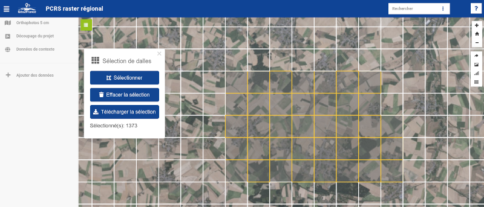

# MapFeatureSelector

## A Ajouter dans config.xml

```xml
<extension type="component" id="MapFeatureSelector" path="./apps/geo2france/addons"/>
```

## Parmètres

Editer le fichier `config.json` avec les options suivantes :
- dallage_geojson_url : url du fichier geojson contant les dalles
- fields : nom des champs à exporter depuis le geojson (séparés par des virgules)

## Utilisation du plugin

* ouvrir le plugin
* cliquer sur "Sélectionner" : cela affiche la couche de dallage
* dessiner la forme souhaitée : chaque clic est un sommet du polygone déssiné (un double clic termine la forme)
* le nombre de dalle sélectionnées s'affiche sur la fenêtre de l'addon : 37 dalles sélectionnées sur l'exemple de la capture d'écran
* Cliquer sur "télécharger la sélection" permet d'exporter un fichier csv contenant la liste des dalles PCRS



