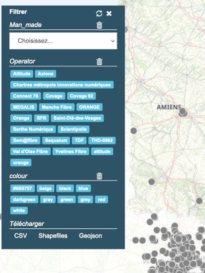

# Filtre attributaire de couches

Ce module permet de filtrer les couches à partir de leurs attributs.

Les filtres sont visibles dans une fenêtre dite flottantes car l'utilisateur peut changer la position de la fenêtre par un clic maintenu sur le haut de la fenêtre et un déplacement de la souris (pan).

Selon la configuration, l'interface permet de choisir une couche qui peut être filtrée attributairement afin de filtrer plusieurs couches à partir de leurs critères respectifs.

## Configuration dans le fichier de carte XML

**1. Utiliser un ID par Mviewer**

Nous vous conseillons d'utiliser un identifiant respectif à votre Mviewer :

```
<application
    id="mviewerNature"
```

Cet ID permettra de lier une configuration (fichier config.json) à un seul Mviewer. Ainsi, un seul dossier et un seul fichier config.json pourra être utilisé. Ce qui évite de duppliquer le dossier principal du plugin par Mviewer.

**2. Importer le plugin**

Comme tous les plugins, vous devez ajouter dans le fichier de configuration de votre Mviewer une balise qui permet de dire à votre Mviewer qu'il faut charger le plugin :

```
<extensions>
        <extension type="component" id="filter" path="demo/addons"/>
</extensions>
```

## configuration du plugin

La configuration du plugin est accessible dans le fichier `config.json` du répertoire `addon/filter`. Ce répertoire peut être localisé différemment selon votre organisation.

**1. Une configuration par Mviewer**

Pour commencer, vous devez ajouter votre ID de Mviewer sous la propriété `"mviewer"` tel que avec un id qui est "filter" on obtiendra : 

```
"options": {
   "mviewer":{
      "filter":{
        "layers": [{
          "layerId": "structures"
      }
    }
}
```

**2. Ajouter une couche**

Dans ce fichier `config.json`, chaque couche aura des filtres attributaires potentiellements différents.

Ajoutez la couche au sein d'une propriété `layers` tel que pour une couche avec un id de couche (`idLayer`) `structure` nous aurons : 

```
"options": {
   "mviewer":{
      "filter":{
        "layers": [{
          "layerId": "structures"
      }
    }
}
```

**3. Ajouter des filtres pour la couche**

Les filtres peuvent être de type combobox, date, checkbox, button, textbox.

Voici un exemple de représentation pour des attributs (dans l'ordre, de type combobox, button, textbox, button, combobox) :


Pour chaque attribut à filtrer, vous avez besoin de ces propriétés obligatoires : 

```
{
  "attribut": "dep",
  "type": "button",
  "label": "Départements"
}
```
* attribut

Le nom de l'attribut à filtrer.

* type


Le type entre combobox, date, checkbox, button, textbox (dépendra aussi des données).

* label


Le texte à afficher au dessus du filtre.

Ces propriétés supplémentaires ne sont pas obligatoires mais peuvent permettre de bien interpréter les données et d'interagir :

```
{
...
"dataSeparator":";",
"updateOnChange": true
}
```

* dataSeparator
Permet d'indiquer le séparateur si plusieurs valeurs sont contenues dans un champ pour une entité.

* updateOnChange

Cette propriété permet de mettre à jour l'interface des filtres selon les attributs disponibles dans les entités filtrées. 

Ainsi, si notre attribut `marché` de type liste (combobox) est configuré `updateOnChange: true` et que les entités filtrées et visibles à l'écran n'ont que 2 valeurs de marché, alors la liste ne contiendra que les deux valeurs de marché selon le filtre réalisé.

Vous aurez un exemple ici de configration :  [exemple pour l'image précédente](https://github.com/geobretagne/mviewer/blob/master/demo/addons/filter/config.json#L22-L47).


**4. Ajouter des boutons pour télécharger les données filtrées (uniquement pour les source WFS)**

Si vous rajoutez la propriété *downloadFormats* avec une liste de formats, des boutons de téléchargements des données seront ajoutés et permettront de télécharger les données filtrées. Ceci n'est possible que pour un layer WFS et créé un filtre CQL pour télécharger les données via une requête WFS. 



```
"layers": [{
          "layerId": "occurence_public_filter",
          "downloadFormats":[
            { "label": "CSV", "format": "CSV" },
            { "label": "Shapefiles", "format": "SHAPE-ZIP" },
            { "label": "Geojson", "format": "application/json" }
          ],
          "filter": [{
              "attribut": "man_made",
```

**Exemple** : 

Dans [notre jeu de données](https://github.com/geobretagne/mviewer/blob/master/demo/filter/data/structures.json), l'attribut `marché` contient la valeur `Algues ; Europe ; Accompagnement et Ressources ;`.

En indiquant le séparateur, le plugin sera capable de proposer de filtrer la couche sur les valeur disponibles de l'attribut `marché`.

## Exemple

Vous pouvez retrouver un exemple complet dans les dossiers suivants : 

* Fichier de configuration du plugin : [demo/addons/filter/config.json](https://github.com/geobretagne/mviewer/blob/master/demo/addons/filter/config.json)
* Fichier de configuration de la carte : [demo/filter/filter.xml](https://github.com/geobretagne/mviewer/blob/master/demo/filter/filter.xml)

Dans cet exemple, le Mviewer a un identifiant repectif "filter" tel que dans le config.xml : 

```
<application
    id="filter"
```

et dans le config.json :

```
  "options": {
    "mviewer":{
      "filter":{

```
## Mdoifier le style

la configuration vous permet de modifier le style selon ces propriétés : 

- **text**: couleur du text
- **background**: couleur du background
- **border**: règle pour la border
- **right**: placement à partir de la droite (en pixel)
- **left**: placement à partir de la gauche (en pixel)
- **bottom**: placement à partir du bas (en pixel)
- **top**: placement à partir du haut
- **unSelectedBtnColor**: couleur du fond pour les tags sélectionnés
- **textSelectBtnColor**: couleur du text pour les tags sélectionnés
- **selectedBtnColor**: couleur du fond pour les boutons poussés

**Exemple de configuration de style simple :**

```
"style": {
    "border": "1px #2e5367 solid",
    "background": "#2e5367",
    "text": "white",
    "colorButton": "#2e5367"
},
```

[code lié](https://github.com/geobretagne/mviewer/blob/feature-652/demo/addons/filter/js/filter.js#L996-L1011)
## Pour aller plus loin...

Une section de la documentation mviewer est disponible pour bien comprendre et mettre en oeuvre les plugins : 

https://mviewerdoc.readthedocs.io/fr/latest/doc_tech/config_customcomponent.html
