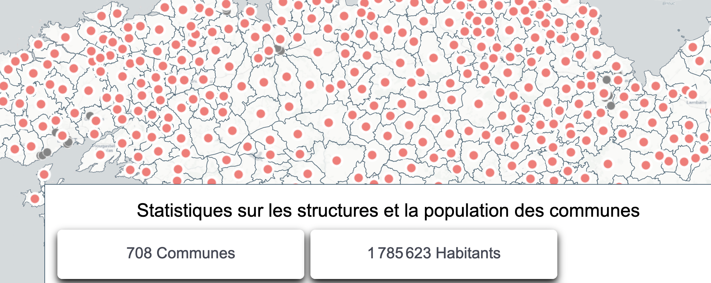

# Panneau de statistiques sur les couches

Ce module permet d'afficher un panneau qui présente des indicateurs, basés sur des objets visibles dans la carte.

## Description détaillée

Si on a couche de zones d'activités avec un champ surface_disponible, on peut ajouter un indicateur qui affiche le nombre total de zones visibles dans la carte, ou la somme des surfaces disponibles dans chaque zone.

## Informations complémentaires

Le fichier de configuration de l'addon permet de définir pour chaque indicateur :

* la couche pour laquelle l'indicateur va s'afficher
* le champ de la couche concerné
* le type d'opération (count, sum, moyenne...)
* un template html qui sera utilisé pour l'affichage de l'indicateur

L'indicateur devra se mettre à jour en fonction :
*    du déplacement dans la carte
*    du zoom dans la carte
*    d'un éventuel filtrage via le custom component filter

## configuration d'un indicateur

les paramètres suivants permettent de configurer un indicateur:

* type : type d'indicateur, 1 seul type supporté pour le moment "stat" 
* layerId: identifiant de la couche concernée
* field: champ sur lequel calculer l'indicateur ( vide si c'est une opération count)
* operator: type d'opération à réaliser parmi COUNT (nombre d'objets), SUM (somme des valeurs de l'attribut), MIN(valeur minimum de l'attribut), MAX(valeur maximum de l'attribut), MEAN(valeur moyenne de l'attribut)

## Exemple de configuration


Ex pour afficher le nombre de communes sur la carte
```
 {
    "type": "stat",
    "layerId": "population_communes",
    "field": "",
    "template":"<span><span class='stat_value'>{x}</span> Communes</span>",
    "operator": "COUNT",
 }
```


Ex pour afficher le nombre d'habitants sur les communes de la carte avec une classe css particulière pour animer l'indicateur

```
 {
   "type": "stat",
    "layerId": "population_communes",
    "field": "population",
    "template":"<span class='anim_fade'>{x} Habitants</span>",
    "operator": "SUM",
 }
```

css : 
```
 .stat_effect > span.anim_fade {
  animation: fade_animation 3s ease;
}

@keyframes fade_animation {
  from {
    opacity : 0;
  }
  to {
    opacity : 1;

  }      
}

```