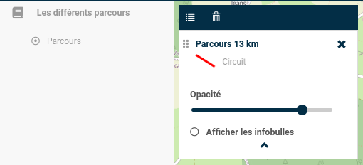

# Visualisation de différentes Tracks

Cette extension permet à l'utilisateur de pouvoir visualiser différents parcours au format `GPX`. 

Celle-ci ajoute également la possibilité d'interagir avec les données présentes de telle sorte à mieux comprendre l'environnement concerné. 

De plus, l'extension est entièrement configurable depuis le fichier de config `config.json` (voir ci-dessous), permettant ainsi une personnalisation bien précise en fonction des besoins.

## 1. Configuration du fichier de carte XML

### **1.1. Utiliser un ID unique pour un Mviewer**

Il est préférable d'utiliser un ID qui correspond à votre Mviewer : 

```xml
<config>
    <application id="parcours"
                 ...
    />
    ...
</config>
```

Cet ID va permettre de lier un fichier de configuration `config.json` avec un ***seul*** Mviewer. Dans ce cas, un seul dossier et un seul fichier de configuration seront utilisés.

### **1.2. Importer le plugin**

L'étape suivante consiste à importer le plugin dans le fichier de configuration de votre Mviewer. En effet, c'est une étape qui est identique pour n'importe quel plugin que l'on souhaite ajouter à notre application. Pour ce faire, il faut se rendre dans le fichier `XML` dans lequel il est nécessaire d'ajouter la balise suivante :

```xml
<extensions>
    <extension type="component" id="trackview" path="demo/addons"/>
</extensions>
```

Une fois arrivé à ce stade de la configuration, le plugin est désormais importé dans votre application.

## 2. Configuration du plugin

Comme nous avons déjà pu le voir précédemment, l'extension est entièrement configurable. Nous allons donc voir dans cette partie les différentes configurations disponibles.

Le fichier de configuration `config.json` est disponible dans le répertoire `addons/trackview`. L'emplacement de celui-ci peut être modifié en fonction de vos besoins. 

### **2.1. Une structure à respecter**

Afin que l'extension puisse fonctionner correctement, il est très important de respecter la structure de configuration que l'on peut voir ci-dessous :

```json
{
    "type": "module",
    "js": [
        "../../../lib/chartjs-3.7.1/Chart.min.js", "lib/turf.min.js", "js/custom-dropdown.js", "js/trackview.js"
    ],
    "css": "/css/style.css",
    "html": "./trackview.html",
    "target": "page-content-wrapper"
    ...
}
```

- `type` indique que le contenu est un module, un fichier pouvant contenir des fonctions, des objets ou encore des variables exportables et réutilisables dans d'autres parties du code.

- `js` c'est ici que l'on renseigne les fichiers js que l'on souhaite charger.

- `css` c'est ici que l'on renseigne le chemin vers le fichier de style

- `html` c'est ici que l'on renseigne le chemin vers le fichier html pouvant contenir davantage d'éléments en fonction des besoins

- `target` indique l'élément de la page dans lequel le contenu sera inséré.

### **2.2. Une configuration par Mviewer**

Il est très important de reprendre l'ID de votre Mviewer (voir **partie 1.1**), afin de le renseigner sous la propriété `"mviewer"`, comme nous pouvons le voir ci-dessous :

```json
{
    "type": "module",
    "js": [
        "../../../lib/chartjs-3.7.1/Chart.min.js", "lib/turf.min.js", "js/custom-dropdown.js", "js/trackview.js"
    ],
    "css": "/css/style.css",
    "html": "./trackview.html",
    "target": "page-content-wrapper",
    "options" : {
        "mviewer": {
            "parcours": [
                {
                    ...
                }
                ...
            ]
        }
    }  
}
```

Dans notre exemple, nous avons utilisé l'ID `"parcours"`.

### **2.3. Ajouter une couche**

Le fichier `config.json` permet d'ajouter plusieurs couches chacune étant personnalisable comme on le souhaite.

En effet, dans notre cas, il est possible de renseigner un seul parcours, ou bien d'en ajouter un 2e, un 3ème et ainsi de suite.

Nous allons donc voir par la suite comment ajouter un parcours qui servira d'exemple en cas d'ajout d'un second.

Pour commencer, nous pouvons voir ci-dessous la structure permettant l'ajout d'un ou de plusieurs parcours.

```json
{
    "type": "module",
    "js": [
        "../../../lib/chartjs-3.7.1/Chart.min.js", "lib/turf.min.js", "js/custom-dropdown.js", "js/trackview.js"
    ],
    "css": "/css/style.css",
    "html": "./trackview.html",
    "target": "page-content-wrapper",
    "options" : {
        "mviewer": {
            "parcours": [
                {
                    "Premier parcours"
                },
                {
                    "Seconds parcours"
                },
                {
                    "Troisième parcours"
                }
                ...
            ]
        }
    }  
}
```

Les données de chaque parcours doivent être comprises entre les `{}`  pour le bon fonctionnement du plugin.

Pour une meilleure lisibilité, nous allons voir en plusieurs étapes les différentes données à renseigner dans le fichier `config.json`.

#### **2.3.1. Les paramètres de base**

Ci-dessous les paramètres nécessaires à l'ajout des données sur Mviewer.

```json
{
    "type": "module",
    "js": [
        "../../../lib/chartjs-3.7.1/Chart.min.js", "lib/turf.min.js", "js/custom-dropdown.js", "js/trackview.js"
    ],
    "css": "/css/style.css",
    "html": "./trackview.html",
    "target": "page-content-wrapper",
    "options" : {
        "mviewer": {
            "parcours": [
                {
                    "id": 0,
                    "label": "Parcours 13 km",
                    "title": "Circuit",
                    "param": {
                        "pointKilometers": {
                            "display": "true"
                        },
                        "tolerance": {
                            "value": 2
                        }
                    },
                    "stats": {
                        "type": "customlayer",
                        "layerId": "parcours_1",
                        "opacity": 0.8
                    },  
                    "data": {
                        "url": "demo/trackview/data/gpx/parcours_13km.gpx"
                    }
                }
                ...
            ]
        }
    }  
}
```

- `id` sert d'identifiant pour un parcours, le premier avec l'identifiant 0, le second avec l'identifiant 1, le troisième avec le 2 et ainsi de suite.

- `label` sert à donner un titre à la légende.

- `title` permet de donner une description de ce que représente la légende.

Pour une meilleure compréhension, voici une illustration ci-dessous :


- `param` permet de stocker différents paramètres propres au parcours
    - `pointKilometers` paramètre concernant les points kilométriques
        - `display` prend la valeur **true** ou **false** pour savoir si on souhaite afficher les points tous les kilomètres ou non.
    
    - `tolerance` paramètre concernant la tolérance
        - `value` prend une valeur en pixel qui permet de détecter le parcours plus facilement ou non. Plus la valeur est élévée, plus facile sera la détection.

- `stats`

    - `type` permet de définir le type de la couche, ici "*customlayer*"
    - `layerId` c'est grâce à cette ID que Mviewer fait le lien entre la légende et les thèmes (pour plus d'informations sur les thèmes : [les thèmes avec Mviewer](https://mviewerdoc.readthedocs.io/fr/latest/doc_tech/config_topics.html)).

    En effet, afin que cet ID soit utile, il ne faut pas oublier de rajouter dans la configuration de l'application (**fichier XML**) le code suivant :

    ```xml
    <themes mini="true" legendmini="false">
        <theme id="theme_1" name="Les différents parcours" collapsed="true" icon="fas fa-book">
            <layer id="parcours_1" name="Parcours"/>
        </theme>
    </themes>
    ```

    L'ID se situe donc dans la balise `layer` qui permettra de faire le lien avec la légende.

    Concernant les autres paramètres, merci de se rendre vers la documentation sur le lien ci-dessus.

    Pour une meilleure compréhension, voici une illustration ci-dessous.

    

    - `opacity` permet de définir l'opacité par défaut du parcours lors du chargement de la page.

- `data`
    - `url` permet de renseigner le chemin vers les données à charger.
    
    ***Remarque:*** Les données doivent impérativement être au format **GPX**.

#### **2.3.2. Le style**

Une fois arrivé à ce stade de la configuration, nous allons maintenant voir les différents paramètres disponibles afin de styliser le plugin comme on le souhaite.

Pour ce faire, il faut ajouter le code ci-dessous sous la propriété `"data"`. Le code ci-dessous peut également servir d'exemple.

```json
{
    "style": {
        "geometry": "LineString",
        "segment": {
            "color": {
                "default": "#f00",
                "selected": "#03224c"
            },
            "width": {
                "default": 3,
                "selected": 5
            }
        },
        "point": {
            "color": {
                "image": "#03224c",
                "stroke": "#fff"
            },
            "radius": 7,
            "width": 2
        },
        "pointKilometers": {
            "color": {
                "image": "#fff",
                "stroke": "f00",
                "text": "#333"
            },
            "radius": 9,
            "width": 0.8
        },
        "graph": {
            "type": "line",
            "title": "Dénivelé du parcours en fonction de la distance parcourue",
            "name": {
                "xAxis": {
                    "text": "Distance (km)"
                },
                "yAxis": {
                    "text": "Dénivelé (m)"
                }
            },
            "color": {
                "segment": "#f00",
                "point": "#f00"
            }
        }
    }
}
```

Pour commencer, on va voir plus en détails la configuration du style pour les **segments**, qui correspondent au parcours que vous avez chargé.

- `style` c'est ici que se situe tous les styles.
    - `geometry` c'est ici qu'il faut renseigner le type du parcours, soit "**LineString**".
    - `segment` concerne le style des segments (du parcours).
        - `color` couleur
            - `default` couleur par défaut d'un segment (ou couleur du parcours).
            - `selected` on renseigne la couleur d'un segment selectionné/survolé par la souris.
        - `width` taille (épaisseur)
            - `default` largeur par défaut d'un segment (ou largeur du parcours).
            - `selected` on renseigne la taille d'un segment selectionné/survolé par la souris.

***Remarque:*** La couleur peut être renseignée de plusieurs manières, que ce soit en **hexa** (**#f00** ou encore **#ff0000** pour du rouge par exemple), par leur **simple nom** en **anglais** (**red** ou **green**) ou enfin, en **RGB** (**rgb(255, 0, 0)** pour le **rouge**).

Ensuite, nous allons maintenant voir le style pour les **points** qui se situe en bout de parcours lors du survol de la souris, à ne pas confondre avec les points kilométriques.

- `point` concerne le style des points (en bout de parcours).
    - `color` couleur
        - `image` c'est ici que l'on renseigne la couleur du point.
        - `stroke` c'est ici que l'on renseigne la couleur des contours du point.
    - `radius` c'est ici que l'on renseigne le rayon du point.
    - `width` c'est ici que l'on renseigne la largeur du point.

Concernant les **points kilométriques**, le principe est presque le même comme nous allons le voir ci-dessous.

- `pointKilometers` concerne le style des points kilométriques.
    - `color` couleur
        - `image` c'est ici que l'on renseigne la couleur du point.
        - `stroke` c'est ici que l'on renseigne la couleur des contours du point.
        - `text` c'est ici que l'on renseigne la couleur du texte sur le point.
    - `radius` c'est ici que l'on renseigne le rayon du point.
    - `width` c'est ici que l'on renseigne la largeur du point.

Enfin, nous allons maintenant voir la configuration du **graphique altimétrique** qui, comme son nom l'indique, permet de voir l'altimétrie (ou altitude) à un instant précis du parcours. Celui-ci est également paramétrable afin de le rendre le plus personnalisable possible.

- `graph` contient tous les paramètres du graphique altimétrique.
    - `type` c'est ici que l'on va renseigner le type du graphique, soit ici "**line**".
    - `title` permet de renseigner le titre du graphique (exemple "*Graphique montrant l'altitude*").
    - `name` contient les informations sur les différents axes du graphique (abscisse et ordonnée).
        - `xAxis` concerne l'axe des abscisses.
            - `text` c'est ici que l'on renseigne le nom de l'axe concerné.
        - `yAxis` concerne l'axe des ordonnées.
            - `text` c'est ici que l'on renseigne le nom de l'axe concerné.
    - `color` couleur
        - `segment` c'est ici que l'on renseigne la couleur des segments qui sont sur le graphique.
        - `point` c'est ici que l'on renseigne la couleur des points qui sont présent sur le graphique.

Une fois arrivé à ce stade de la configuration, vous êtes désormais capable de configurer entièrement le plugin, que ce soit d'un point de vue style, taille, texte ou encore concernant l'emplacement des données à charger.

Enfin, si le plugin est utilisé pour visualiser qu'un seul parcours, le bouton qui est présent peut être soit déplacé, soit modifier ou soit supprimé en fonction des besoins.