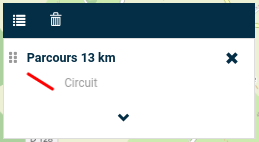

# Visualisation de différentes Tracks

Cette extension permet à l'utilisateur de pouvoir visualiser différents parcours au format `GPX`. 

Celle-ci ajoute également la possibilité d'interagir avec les données présentes de telle sorte à mieux comprendre l'environnement concerné. 

De plus, l'extension est entièrement configurable depuis le fichier de config `config.json` (voir ci-dessous), permettant ainsi une personnalisation bien précise en fonction des besoins.

## 1. Configuration du fichier de carte XML

**1. Utiliser un ID unique pour un Mviewer**

Il est préférable d'utiliser un ID qui correspond à votre Mviewer : 

```xml
<config>
    <application id="parcours"
                 ...
    />
    ...
</config>
```

Cet ID va permettre de lier un fichier de configuration `config.json` avec un ***seul*** Mviewer. Dans ce cas, un seul dossier et un seul fichier de configuration seront utilisés.

**2. Importer le plugin**

L'étape suivante consiste à importer le plugin dans le fichier de configuration de votre Mviewer. En effet, c'est une étape qui est identique pour n'importe quel plugin que l'on souhaite ajouter à notre application. Pour ce faire, il faut se rendre dans le fichier `XML` dans lequel il est nécessaire d'ajouter la balise suivante :

```xml
<extensions>
    <extension type="component" id="trackview" path="demo/addons"/>
</extensions>
```

Une fois arrivé à ce stade de la configuration, le plugin est désormais importé dans votre application.

## 2. Configuration du plugin

Comme nous avons déjà pu le voir précédemment, l'extension est entièrement configurable. Nous allons donc voir dans cette partie les différentes configuration disponibles.

Le fichier de configuration `config.json` est disponible dans le répertoire `addons/trackview`. L'emplacement de celui-ci peut être modifier en fonction de vos besoins. 

**1. Une structure à respecter**

Afin que l'extension puisse fonctionner correctement, il est très important de respecter la structure de configuration que l'on peut voir ci-dessous :

```json
{
    "type": "module",
    "js": [
        "../../../lib/chartjs-3.7.1/Chart.min.js", "lib/turf.min.js", "js/custom-dropdown.js", "js/trackview.js"
    ],
    "css": "/css/style.css",
    "html": "./trackview.html",
    "target": "page-content-wrapper"
    ...
}
```

- `type` indique que le contenu est un module, un fichier pouvant contenir des fonctions, des objets ou encore des variables exportables et réutilisables dans d'autres parties du code.

- `js` c'est ici que l'on renseigne les fichiers js que l'on souhaite charger.

- `css` c'est ici que l'on renseigne le chemin vers le fichier de style

- `html` c'est ici que l'on renseigne le chemin vers le fichier html pouvant contenir d'avantages d'éléments en fonction des besoins

- `target` indique l'élément de la page dans lequel le contenu sera inséré.

**2. Une configuration par Mviewer**

Il est très important de reprendre l'ID de votre Mviewer (voir **partie 1.1**), afin de le renseigner dans sous la propriété `"mviewer"`, comme nous pouvons le voir ci-dessous :

```json
{
    "type": "module",
    "js": [
        "../../../lib/chartjs-3.7.1/Chart.min.js", "lib/turf.min.js", "js/custom-dropdown.js", "js/trackview.js"
    ],
    "css": "/css/style.css",
    "html": "./trackview.html",
    "target": "page-content-wrapper",
    "options" : {
        "mviewer": {
            "parcours": [
                {
                    ...
                }
                ...
            ]
        }
    }  
}
```

Dans notre exemple, nous avons utilisé l'ID `"parcours"`.

**3. Ajouter une couche**

Le fichier `config.json` permet d'ajouter plusieurs couches chacune étant personnalisable comme on le souahite.

En effet, dans notre cas, il est possible de renseigner un seul parcours, ou bien d'en ajouter un 2ème, un 3ème et ainsi de suite.

Nous allons donc voir par la suite comment ajouter un parcours qui servira d'exemple en cas d'ajout d'un second.

Pour commencer, nous pouvons voir ci-dessous la structure permettant l'ajout d'un ou de plusieurs parcours.

```json
{
    "type": "module",
    "js": [
        "../../../lib/chartjs-3.7.1/Chart.min.js", "lib/turf.min.js", "js/custom-dropdown.js", "js/trackview.js"
    ],
    "css": "/css/style.css",
    "html": "./trackview.html",
    "target": "page-content-wrapper",
    "options" : {
        "mviewer": {
            "parcours": [
                {
                    "Premier parcours"
                },
                {
                    "Seconds parcours"
                },
                {
                    "Troisième parcours"
                }
                ...
            ]
        }
    }  
}
```

Les données de chaque parcours doivent être comprises entre les `{}`  pour le bon fonctionnement du plugin.

Pour une meilleure lisibilité, nous allons voir en plusieurs étapes les différentes données à renseigner dans le fichier `config.json`.

**1.1 Les paramètres de base**

Ci-dessous les paramètres nécessaires à l'ajout des données sur Mviewer.

```json
{
    "type": "module",
    "js": [
        "../../../lib/chartjs-3.7.1/Chart.min.js", "lib/turf.min.js", "js/custom-dropdown.js", "js/trackview.js"
    ],
    "css": "/css/style.css",
    "html": "./trackview.html",
    "target": "page-content-wrapper",
    "options" : {
        "mviewer": {
            "parcours": [
                {
                    "id": 0,
                    "label": "Parcours 13 km",
                    "title": "Circuit",
                    "stats": {
                        "type": "customlayer",
                        "layerId": "parcours_1",
                        "opacity": 0.8
                    },  
                    "data": {
                        "url": "demo/trackview/data/gpx/parcours_13km.gpx"
                    }
                }
                ...
            ]
        }
    }  
}
```

- `id` sert d'identifiant pour un parcours, le premier avec l'identifiant 0, le second avec l'identifiant 1, le troisième avec le 2 et ainsi de suite.

- `label` sert à donner un titre à la légende.

- `title` permet de donner une description de ce que représente la légende.

Pour une meilleure compréhension, voici une illustration ci-dessous :



- `stats`

    - `type` permet de définir le type de la couche, ici "*customlayer*"
    - `layerId` c'est grâce à cette ID que Mviewer fait le lien entre la légende et les thèmes (pour plus d'informations sur les thèmes : [les thèmes avec Mviewer](https://mviewerdoc.readthedocs.io/fr/latest/doc_tech/config_topics.html)).

    En effet, afin que cet ID soit utile, il ne faut pas oublier de rajouter dans la configuration de l'application (**fichier XML**) le code suivant :

    ```xml
    <themes mini="true" legendmini="false">
        <theme id="theme_1" name="Les différents parcours" collapsed="true" icon="fas fa-book">
            <layer id="parcours_1" name="Parcours"/>
        </theme>
    </themes>
    ```

    L'ID se situe donc dans la balise `layer` qui permettra de faire le lien avec la légende.

    Concernant les autres paramètres, merci de se rendre vers la documentation sur le lien ci-dessus.

    Pour une meilleure compréhension, voici une illustration ci-dessous.

    

    - `opacity` permet de définir l'opacité par défaut du parcours lors du chargement de la page.

- `data`
    - `url` permet de renseigner le chemin vers les données à charger.
    
    ***Remarque:*** Les données doivent impérativement être au format **GPX**.

**1.2 Le style**
