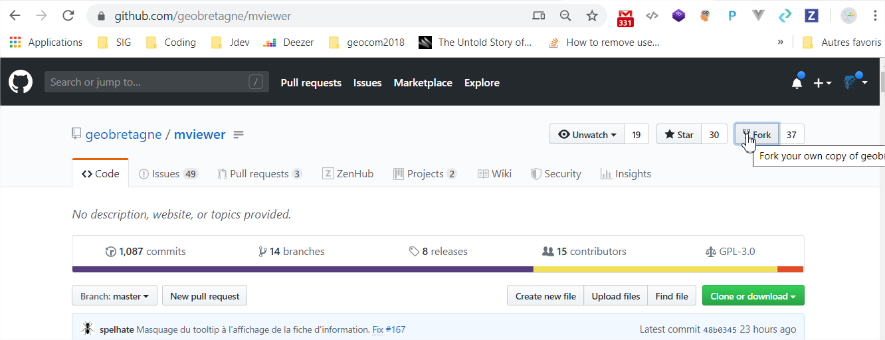

# Contribuer à la documentation - MkDocs

<div class="warning">

<div class="title">

Warning

</div>

La documentation est désormais dans le répertoire docs du dépôt
principal **mviewer** et non plus dans le dépôt **mviewer.doc**.

</div>

Participez à l'amélioration de la documentation en ligne de mviewer.

Respectez le processus de contribution décrit dans la section [Contribuer](contrib.md).

**Sources**

Les sources de la documentation sont disponibles sur GitHub
[mviewer/mviewer](https://github.com/mviewer/mviewer.git), dans le
répertoire docs.

**Créez une issue sur GitHub**

Voir la page [Créer une issue](issue.md) pour proposer une modification.

**Fork**

Pour apporter des modifications sur la documentation, vous devrez
réaliser un fork vers votre compte organisation de Github. Pour réaliser
un fork, dirigez-vous vers l'exemple dans la section [Organisation des fichiers](../doc_tech/config_practices.md).



## Déployer la documentation en local

**Prérequis**

-   Disposer de python3 et de pip sur votre machine.
-   Installer les dépendances MkDocs :

<!-- -->

    pip install -r docs/requirements.txt

-   Avoir réalisé un fork du repository
    [mviewer/mviewer](https://github.com/mviewer/mviewer.git).
-   Avoir réalisé un clone de votre fork vers un répertoire local de
    votre ordinateur :

<!-- -->

    cd /home/user/pierre/git/
    git clone https://github.com/mon_compte_github/mviewer.git --recurse-submodules

-   Lancer la documentation en local depuis la racine du dépôt :

<!-- -->

    mkdocs serve

La commande affiche l'URL d'aperçu (par défaut
<http://127.0.0.1:8000>). Toute modification enregistrée dans `docs/`
est rechargée automatiquement.

**Actions**

-   Positionnez-vous dans votre dossier mviewer issu du clone :

<!-- -->

    cd /home/user/pierre/mviewer

-   Éditez ou créez vos pages Markdown dans le répertoire `docs/` :

<!-- -->

    cd /home/user/pierre/mviewer/docs

-   Ajoutez vos nouvelles pages `.md` dans la navigation du fichier
    `mkdocs.yml` (clé `nav` à la racine du dépôt).
-   Lancez l'aperçu local pendant vos modifications :

<!-- -->

    mkdocs serve

-   Générer la version statique lorsque vous souhaitez livrer la
    documentation :

<!-- -->

    mkdocs build

-   Inspirez-vous de l'existant pour comprendre l'organisation des
    fichiers et la nomenclature des images dans `_images/`.

## Ajouter des blocs de code

Utilisez une section de code Markdown :

````markdown
Mon texte d'introduction

```js
mon bloc de code
```
````

## Ajouter des puces

Utilisez les listes Markdown :

```markdown
- premier tiret
- deuxième tiret
```

## Rajouter des images

-   Ajoutez un dossier dans ../docs/\_images tel que :

<!-- -->

    /home/user/pierre/mviewer/docs/_images/doc_test/

-   Ajoutez vos images dans ce dossier et renseignez le chemin de
    l'image à afficher dans le code tel que :

<!-- -->

    Voici une image :

    .. image:: ../_images/doc_test/image1.png
                :alt: description de l'image
                :align: center

    Suite du texte.

## Liste numérotée

Utilisez la syntaxe suivante (respectez les sauts de ligne) :

    Une liste avec des numéros :

    #. Mon premier
    #. Mon second
    #. ...

    Suite du texte.

## Référencer une page

-   Pour créer un point de référence que l'on peut citer comme lien
    depuis n'importe quelle page, ajoutez une ancre HTML juste avant le
    titre ciblé : `<a id="reference"></a>`.
-   Utilisez ensuite un lien Markdown classique pour y faire référence,
    par exemple `Voir la [Page de référence](#reference)`.
-   Le texte du titre sera cliquable pour s'y rendre, et vous pourrez
    également pointer vers cette ancre depuis d'autres fichiers en
    utilisant un lien relatif, par exemple
    `[Page de référence](doc.md#reference)`.

## Lien, hyperlien

Utilisez simplement la syntaxe Markdown classique :

```markdown
Ceci est un [lien cliquable](https://github.com/mviewer/mviewer).
```

## Construire et déployer la documentation

-   Les sources de la documentation sont localisées dans votre dossier
    `mviewer/docs` créé par le clone.
-   Construisez le site statique dans `site/` avec :

<!-- -->

    mkdocs build

-   La documentation générée est disponible dans `site/`. Copiez ce
    dossier sur votre serveur web ou publiez-le via GitHub Pages.

**Faites votre pull request**

Retrouvez la procédure décrite dans la partie [Travailler avec Git et GitHub](git.md).

## Documentation

Pour aller plus loin sur la syntaxe :

1.  [Guide MkDocs](https://www.mkdocs.org/user-guide/)
2.  [Thème Material](https://squidfunk.github.io/mkdocs-material/)
3.  [Rappel Markdown](https://www.markdownguide.org/basic-syntax/)
