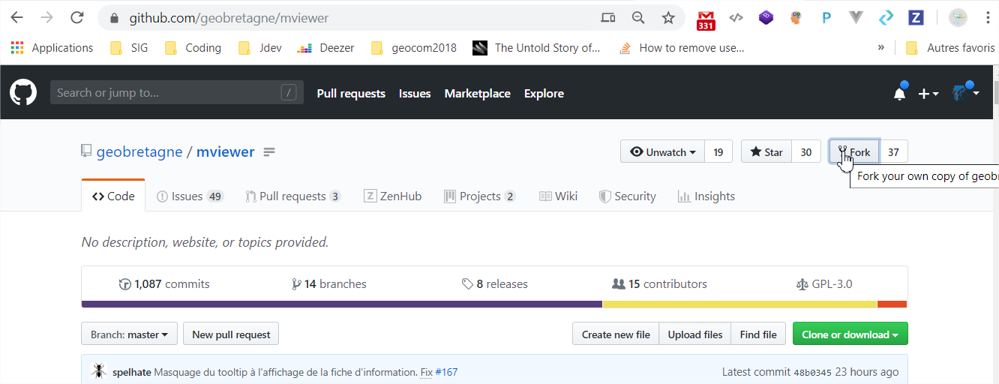
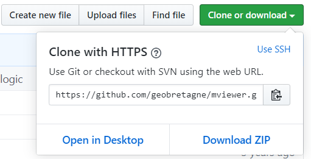

.. Authors :
.. mviewer team

.. _contribdoc:

Contribuer à la documentation - Readthedoc
==========================================

.. warning::
    La documentation est désormais dans le répertoire docs du dépôt principal **mviewer** et non plus dans le dépôt **mviewer.doc**.

Participez à l'amélioration de la `documentation <https://mviewerdoc.readthedocs.io/>`_ en ligne de mviewer.

Respectez le processus de contribution décrit dans la section ":ref:`ask`".

**Sources**

Les sources de la documentation sont disponibles sur GitHub `geobretagne/mviewer <https://github.com/geobretagne/mviewer.git>`_, dans le répertoire docs.

**Créez une issue sur GitHub**

Voir la page ":ref:`issue`" pour proposer une modification.

**Fork**

Pour apporter des modifications sur la documentation, vous devrez réaliser un fork vers votre compte organisation de Github.
Pour réaliser un fork, dirigez-vous vers l'exemple dans la section ":ref:`fork`".

Déployer la documentation en local
----------------------------------

**Prérequis**

- Vous devez disposez d'un serveur web type Apache2

*Si vous ne connaissez pas Apache, vous pouvez installer facilement* `XAMPP <https://www.apachefriends.org/fr/download.html>`_ *en suivant l'explicatif* ":ref:`installxamp`" *plus bas.*

- Vous devez disposer des droits sur votre ordinateur pour installer python et disposer de pip.
- Avoir réalisé un fork du repository `geobretagne/mviewer <https://github.com/geobretagne/mviewer.git>`_
- Avoir réalisé un clone de votre fork vers un répertoire local de votre ordinateur :

::

    cd /home/user/pierre/git/
    git clone https://github.com/mon_compte_github/mviewer.git

*L'URL de votre fork est disponible en cliquant sur "Clone or download"*

- Avoir installé python sphinx en suivant la `page sphinx <https://www.sphinx-doc.org/en/master/usage/installation.html>`_ :

::

    // debian
    apt-get install python3-sphinx

- Disposer de pip (debian) :

::

    // debian
    sudo apt install python-pip
    pip --version

- Installer le package stemmer (si manquant au build) :

::

    // Debian
    sudo apt-get install python-stemmer

    // pip
    pip install PyStemmer

**Actions**

- Positionnez-vous dans votre dossier mviewer issu du clone :

::

    cd /home/user/pierre/mviewer

- Vous pouvez apporter des modifications dans le dossier "docs" :

::

    cd /home/user/pierre/mviewer/docs

- Pour rajouter des parties et sous-parties dans le menu de gauche, il vous faudra modifier le fichier index.rst :

::

    /home/user/pierre/mviewer/docs/index.rst

- Rajouter par exemple une partie "Nouvelle partie" en respectant cette syntaxe :

::

    Nouvelle partie
    -------------------------------------------------

    Nouvelle partie pour tester.

    .. toctree::
    :hidden:
    :maxdepth: 1
    :caption: Ici le Titre

    doc_test/introduction
    doc_test/sous_partie1
    doc_test/sous_partie2

- Comme décrit dans la syntaxe précédente, vous devez rajouter un dossier "doc_test" (où "doc_test" est le nom que vous avez choisis)

::

    /home/user/pierre/mviewer/docs/doc_test

- Dans ce dossier, rajoutez les fichiers comme décrits dans l'arborescence :

::

    ../mviewer/docs/doc_test/introduction.rst
    ../mviewer/docs/doc_test/sous_partie1.rst
    ../mviewer/docs/doc_test/sous_partie2.rst

- Inspirez-vous de l'existant pour comprendre l'organisation des fichiers avec index.rst

- Vous devrez écrire selon une syntaxe particulière. Recherchez dans les fichiers et dans les exemples de cette page pour vous aider.

Ajouter des blocs de code
--------------------------

Utilisez la syntaxe suivante (respectez les sauts de ligne) :

::

    mon text::

    mon bloc de code

    Suite du texte.

Ajouter des puces
-----------------

Utilisez la syntaxe suivante (respectez les sauts de ligne) :

::

    Voici une liste :

    - premier tiret
    - deuxième tiret

    Suite du texte.

Rajouter des images
-------------------

- Ajoutez un dossier dans ../docs/_images tel que :

::

    /home/user/pierre/mviewer/docs/_images/doc_test/

- Ajoutez vos images dans ce dossier et renseignez le chemin de l'image à afficher dans le code tel que :

::

    Voici une image :

    .. image:: ../_images/doc_test/image1.png
                :alt: description de l'image
                :align: center

    Suite du texte.

Liste numérotée
-----------------

Utilisez la syntaxe suivante (respectez les sauts de ligne) :

::

    Une liste avec des numéros:

    #. Mon premier
    #. Mon second
    #. ...

    Suite du texte.

Référencer une page
---------------------

- Pour créer un point de référence .._reference: que l'ont peut citer comme lien depuis n'importe quelle page (lien interne)

- Utilisez les titres pour afficher le texte à afficher comme référence :

::

    .. _reference:

    Page de référence
    -----------------

- Appelez la référence affichera "Voir la Page de référence" :

::

    Voir la ":ref:`reference`"

- "Page de référence" sera cliquable pour s'y rendre

Lien, hyperlien
----------------

Utilisez la syntaxe suivante (respectez les sauts de lignes) :

::

    Ceci est un `lien cliquable <https://github.com/geobretagne/mviewer>`_

Construire et déployer la documentation
---------------------------------------

- Les sources de la documentation sont localisées dans votre dossier git/mviewer/docs crée par le clone (voir plus haut) :

::

    /home/user/pierre/mviewer/docs

- Nous voulons que notre documentation soit construite (build) dans le dossier :

::

    /var/www/mviewer-doc/

- Si vous avez utilisé XAMPP (voir "xampp"::), le dossier cible où sera construite la documentation sera (sous windows) :

::

    C:\xampp\mviewer-doc\

- Nous avons ensuite à passer la commande :

::

    sphinx-build -b html home/user/pierre/mviewer/docs /var/www/mviewer-doc/

- La documentation est maintenant dans le dossier de notre choix :

::

    /var/www/mviewer-doc/

    ou pour XAMPP:

    C:\xampp\mviewer-doc\

- Déployez la documentation crée via la commande avec Apache2 si vous avez d'autres chemins d'accès

- Avec XAMPP Accédez à la documentation via localhost/mviewer-doc (mviewer-doc étant le nom de dossier que vous avez utilisé)

**Faites votre pull request**

Retrouvez la procédure décrite dans la partie ":ref:`pr`".

.. _installxamp:

Installer XAMPP (windows)
-------------------------

- Téléchargez `XAMPP <https://www.apachefriends.org/fr/download.html>`_
- Lancez XAMPP pour afficher l'interface d'administration (GUI)
- Sur la ligne du module "Apache", à droite cliquez sur "Start" au sein des actions
- "Apache" doit passer en vert dans la colonne "Module"
- Cliquez sur "Explorer" dans la colonne tout à droite
- Une fenêtre d'exploration s'affiche (par défaut vers C:\xampp)
- Rechercher "htdocs" dans la fenêtre d'exploration
- Créez un dossier "mviewer-doc"

C'est dans le dossier "mviewer-doc" que sera déployée la documentation après la phase de build (voir plus haut).

- Accédez au dossier avec votre navigateur via l'URL :

::

    localhost/mviewer-doc

Documentation
-------------

Pour obtenir plus d'information sur la syntaxe et sphinx :

#. `Sphinx <http://www.sphinx-doc.org/en/master/>`_
#. `Sphinx syntaxe tutoriel <https://thomas-cokelaer.info/tutorials/sphinx/rest_syntax.html>`_
#. `Sphinx syntaxe infos <http://openalea.gforge.inria.fr/doc/openalea/doc/_build/html/source/sphinx/rest_syntax.html>`_
#. `Sphinx example syntaxe <https://matplotlib.org/sampledoc/cheatsheet.html>`_