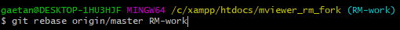
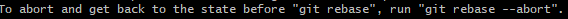
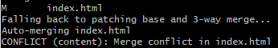
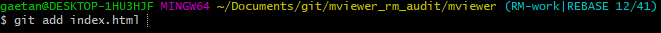
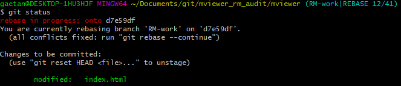
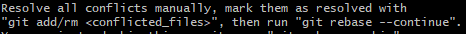
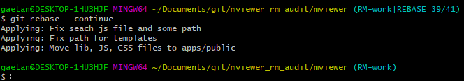
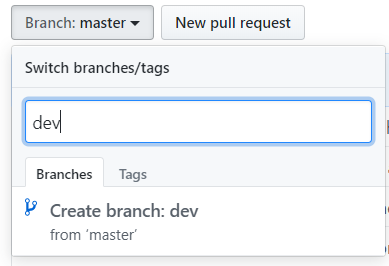
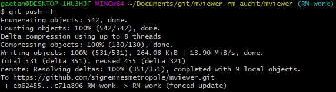
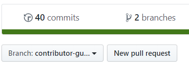

.. Authors :
.. mviewer team

.. _git:

Travailler avec Git et GitHub
=============================

Entrenez votre mviewer et facilitez vos contributions en travaillant avec les outils Git et Github.

Présentation générale
----------------------

GitHub est incontournable pour contribuer et découvrir la communauté mviewer. 
C'est là où vous proposerez vos idées, obtiendrez des informations et les dernières versions mviewer.

Grâce à Git vous pourrez réaliser vos contributions ou obtenir le code source dans votre environnement de travail.

Git propose une multitude d'action pour s'interfacer avec GitHub. Ces actions vous seront plus qu'utiles pour contribuer et maintenir votre mviewer à jour.
Nous expliquerons ici l'utilité et les manipulations utiles telles qu'un fork, rebase, commit, pull.

Présentation GitHub
--------------------------

GitHub est une plate-forme en ligne de contrôle de version et de collaboration pour le développement.
GitHub facilite le travail en équipe via une interface web qui permet d'accéder au dépôt de code Git. 
GitHub fournit des outils de gestion pour la collaboration. 

Présentation Git
--------------------------

Git est un outil libre de gestion de version décentralisé pour tout type de projet. Il permet de réaliser des développements sur votre propre dépôt (dépôt = répertoire). 
Git facilite ensuite la mise en commun du code entre les différents dépôt.

Git historise toutes les modifications afin d'identifier les nouveauté et permettre de revenir dans n'importe quel version précédente.

Présentation Git Flow
-------------------------

**Qu'est-ce que c'est ?**

Git Flow est un workflow (organisation) permettant d'établir une stratégie de base sur la création des branches.
Git Flow permet de gérer le travail collaboratif pour gérer les issues (bugs), les features (nouvelles fonctionnalités) et les releases (versions).

C'est le workflow qui a été adopté par les contributeurs Mviewer.

**Principes de base**

Pour simplifier, le fonctionnement est basé sur 2 branches : master et develop.

Si plusieurs personnes travaillent sur ces deux branches, l'historiques des réalisations (commits) peut vite devenir illisible et les modifications risquent de se court-circuiter (conflits).

L'idée est donc de créer des sous-niveaux de branches : 

 - Les branches **features-xxxx** permettent de travailler sur des nouvelles fonctionnalités. Elles sont crées directement à partir de la branche develop et une fois le travail fini, fusionnées vers la branche develop. 
 - Les branches **release-xxxx** permettent de faire une mise à jour de la branche master à partir de la branche develop.
 - Les branches **hotfix-xxxx** permettent de publier rapidement (hot) une correction (fix) depuis la branche master. Ces branches seront ensuite fusionnées vers la branche master et develop.

.. image:: ../_images/contrib/git-flow.png
              :alt: git-flow process
              :align: center

Voici quelques références externes pour vous aider à mieux comprendre Git-Flow:

#. `Avoir une bonne stratégie avec Git-flow <https://blog.soat.fr/2016/12/avoir-une-bonne-strategie-avec-git-flow/>`_
#. `Git-Flow est-il le workflow dont j'ai besoin ? <https://blog.xebia.fr/2018/03/28/gitflow-est-il-le-workflow-dont-jai-besoin/>`_
#. `Tutoriel vidéo Grafikart <https://www.grafikart.fr/tutoriels/git-flow-742>`_
#. `Git-Flow workflow tutorial by Atlassian <https://www.atlassian.com/git/tutorials/comparing-workflows/gitflow-workflow>`_

Fork et Pull
------------------------------

Nous avons déjà montré l'utilité et l'utilisation d'un **fork** et d'un **pull** sur la page ":ref:`practices`".

 - Le fork est décrit à la section ":ref:`fork`"
 - Le pull est utilisé à la section ":ref:`pull`"

Rebase
------------------------------

Lorsque vous faites des modifications via des commits sur votre branche de travail d'autres contributeurs modifient le code mviewer avec de nouveaux commits.

Le code de mviewer dans le GitHub GéoBretagne n'a pas connaissance de vos modifications.
Tant que vous n'avez pas mis à jour votre branche, votre code ne contient pas les modifications faites sur le GitHub mviewer GéoBretagne (upstream).

Les deux codes ont donc des nouveautés. On peut dire que les branches ont divergé.

Vous devez alors intégrer les nouveautés de mviewer dans une branche de travail contenant vos modifications. Pour rappel, cette branche ne doit pas jamais être la branche master.

Pour cela, nous allons en premier reprendre tous les nouveaux commits du mviewer natif (GéoBretagne) en mettant à jour votre fork (branche master). Ensuite, nous mettrons à jour votre branche de travail depuis la branche master de votre fork.

Dans la pratique, nous placerons les nouveaux commits de la branche master du fork dans l'arbre de commits de votre branche de travail via un **rebase**.

**Mise à jour du fork**

Reprenez dans l'ordre les étapes ":ref:`setupstream`" et ":ref:`updatefork`".

Réalisez ensuite la procédure suivante.

**Que fait un Rebase ?**

- Git va reprendre le dernier commit commun entre votre branche de travail à mettre à jour et la branche qui contient les nouveautés (master)
- Git replacera ensuite vos commits et les nouveaux commits dans l'ordre chronologique

Vous disposerez donc des nouveaux commits et de vos propres commits.

**Comment faire ?**

- Faites une copie de votre branche (optionnel mais conseillé) en créant une nouvelle branche à partir de votre branche de travail
- Si votre branche s'appelle par exemple "RM-work", lancez la commande de rebase de la branche master (fork à jour) vers votre branche à mettre à jour (RM-work) :

::
    
    git rebase origin/master RM-work

- Vous verrez la liste des commits dérouler les messages des commits un à un

- Vous aurez probablement un conflit. Le processus sera donc stoppé mais pas abandonné

- Si vous souhaitez abandonner lancer la commande(*) :

::

    git rebase --abort

- Si vous souhaitez ignorer le conflit (déconseillé !) :

::

    git rebase --skip

- Nous conseillons de résoudre le conflit. Git vous indique un nom de fichier en conflit (ici indiqué index.html). C'est qu'il n'a pas réussi tout seul à intégrer les modifications sans perdre votre code actuel comme indiqué :

::

- Ouvrez ce fichier avec un éditeur classique. Vous observerez que Git a inséré des caractères spéciaux pour nous permettre d'identifier les lignes en conflit :

::

    // je suis une pomme
    var type = "Pomme"
    <<< HEAD
    // nouveau code
    var test = "je suis rouge";
    ==========
    // code actuel
    var test = "je suis verte";
    var taille = 12;
    >>>>>
    var region = "Normandie";

- Vous pouvez garder le nouveau code entrant entre <<< HEAD et ===  ou bien garder le code actuel entre ==== et >>> ou bien garder les deux.

- Pour cela, vous allez modifier à la main le fichier en supprimant les caractères <<< HEAD et ==== et >>>> ainsi que les lignes indésirables.

- Nous avons maintenant ce contenu :

::

    // voici ma couleur
    var type = "Pomme"
    var test = "je suis rouge";
    var taille = 12;
    var region = "Normandie";

- Sauvegardez votre fichier

- Indiquez à Git que vous avez géré le conflit :

::

    git add /chemin/vers/le/fichier/index.html

- On contrôle que le fichier est marqué comme "modified" avec la commande :

::

    git status

- Indiquez à git de poursuivre le rebase comme décrit dans le message :

::

    git rebase --continue

- Vous verrez d'autres commits listés et vous aurez probablement d'autres conflits. Répétez les opération précédentes pour bien tous les gérer.

- Lorsque le rebase est terminé vous n’aurez pas de message spécifique qui vous l’indiquera. Vous pourrez cependant voir que les derniers commits ont bien été appliqués.

**Vérifier le résultat du rebase**

Nous devons absolument vérifier que le rebase a pris en compte les commits natifs issus de GéoBretagne et vos commits de travail.

- Aller sur la page GitHub `geobretagne/mviewer <https://github.com/geobretagne/mviewer>`_
- Ouvrez `la page des commits <https://github.com/geobretagne/mviewer/commits/master>`_
- Vérifiez dans la liste déroulante que vous êtes bien sur la branche master

- Observez les derniers commits, la date et le titre
- Nous allons maintenant vérifier que ces commits sont bien dans notre historique de commits après le rebase.
- Affichez l'historique des commits dans le terminal Git :

::

    git logs

.. image:: ../_images/contrib/gitlog.png
            :alt: git logs
            :align: center

- Affichez la liste les commits présente sur `la page des commits <https://github.com/geobretagne/mviewer/commits/master>`_

- Vous devez les retrouver dans la liste des commits de la branche dans laquelle vous venez de réaliser votre rebase

- En cas de doute sur la gestion de certains conflits, vérifiez les fichiers visuellement et réalisez des tests dans vos applications

- Si tout vous semble correct, vous avez bien récupéré les modifications et votre arbre de commits est à jour (ainsi que votre code)

**Transmettre du local vers la branche**

Actuellement, le rebase a apporté des modifications sur votre ordinateur. Mais le code en ligne (GitHub) n'a pas changé.
Vous devez pousser les modifications vers la branche distante.

- Lancez la commande suivante pour transmettre le travail du rebase à la branche distante (en ligne et visible sur GitHub) (**) :

::

    git push -f

- Ouvrez `la page des commits de votre branche de travail (ex pour la branche dev : <https://github.com/org/mviewer/commits/dev>`_) et vérifiez le succès de l'opération

- Supprimer ensuite la branche de sauvegarde si tout vous semble bon

(*) Avec --abort Il faudra tout reprendre tout le rebase depuis le début si vous arrêter et décidez de recommencer.

(**) *Avec -f, cela indique un push forcé afin de réécrire en force l'historique des commits sur la branche distante. Il vaut mieux maîtriser ce que l'on pousse et contrôler votre code en local avant.*

.. _pr:

Pull Request
------------------------------
Une pull request ou "demande de tirage" réalise une demande pour que les modifications d'une branche intègre une autre branche.

Vous devez créer une pull request pour apporter une contribution de votre branche au sein de votre repository mviewer vers le repository `geobretagne/mviewer <https://github.com/geobretagne/mviewer>`_.

Pour réaliser une pull request, dirigez-vous sur votre fork GitHub : 

- Sélectionnez votre branche qui contient vos modifications à apporter en contribution

- Cliquez sur "New pull request"

- Ajouter un titre simple mais distinctif et parlant
- Ajouter un explicatif, avec de préférence le lien vers l'issue concernée
- Cliquez sur "Create pull request"

.. image:: ../_images/contrib/askpr2.PNG
              :alt: details pull request
              :align: center

- Vous pourrez accéder à la pull request et discuter via le `volet dédié <https://github.com/geobretagne/mviewer.doc/pulls>`_ du repository `geobretagne/mviewer <https://github.com/geobretagne/mviewer>`_.

Votre pull request sera revue et vous aurez très certainement un retour pour réaliser des ajustements ou bien vous notifier que votre demande est acceptée.

N'hésitez-pas à laisser un message dans la pull request pour relancer la communauté si vous n'avez pas de réponse dans un délai raisonnable.

Cherry-pick
-----------

Si vous ne souhaitez reprendre qu'un seul commit d'une autre branche ou d'un autre repository, vous pouvez utilisez le cherry-pick.
C'est un report manuel avec Git d'un commit d'une branche vers une autre branche, peu importe le repository.

Pour peu de commits, cette solution peut paraître plus simple que d'utiliser la technique de rebase.

Exemple avec un numéro de commit 235c47f à récupérer sur une branche nommée "dev" :

::

    cd /home/user/jean/git/mviewer
    git checkout dev
    git cherry-pick 235c47f

Parcourez la documentation plus pas pour plus de détails.

Contribution
-------------

Pour contribuer, nous cous recommandons de suivre la documentation ":ref:`contrib`".

.. _docgit:

Documentation
-------------
 
#. `OpenClassrooms <https://openclassrooms.com/fr/courses/2342361-gerez-votre-code-avec-git-et-github>`_
#. `Débuter avec Git <https://carlchenet.com/category/debuter-avec-git/>`_
#. `Mémo Git <http://rogerdudler.github.io/git-guide/files/git_cheat_sheet.pdf>`_
#. `Cherry-pick <https://git-scm.com/docs/git-cherry-pick>`_