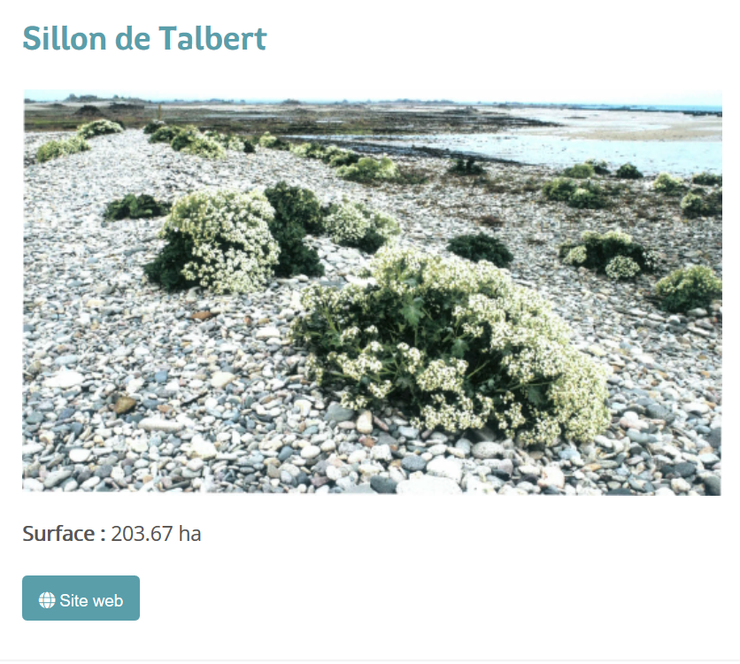

.. Authors :
.. mviewer team

.. _configtpl:

Configurer - Templates
=========================

Personnalisation de la fiche d'information

Pour les couches de type vecteur et WMS, il est possible de définir un template afin de formater côté client, la fiche d'information des entités sélectionnées.
Le moteur de template (logic less) utilisé est Mustache : https://github.com/janl/mustache.js

Exemple de template structuré
--------------------------------

.. code-block:: xml
       :emphasize-lines: 1,13,15,47
       :linenos:

        {{#features}}
            <li class="item">
                Exemple de formatage
                <h3 class="title-feature">{{nom}}</h3>
                 
                

                     <b> Surface : </b> {{surface}} ha  
                

                <a href="{{url}}" target="_blank" title="Lien site internet" class="but-link">
                      <b>Site Web</b>
                </a>
            </li>
        {{/features}}

        

Les éléments en rouge sont obligatoires.

Explications : ``{{#features}}{{/features}}`` est une boucle effectuée sur chaque entité présente dans la couche sélectionnée.
``<li class="item"></li>`` est une entrée de liste html utilisée par le mviewer. S'il y a plusieurs entrées de liste car plusieurs entités sélectionnées, le mviewer présentera les réponses sous la forme d'un carousel.

Ce qu'il faut savoir de Mustache
--------------------------------

- On fait référence à la valeur d'un champ de cette façon : ``{{champ}}``.
- Il est possible de gérer une absence de valeur ou une valeur false de cette façon :

.. code-block:: xml
       :linenos:

        {{#champ2}}
            Ce texte s'affiche si champ2 contient une valeur ou est différent de false.
        {{/champ2}}

La finalité du template est ici de fabriquer un contenu formaté HTML. L'ajout des balises <style> permet de personnaliser l'affichage du champ via du CSS. Exemple ici sur le formatage du texte et d'un bouton pour clic.

Pour aller plus loin sur la personnalisation, consulter les différentes documentation sur HTML et CSS.

Nous avons la possibilité d'injecter du code via la balise 

Les champs ``{{#fields_kv}}`` et ``{{serialized}}`` sont tous les deux virtuels : ils sont créés grâce à une fonctionnalité de Mustache permettant de `définir des champs comme des fonctions <https://github.com/janl/mustache.js#functions>`_.
S'ils ne sont pas utilisés, ils ne consomment pas de ressource.
Ils ont été `ajoutés aux champs simples <https://github.com/geobretagne/mviewer/pull/206/files>`_ afin de faciliter certains flux de traitement des données.

Appel depuis le XML
--------------------------------

Le template sera enregistré au format mst. Pour l'appeler dans la configuration mviewer au niveau de la layer, il faut le bon format ``infoformat="application/vnd.ogc.gml"`` et ajouter un appel au mst via une balise template au sein du layer ``<template url=""/>``.
