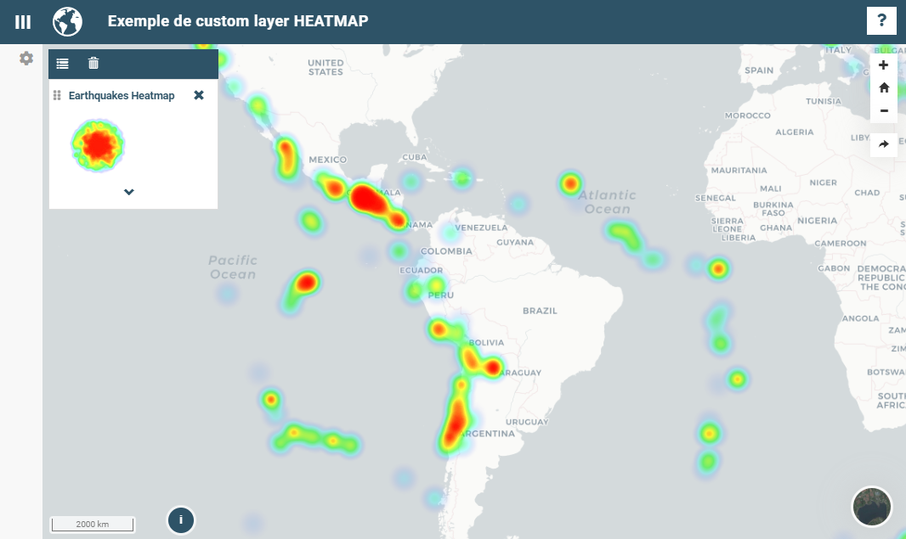
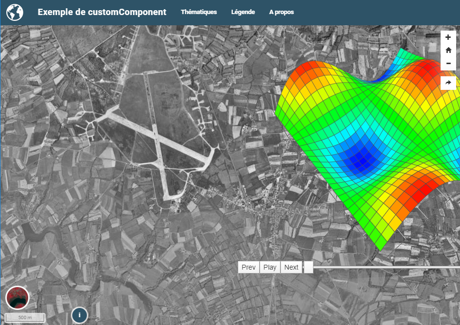

# Développer ses propres composants

Il est possible de développer 3 types de composants dans mviewer en
s'appuyant sur la le socle natif de mviewer et sans modification de son
coeur.

<table>
<caption>Title</caption>
<colgroup>
<col style="width: 25%" />
<col style="width: 25%" />
<col style="width: 25%" />
<col style="width: 25%" />
</colgroup>
<thead>
<tr class="header">
<th>Type</th>
<th>Portée</th>
<th>Affichage</th>
<th>Lien</th>
</tr>
</thead>
<tbody>
<tr class="odd">
<td>customLayer</td>
<td>couche identifiée par son id</td>
<td>Carte</td>
<td><code class="interpreted-text"
role="ref">détail&lt;customlayer&gt;</code></td>
</tr>
<tr class="even">
<td>customControl</td>
<td>couche identifiée par son id</td>
<td>Légende de la couche</td>
<td><code class="interpreted-text"
role="ref">détail&lt;customcontrol&gt;</code></td>
</tr>
<tr class="odd">
<td>customComponent</td>
<td><ul>
<li></li>
</ul></td>
<td><ul>
<li></li>
</ul></td>
<td><code class="interpreted-text"
role="ref">détail&lt;customcomponent&gt;</code></td>
</tr>
</tbody>
</table>

Title

<figure>

<figcaption aria-hidden="true">Exemple de customlayer
heatmap</figcaption>
</figure>

<figure>

<figcaption aria-hidden="true">Exemple de customcontrol
heatmap</figcaption>
</figure>

<figure>

<figcaption aria-hidden="true">Exemple de customcomponent
3d</figcaption>
</figure>

Note

Pour aller plus loin :

-   [Développer un customLayer](customlayer.md)
-   [Développer un customControl](customcontrol.md)
-   [Développer un Custom component](customcomponent.md)

