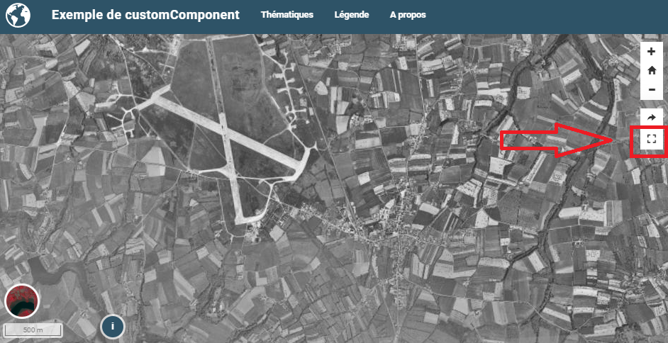

# Développer un Custom component



L'ojectif est ici de créer un bouton dont la fonction est d'afficher la
carte en mode "plein écran" en utilisant l'API HTML 5
`requestFullscreen`.

<div class="sidebar">

**Créez un répertoire avec :**

-   fichier HTML
-   fichier JavaScript
-   fichier de configuration
-   fichier de style

</div>

    / demo/addons
            │
            ├── fullscreen
            │      │
            │      ├── config.json
            │      ├── fullscreen.js
            │      ├── fullscreen.html
            │      ├── style.css

L'exemple complet est disponible sur
[github.](https://github.com/mviewer/mviewer/tree/develop/demo/fullscreen)

## Ecrire le code html

Le code html est la partie visible du composant. Le code HTML sera
intégré par mviewer et "dessiné" dans la `div` ciblée via le fichier
config.json. Dans le cas présent on créé un simple bouton avec une icône
**fontawesome** :

``` HTML
<a class="btn btn-default btn-raised" type="button" id="fullscreen-btn">
    <span class="fas fa-expand"></span>
</a>
```

## Ecrire le code javascript

Le code JavaScript est la partie logique de notre composant. Dans
l'exemple ci-dessous, on associe une fonction à l'évènement `click` du
bouton créé précédemment.

``` javascript
const fullscreen = (function() {

    var _btn;
    var _fullscreen = function (e) {
        document.getElementById("map").requestFullscreen();
    };

    return {

        init : function () {
            _btn = document.getElementById("fullscreen-btn");
            _btn.addEventListener('click', _fullscreen);
        }
    };

})();

new CustomComponent("fullscreen", fullscreen.init);
```

<div class="warning">

<div class="title">

Warning

</div>

Si on souhaite disposer d'un bloc de code publique, il faut remplacer la
ligne `const fullscreen = (function() {` par
`var fullscreen = (function() {`

</div>

## Ecrire le code CSS

Le code CSS permet d'affiner le style de notre bouton.

``` javascript
#fullscreen-btn {
    border-radius: 0px;
    padding: 5px 10px 5px 10px;
}
```

## Ecrire le config.json

Dans le fichier de configuration - **config.json** - , il faut
référencer toutes les ressources utiles. le paramètre `target` permet de
cibler la `div` dans laquelle le composant sera affiché.

``` JSON
{
    "js": ["fullscreen.js"],
    "css": "style.css",
    "html": "fullscreen.html",
    "target": "toolstoolbar"
}
```

## Ecrire le config.xml

Dans le fichier de configuration, il faut ajouter la ligne en
surbrillance.

``` XML
<extensions>
    <extension type="component" id="fullscreen" path="addons"/>
</extensions>
```

<div class="note">

<div class="title">

Note

</div>

Pour aller plus loin :

-   [Les fonctions publiques de mviewer](public_fonctions.md)

</div>
