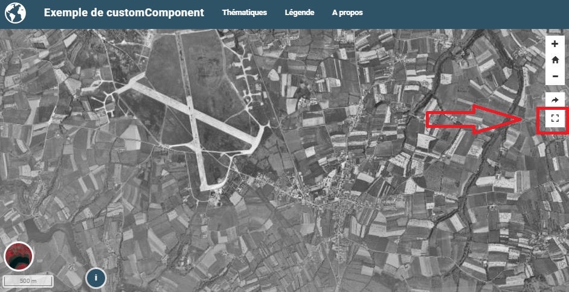

.. Authors :
.. mviewer team

.. _customcomponent:

Développer un Custom component
##############################

L'ojectif est ici de créer un bouton dont la fonction est d'afficher la carte en mode "plein écran" en utilisant l'API HTML 5 ``requestFullscreen``.

.. sidebar:: Créez un répertoire avec :

    - fichier HTML
    - fichier JavaScript
    - fichier de configuration
    - fichier de style

::

    / demo/addons
            │
            ├── fullscreen
            │      │
            │      ├── config.json
            │      ├── fullscreen.js
            │      ├── fullscreen.html
            │      ├── style.css

L'exemple complet est disponible sur `github. <https://github.com/mviewer/mviewer/tree/develop/demo/fullscreen>`_

Ecrire le code html
*******************

Le code html est la partie visible du composant. Le code HTML sera intégré par mviewer et "dessiné" dans la ``div`` ciblée via le fichier config.json.
Dans le cas présent on créé un simple bouton avec une icône **fontawesome** :

.. code-block:: HTML
    :caption: fullscreen.html

    <a class="btn btn-default btn-raised" type="button" id="fullscreen-btn">
        
    </a>

Ecrire le code javascript
*************************

Le code JavaScript est la partie logique de notre composant. Dans l'exemple ci-dessous, on associe une fonction à l'évènement ``click`` du bouton créé précédemment.

.. code-block:: javascript
    :caption: fullscreen.js
    :linenos:
    :emphasize-lines: 12

    const fullscreen = (function() {

        var _btn;
        var _fullscreen = function (e) {
            document.getElementById("map").requestFullscreen();
        };

        return {

            init : function () {
                _btn = document.getElementById("fullscreen-btn");
                _btn.addEventListener('click', _fullscreen);
            }
        };

    })();

    new CustomComponent("fullscreen", fullscreen.init);

.. WARNING:: Si on souhaite disposer d'un bloc de code publique, il faut remplacer la ligne
    ``const fullscreen = (function() {`` par ``var fullscreen = (function() {``

Ecrire le code CSS
******************

Le code CSS permet d'affiner le style de notre bouton.

.. code-block:: javascript
    :caption: style.css

    #fullscreen-btn {
        border-radius: 0px;
        padding: 5px 10px 5px 10px;
    }

Ecrire le config.json
*********************

Dans le fichier de configuration - **config.json** - , il faut référencer toutes les ressources utiles. le paramètre ``target`` permet de cibler la ``div`` dans laquelle le composant sera affiché.

.. code-block:: JSON
    :caption: config.json
    :emphasize-lines: 5

    {
        "js": ["fullscreen.js"],
        "css": "style.css",
        "html": "fullscreen.html",
        "target": "toolstoolbar"
    }

Ecrire le config.xml
********************

Dans le fichier de configuration, il faut ajouter la ligne en surbrillance.

.. code-block:: XML
    :caption: config.xml
    :emphasize-lines: 2

    <extensions>
        <extension type="component" id="fullscreen" path="demo/addons"/>
    </extensions>

.. Note::
    Pour aller plus loin :

    - :ref:`publicfonctions`