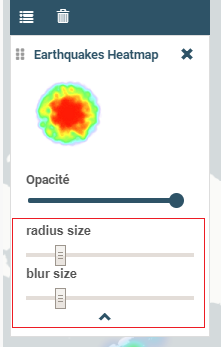

# Développer un customControl

Les **Customs Controls** permettent de créer des interactions entre
l'utilisateur et un layer. Si on souhaite créer une nouvelle
fonctionnalité en lien avec une couche particulière, c'est la solution à
privilégier. Le mécanisme de customControl permet le développement à
façon de solution nouvelle sans modifier le coeur de mviewer.

<div class="admonition">

Convention

Un custom control consiste en deux fichiers - **JavaScript** et
**HTML**. Ces deux fichiers doivent impérativement respecter la règle de
nommage suivante :

> -   **layerid**.html
> -   **layerid**.js
> -   *où layerid correspond à l'id du layer tel que définit dans le
>     config.xml.*
>
> L'emplacement de ces fichiers doit être précisé dans le config.xml
> avec le paramètre `customcontrolpath=""`

</div>

<div class="sidebar">

**Exemple :**

Le custom control - encadré rouge - s'affiche par défaut dans la légende
en dessous des attributions :

</div>



## Ecrire le code - html

Le bloc écrit en HTML s'affichera dans le panneau légende associé à la
couche. Il est possible de créer des éléments HTML qui permettront à
l'utilisateur d'interagir avec la couche associée. Dans l'exemple
suivant, on affiche deux sliders qui vont nous permettre de modifier
dynamiquement l'affichage de notre couche.

``` HTML
<form>
    <label>radius size</label>
    <input id="heatmap-radius" class="" type="range" min="1" max="50" step="1" value="10"/>
    <label>blur size</label>
    <input id="heatmap-blur" type="range" min="1" max="50" step="1" value="10"/>
</form>
```

*Tooltip*

Si vous souhaitez utiliser une infobulle (tooltip), vous pouvez utiliser
les paramètres <span class="title-ref">title</span> et <span
class="title-ref">tooltip</span> :

``` HTML
<button tooltip="top,hover,true,body,mviewer.templates.tooltip" title="Déplacement en voiture">
```

| Paramètre | Description                                 | Exemple                                                                                                        |
|-----------|---------------------------------------------|----------------------------------------------------------------------------------------------------------------|
| tooltip   | Permet de définir les options de la tooltip | \<placement - string\>, \<trigger - string\>, \<html - boolean\>, \<container - string\>, \<template, string\> |
| title     | Texte affiché                               | title='Déplacement en voiture'                                                                                 |

Paramètres à utiliser :

## Ecrire le code - JavaScript

### Ancienne méthode

La ligne 2 surlignée indique la notation propre à l'ancienne méthode.

``` javascript
const layerid = "heatmap";
mviewer.customControls[layerid] = (function() {

    /*
    * Private
    */

    var _initialized = false;

    var _layer;

    var _blurElement = false;

    var _radiusElement = false;

    var _blurHandler = function(e) {
        _layer.setBlur(parseInt(e.target.value, 10));
    };

    var _radiusHandler = function(e) {
        _layer.setRadius(parseInt(e.target.value, 10));
    };

    return {
        /*
        * Public
        */

        init: function () {
            // mandatory - code executed when layer is added to legend panel
            if (!_initialized) {
                _layer = mviewer.getLayer(layerid).layer;
                _blurElement = document.getElementById('heatmap-blur');
                _radiusElement = document.getElementById('heatmap-radius');
                if (_blurElement && _radiusElement) {
                    _blurElement.addEventListener('change', _blurHandler);
                    _radiusElement.addEventListener('change', _radiusHandler);
                    _initialized = true;
                }

            }
        },

        destroy: function () {
            // mandatory - code executed when layer panel is closed
            _initialized = false;
        }
    };

}());
```

### Nouvelle méthode

Depuis la version **3.2** de mviewer, une classe `CustomControl` a été
développée afin de faciliter la saisie de nouveaux customControls. Les 2
lignes surlignées (2, 51) indiquent les lignes modifiées par rapport à
l'ancienne méthode.

``` javascript
const layerid = "heatmap";
const cc = (function() {

    /*
    * Private
    */

    var _initialized = false;

    var _layer;

    var _blurElement = false;

    var _radiusElement = false;

    var _blurHandler = function(e) {
        _layer.setBlur(parseInt(e.target.value, 10));
    };

    var _radiusHandler = function(e) {
        _layer.setRadius(parseInt(e.target.value, 10));
    };

    return {
        /*
        * Public
        */

        init: function () {
            // mandatory - code executed when layer is added to legend panel
            if (!_initialized) {
                _layer = mviewer.getLayer(layerid).layer;
                _blurElement = document.getElementById('heatmap-blur');
                _radiusElement = document.getElementById('heatmap-radius');
                if (_blurElement && _radiusElement) {
                    _blurElement.addEventListener('change', _blurHandler);
                    _radiusElement.addEventListener('change', _radiusHandler);
                    _initialized = true;
                }

            }
        },

        destroy: function () {
            // mandatory - code executed when layer panel is closed
            _initialized = false;
        }
    };

}());
new CustomControl(layerid, cc.init, cc.destroy);
```

<div class="warning">

<div class="title">

Warning

</div>

Si on souhaite disposer d'un bloc de code public, il faut remplacer la
ligne `const cc = (function() {` par `var cc = (function() {`

</div>

## Ecrire le config.xml

Dans le fichier de configuration, à partir de l'exemple customLayer
**heatmap**, il faut ajouter les 3 lignes mises en surbrillance.

``` XML
<layer id="heatmap"
    name="Earthquakes Heatmap"
    visible="true"
    url="demo/heatmap/customlayer.js"
    queryable="true"
    type="customlayer"
    customcontrol="true"
    customcontrolpath="demo/heatmap/control"
    legendurl="demo/heatmap/legend.png"
    opacity="1"
    expanded="true"
    attribution=""
    metadata=""
    metadata-csw="">
</layer>
```

<div class="note">

<div class="title">

Note

</div>

Pour aller plus loin :

-   [Appronfondir - Custom Control](customcontrol_dev.md)
-   [Les fonctions publiques de mviewer](public_fonctions.md)

</div>
