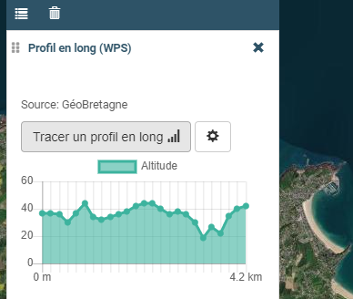

.. Authors :
.. mviewer team
.. Sébastien FOUCHEUR

.. _customcontroldev:

Appronfondir - Custom Control
=============================

Les **Customs Controls** permettent de personnaliser la représentation et les interactions que l'on a avec les layers de façon plus avancée que ce que
l'on peut faire avec le fichier de configuration XML.

Voici un exemple, le custom control s'affiche dans la légende en dessous des attributions :

Première méthode : Définition Simple (CustomControl)
----------------------------------------------------------

Cette méthode permet de créer des customs controls plus simples qu'avec la deuxième méthode mais permet moins de personnalisation.

Dans ce cas précis on utilise la classe de base ``CustomControl`` dans le fichier ``custom.js``.

La classe possède une méthode ``constructor()`` qui prend en paramètre les méthodes ``init()`` et ``destroy()`` que l'on peut définir dans le fichier JavaScript (dans cet exemple ``moncontrol.js``)
présent dans l'arborescence suivante::

    /apps
        ├── ma_carte1
        │   ├── addons
        │   │   ├── couche1
        │   │   │   ├── control
        │   │   │   │   ├── moncontrol.html
        │   │   │   │   └── moncontrol.js
        │   │   │   └── layer
        │   │   └── couche2
        │   │       ├── control
        │   │       └── layer
        │   ├── data
        │   ├── css
        │   ├── sld
        │   ├── img
        │   ├── templates
        │   └── ma_carte1.xml
        └── ma_carte2

Pour cela il faut donc définir les deux fonctions en les déclarant avec le mot-clé **const** pour les rendre inaccessibles depuis le reste de l'application indépendamment du custom control dans lequel elles
sont définies, puis il faudra les donner en paramètre à la classe ``CustomControl`` vue plutôt.

.. code-block:: javascript
  :linenos:

    const init = function() {
    // Obligatoire - code exécuté quand le panel est ouvert
    // Votre code ici
    ...

    };

    const destroy =  function() {
        // Obligatoire - code exécuté quand le panel se ferme
        // Votre code ici
        ...
    }
    // Initialiser l'objet avec les fonctions init() et destroy() et l'id de couche "monControl".
    new CustomControl("monControl", init, destroy);

Ajouter des fonctions et des variables
~~~~~~~~~~~~~~~~~~~~~~~~~~~~~~~~~~~~~~

Une **fonction/variable privée** ne sera pas accessible en dehors du code de la classe alors qu’une **fonction/variable publique** sera accessible depuis n’importe où ce qui peut entrainer des conflits avec d’autres fonctions/variables
de l’application si l’on ne fait pas attention.

Pour les variables et fonctions de classe publique
**************************************************

Il faut définir un nouvel attribut pour la classe ``CustomControl`` de la manière suivante :

.. code-block:: javascript
  :linenos:

    ...
    // Initialiser l'objet avec les fonctions init() et destroy() et l'id de couche "monControl".
    var monControl = new CustomControl("monControl", init, destroy);

    // Une fois créer on peut ajouter des propriétés (une propriété peut être une fonction ou une variable)

    // Ajouter une fonction
    monControl.maNouvelleFonction = function(){
        // Votre Code ici
        ...
    }

    // Ajouter une variable
    monControl.maNouvelleVariable = "je suis un exemple";

Ces attributs seront alors publics et accessibles depuis l'éxterieur.

Deuxième méthode : Création d'une sous-classe (AdvancedCustomControl)
---------------------------------------------------------------------

Cette méthode est la plus complète des deux et permet de créer des customs controls plus poussés.

Tous les Custom Control ont une base commune dans le fichier ``custom.js`` où est définie la classe ``AdvancedCustomControl``.

Pour utiliser cette classe il faut modifier le fichier Javascript (dans cet exemple ``moncontrol.js``) présent dans l'arborescence suivante::

    /apps
        ├── ma_carte1
        │   ├── addons
        │   │   ├── couche1
        │   │   │   ├── control
        │   │   │   │   ├── moncontrol.html
        │   │   │   │   └── moncontrol.js
        │   │   │   └── layer
        │   │   └── couche2
        │   │       ├── control
        │   │       └── layer
        │   ├── data
        │   ├── css
        │   ├── sld
        │   ├── img
        │   ├── templates
        │   └── ma_carte1.xml
        └── ma_carte2

Ce fichier définit une classe qui étend (est un héritier de la classe) la classe ``AdvancedCustomControl`` :

.. code-block:: javascript
  :linenos:

    // Classe qui étend la classe abstraite et décrit le custom Control
    class MonControl extends AdvancedCustomControl {
        constructor(id) {
            // Initialise l'id de l'objet avec le constructeur parent
            super(id);
        }
        // Obligatoire - ce code est exécuté lors de l'ouverture du panel
        init() {
            // Votre code ici
            ...
        }
        // Obligatoire - ce code est exécuté lors de la fermeture du panel
        destroy() {
            // Votre code ici
            ...
        }
    }

La classe ``AdvancedCustomControl`` étant **abstraite** cela signifie qu'elle nous oblige à redéfinir les fonctions ``init()`` et ``destroy()`` qui sont obligatoires sinon elle nous renvoie une erreur.

De plus la fonction ``constructor(id)`` permet à l'objet d'être initialisé avec la valeur **id (obligatoire)** lors de la création d'un **objet MonControl**.

Pour créer cet objet et le rendre disponible au reste de l'application il faut rajouter le code suivant :

.. code-block:: javascript
  :linenos:

    // Créer l'objet MonControl avec l'id 'monControl' qui est le nom de la couche
    new MonControl("monControl");

----

Ajouter des fonctions
~~~~~~~~~~~~~~~~~~~~~

Pour empêcher de potentiels téléscopage de variables ou de méthodes on peut ajouter à la classe ``MonControl`` (vue dans les parties précendentes) des fonctions privées ou publiques.

Une fonction privée ne sera pas accessible en dehors du code de la classe alors qu'une fonction publique sera accessible depuis n'importe où ce qui peut entrainer des conflits avec d'autres fonctions
de l'application si l'on ne fait pas attention.

Pour une fonction publique
**************************

Directement en ajoutant dans le code de la classe ``MonControl`` :

.. code-block:: javascript
  :linenos:

    // Classe qui étend la classe abstraite et décrit le custom Control
    class MonControl extends AdvancedCustomControl {
        ...
        maFonctionPublique(){
            // Votre code ici
            ...
        }
    }
    // Créer l'objet control avec l'id 'monControl' qui est le nom de la couche
    new MonControl("monControl");

Cette fonction sera appelable grâce à ``monobjet.maFonctionPublique()`` et l'on peut bien sûr y passer des paramètres.

Pour une fonction privée
************************

En dehors du code de la classe ``MonControl`` et en la déclarant comme une ``constante`` :

.. code-block:: javascript
  :linenos:

    // Fonction privée non utilisable en dehors de ce code
    const maFonctionPrivée = function(){
        // Votre code ici
        ...
    }
    // Classe qui étend la classe abstraite et décrit le custom Control
    class MonControl extends AdvancedCustomControl {
        ...
        maFonctionPublique(){
            maFonctionPrivée();
            // Votre code ici
            ...
        }
    }
    // Créer l'objet control avec l'id 'monControl' qui est le nom de la couche
    new MonControl("monControl");

Cette fonction sera appelable grâce à ``maFonctionPrivée()`` seulement dans ce bout de code et donc on peut par exemple l'utiliser dans une fonction publique (ici ``maFonctionPublique()``).

Ajouter des variables
~~~~~~~~~~~~~~~~~~~~~

Pour empêcher de potentiels bugs on peut ajouter à la classe ``MonControl`` (vue dans les parties précendentes) des variables de classe privée ou publique.

Une variable de classe privée ne sera pas accessible en dehors du code de la classe alors qu'une variable de classe publique sera accessible depuis n'importe où ce qui peut entrainer des bugs (modification involontaire de celle-ci)
si l'on ne fait pas attention.

Pour une variable de classe publique
************************************

Pour ajouter une variable de classe publique il faut juste ajouter une propriété à l'objet :

.. code-block:: javascript
  :linenos:

    // Classe qui étend la classe abstraite et décrit le custom Control
    class MonControl extends AdvancedCustomControl {
        constructor(id,maVariablePublique){
            // Initialise l'id de l'objet avec le constructeur parent
            super(id);
            // Initialiser maVariablePublique
            this.maVariablePublique = maVariablePublique
            ...
        }
        ...
    }
    // Initialiser l'objet avec la chaine de caractères "maVariablePublique" dans la variable de classe publique maVariablePublique et l'id de couche "monControl".
    new MonControl("monControl","maVariablePublique");

Cette variable est accessible à partir du moment où l'on accède à l'objet (dans le navigateur par exemple).

Si on ne souhaite pas forcément donner une valeur à ``maVariablePublique`` on peut déclarer une valeur par défaut en spécifiant une valeur dans les paramètres de la fonction ``constructor()`` :

.. code-block:: javascript
  :linenos:

    // Classe qui étend la classe abstraite et décrit le custom Control
    class MonControl extends AdvancedCustomControl {
        // Fonction avec un paramètre ayant une valeur par défaut
        constructor(id,maVariablePublique = "valeurParDefaut"){
            // Initialise l'id de l'objet avec le constructeur parent
            super(id);
            // Initialiser maVariablePublique
            this.maVariablePublique = maVariablePublique
            ...
        }
        ...
    }
    // Initialiser l'objet avec la chaine de caractères par défaut "valeurParDefaut" dans la variable de classe publique maVariablePublique et l'id de couche "monControl".
    new MonControl("monControl");

La valeur de ``maVariablePublique`` sera toujours **"valeurParDefaut"** tant que vous ne spécifiez pas d'autres valeurs.

Pour une variable de classe privée
**********************************

.. Attention:: La syntaxe suivante ne fonctionne que sur Chrome pour les autres navigateurs remplacez le "**#**" par un "**_**" et vous n'aurez plus besoin de déclarer la variable.

Pour ajouter une variable de classe privée il faut ajouter le **"#"** avant le nom de la variable et la déclarer avant la fonction ``constructor()`` :

::

    // Classe qui étend la classe abstraite et décrit le custom Control
    class MonControl extends AdvancedCustomControl {
        // Déclaration de la variable Privée
        #maVariablePrivee;
        constructor(id,maVariablePrivee = "valeurParDefaut"){
            // Initialise l'id de l'objet avec le constructeur parent
            super(id);
            // Initialiser #maVariablePrivee
            this.#maVariablePrivee = maVariablePrivee
            ...
        }
        ...
    }
    // Initialiser un objet avec la chaine de caractères "maVariablePrivee" dans la variable de classe privée #maVariablePrivee et l'id de couche "monControl".
    new MonControl("monControl","maVariablePrivee");

Si vous voulez quand même pouvoir accéder et modifier la valeur de cette variable en dehors de ce code mais de manière plus sécurisée, il faut déclarer une fonction ``get()`` pour récupérer la valeur et une fonction
``set(valeur)`` pour la modifier :

::

    // Classe qui étend la classe abstraite et décrit le custom Control
    class MonControl extends AdvancedCustomControl {
        // Déclaration de la variable Privée
        #maVariablePrivee;
        constructor(id,maVariablePrivee = "valeurParDefaut"){
            // Initialise l'id de l'objet avec le constructeur parent
            super(id);
            // Initialiser #maVariablePrivee
            this.#maVaribalePrivée = maVariablePrivee
            ...
        }
        // Fonction pour récupérer la valeur de #maVariablePrivee
        getMaVariablePrivee(){
            return this.#maVariablePrivee;
        }
        // Fonction pour modifier la valeur de #maVariablePrivee
        setMaVariablePrivee(valeur){
            this.#maVariablePrivee = valeur;
        }
    }
    // Initialiser un objet avec la chaine de caractères "maVariablePrivee" dans la variable de classe privée #maVariablePrivee et l'id de couche "monControl".
    new MonControl("monControl","maVariablePrivee");

Interactions customLayer et mviewer
-----------------------------------

Depuis le customControl il est possible de communiquer et d'interagir avec la carte et d'une façon plus générale avec mviewer.
Vous pouvez ainsi mobiliser toutes les méthodes publiques dans votre développement.
Pour en savoir plus, consultez, dans la documentation développeur, la partie ":ref:`publicfonctions`".
