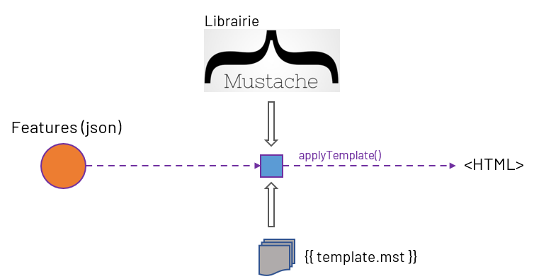

.. Authors :
.. mviewer team

.. _customlayertemplate:

Custom layer et manipulation des templates Mustache
###################################################

.. warning::
    Niveau nécessaire : Avancé

Cette section vous permettra de :

* comprendre le fonctionnement technique des templates dans mviewer
* être en mesure d'adapter un custom layer pour manipuler et personnaliser le template
* être autonome sur la correction des erreurs entre le custom layer et le template Mustache

Prérequis
----------

- Connaissances en JavaScript 
- Maîtriser le fonctionnement des ``custom layer`` et des templates
- Connaître le fonctionnement de ``Mustache.js``

Des sections de la documentation sont dédiées à ces thématiques si vous avez besoin d'en savoir plus.
Voici un `rappel sur Mustache.js <https://zetcode.com/javascript/mustache/>`_.

Rappels sur le fonctionnement des templates
--------------------------------------------

Les templates `Mustache <https://mustache.github.io/>`_ (format .mst) permettent d'afficher de façon standard ou personnalisée les informations d'une entité géographique visible sur la carte.
L'utilisateur cliquera alors sur la carte pour avoir des informations sur l'entité ciblée.

Au clic, `le code mviewer <https://github.com/mviewer/mviewer/blob/master/js/info.js#L304>`_ réalise une requête (`getFeatureInfo <https://docs.geoserver.org/stable/en/user/services/wms/reference.html#getfeatureinfo>`_) vers le serveur cartographique utilisé (ex. geoserver) afin d'interroger la couche et obtenir les informations sur les entités localisées sous le clic.

.. note::
    Les templates utilisés sont localisés dans le `fichier mviewer/js/templates.js <https://github.com/mviewer/mviewer/blob/master/js/templates.js>`_.

Si le résultat de la requête contient bien des informations à afficher, alors les informations seront intégrées par `ce code mviewer <https://github.com/mviewer/mviewer/blob/d862151406effda754999aed570d71fdcf923889/js/info.js#L726>`_ dans le template à droite (right-panel) ou en bas (bottom-panel) au format HTML. C'est via la librairie Mustache.js que nous obtenons du HTML à partir d'un template (.mst) et d'information JSON.

Limite avec un custom layer
----------------------------

Il est possible que le template à afficher se base sur des informations (``JSON``) qui ne sont pas fournies par les informations fournies par le serveur cartographique.
C'est le cas par exemple si vous récupérez des données statistiques et que vous souhaitez afficher des données agrégées ou calculées.

Vous rencontrerez ce problème si vous utilisez une représentation type cluster comme `ici <https://github.com/mviewer/mviewer/blob/master/customlayers/cluster.js>`_.

Vous devrez donc organiser avec le JavaScript les informations ``JSON`` à fournir au template .mst afin de l'afficher correctement.

Pour réaliser cette manipulation de données et préparer le ``JSON`` à fournir au template, vous pouvez ajouter du JavaScript dans le template via la balise HTML <script>.
Cette solution rajoute de la complexité dans le code et alourdir considérablement le fichier .mst.

Une autre solution éxiste via l'utilisons d'une fonction personnalisée que nous allons expliquer dans la section suivante.

Utilisation d'une fonction personnalisée
----------------------------------------

Ce type de fonction permet de manipuler librement les données que l'on va fournir au template Mustache et qui seront affichées par la suite lors d'un clic sur un objet de la carte.

Cette méthode est très utile pour :

- Afficher les informations d'un cluster (car on cherche à afficher les features qui sont dans la feature Cluster).
- Créer un mustache simple à partir d'informations complexes qui doivent être agrégées par le custom layer.
- Conserver le code JavaScript dans le custom layer pour alléger le fichier .mst.

Vous trouverez ici un (`exemple avec un cluster <https://github.com/mviewer/mviewer/blob/master/customlayers/cluster.js#L87>`_) native dans mviewer.

Exemple d'utilisation
----------------------

Voici un exemple de méthode (``handle``) pour manipuler les informations au sein d'une ou plusieurs features afin de les afficher dans le template mustache dédié :

.. code-block:: javascript
  :linenos:

    /**
    * Obligatoire pour que le template mustache fonctionne avec les clusters
    * @param {Array} clusters 
    * @param {Object} views 
    */
    const _handle = function(clusters, views) {
        if (clusters.length > 0) {
        var l = mviewer.getLayer("myclusterlayerid");
        var elements = [];
        var html;
        var panel = "";
        // ici on parcours toutes les features pour accéder au contenu et manipuler les propriétés
        // on pourra par exemple rajouter pour une entité de nouveaux attributs ou d'autres données supplémentaires
        clusters.forEach(c => {
            // ICI ON CREER MANUELLEMENT LES FEATURES POUR MUSTACHE ET LE TEMPLATE POUR V3.5 ET ANTERIEUR
            if (c?.properties) {
                // v<3.5
                elements = elements.concat(
                    c.properties.features.map(d => 
                        ({
                            properties: d.getProperties()
                        })
                    )
                )
            } else {
                // v>=3.5
                elements = elements.concat(
                    c?.getProperties()?.features || c.properties.features
                );
            }
        })
        // Création du HTML à partir du template et des features issues de la manipulation des données
        if (l.template) {
            html = info.templateHTMLContent(elements, l);
        } else {
            html = info.formatHTMLContent(elements, l);
        }
        // force l'affichage selon le mode mobile ou desktop
        if (configuration.getConfiguration().mobile) {
            panel = "modal-panel";
        } else {
            panel = "right-panel"
        }
        var view = views[panel];
        view.layers.push({
            "id": view.layers.length + 1,
            "firstlayer": true,
            "manyfeatures": (elements.length > 1),
            "nbfeatures": elements.length,
            "name": l.name,
            "layerid": "myclusterlayerid",
            "theme_icon": l.icon,
            "html": html
        });
        }
    };
    // déclarer la fonction _handle pour ce custom layer à sa création
    new CustomLayer(ID_LAYER, layer, null, _handle);

Notez donc que vous pouvez modifier les propriétés d'une feature avec cette solution ou que vous pouvez totalement créer un nouveau JSON à donner en paramètre d'entrée du template.

Pour rajouter un attribut ``randomValue`` supplémentaire nous aurions donc pu utiliser quelque chose comme : 

.. code-block:: javascript
  :linenos:

    elements = elements.concat(
        c.properties.features.map(d => 
            ({
                properties: {
                    ...d.getProperties(),
                    randomValue: math.random()
                }
            })
        )
    )

L'attribut ``randomValue`` serait alors utilisable dans le template.mst via ``{{randomValue}}``.