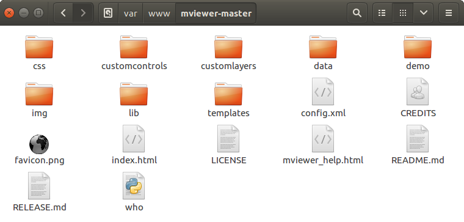
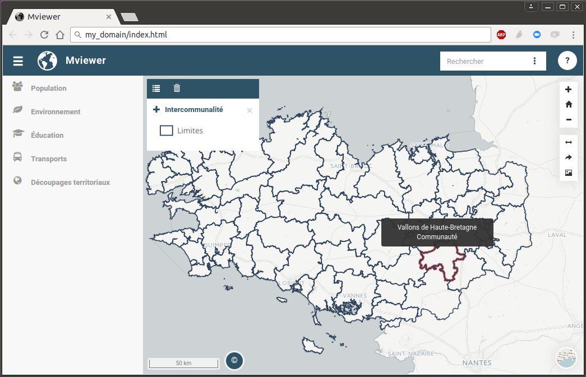

.. Authors :
.. mviewer team
.. Gwendall PETIT (Lab-STICC - CNRS UMR 6285 / DECIDE Team)

.. _deploy:

Installer MVIEWER
#################

Mviewer est une application web développée en HTML / CSS / JAVASCRIPT. Elle nécessite simplement d'être déployée sur un serveur WEB qui peut être APACHE, NGINX, TOMCAT...

Avec un serveur web Apache
**************************

.. WARNING:: Prérequis : disposer d'une instance **Apache**

Clonage des sources et déploiement
===================================

L'objectif est de copier les sources depuis github.com dans le répertoire web d'Apache.

Avec git
----------

Dans un terminal, après vous être placé dans le dossier web Apache, exécuter la commande **git** suivante.

.. code-block:: bash

	git clone https://github.com/geobretagne/mviewer.git

Sans git
----------

Télécharger ce `fichier zip <https://github.com/geobretagne/mviewer/archive/master.zip>`_ présent sur la page d'accueil du dépôt mviewer sur GitHub : https://github.com/geobretagne/mviewer

Dézipper le contenu du  zip dans le dossier web Apache **/var/www/** *(ou autres dossiers de déploiement Apache)*.

Test navigateur
=================

Une fois déployée, l'application est accessible dans le navigateur internet en saisissant l'URL http://nom_du_serveur/nom_du_mviewer/demo/

exemples :

 - http://localhost/mviewer/demo/
 - http://localhost/miewer-master/demo/index.html

En lançant l'application racine  **index.html**, vous avez maintenant un visualiseur géographique fonctionnel avec les couches de la Région Bretagne *(configuration par défaut disponible dans apps/default.xml)*.

Avec Docker
***********

.. WARNING:: Prérequis : disposer de **docker**

mviewer en mode standalone
===================================

C'est la solution la plus simple. Il est ainsi possible de lancer mviewer et de visualiser toutes les démos disponibles dans l'application.
Ce mode ne convient pas pour effectuer ses propres applications mviewer.

.. code-block:: bash

    #Récupérer la dernière image buildée de mviewer
    docker pull mviewer/mviewer
    #Lancer le container docker mviewer
    docker run --rm -p80:80 mviewer/mviewer

mviewer et un dossier d'applications
========================================

C'est la solution à privilégier pour créer ses propres applications. En parallèle de mviewer, un dossier web **apps** (volume) est monté. Ce dossier web contient vos applications mviewer ainsi que les ressources nécessaires.

.. code-block:: bash

    # Lancer le container mviewer + le répertoire web apps qui pointe vers
    # /chemin/vers/repertoire_de_configurations_xml
    docker run --rm -p80:80 \
        -v/chemin/vers/repertoire_de_configurations_xml:/usr/share/nginx/html/apps \
        mviewer/mviewer

mviewer avec docker-compose
================================

Cette solution permet de mettre en place les mêmes possibilités que la méthode précédante (mviewer + volume d'applications) en utilisant docker-compose et deux fichiers de paramétrage

.. WARNING:: Prérequis : disposer de **docker** et **docker-compose**

1. Création du fichier environemment

.. code-block:: bash
    :caption: .env

    APPSPATH=/home/prod/mviewer-apps

2. Création du fichier de configuration

.. code-block:: yaml
    :caption: docker-compose.yml

    version: '3.2.1'
    services:
      mviewer:
        container_name: mviewer
        build: .
        ports:
          - "80:80"
        image: mviewer/mviewer
        volumes:
          - '${APPSPATH}:/usr/share/nginx/html/apps'

3. Lancer mviewer

.. code-block:: bash

    docker pull mviewer/mviewer
    docker-compose up

Test navigateur
=================

Une fois déployée, l'application est accessible dans le navigateur internet en saisissant l'URL http://nom_du_serveur/demo/

exemples :

 - http://localhost/demo/
 - http://localhost/index.html
 - http://localhost/?config=apps/default.xml

Configuration et adaptations
****************************

Si vous souhaitez publier vos propres couches/thèmes ou bien ajouter/supprimer certaines fonctionnalités, veuillez consulter la page ":ref:`configxml`".