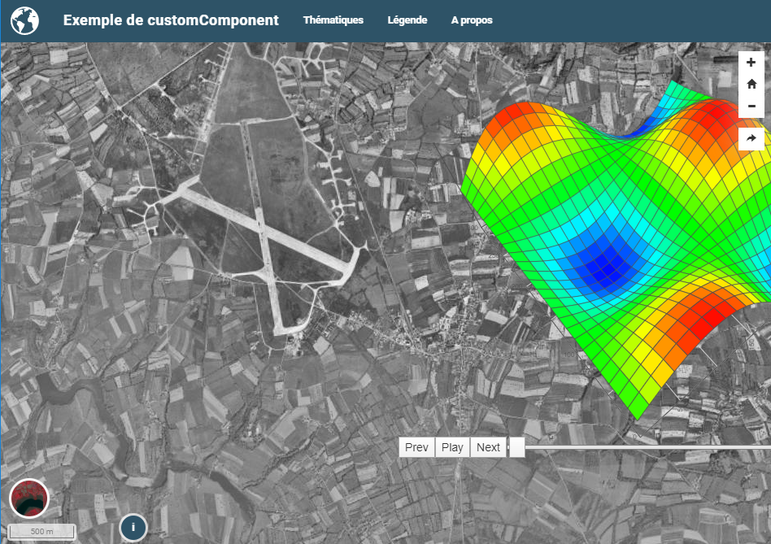

.. Authors :
.. mviewer team

.. _custom:

*********************************
Développer ses propres composants
*********************************

Il est possible de développer 3 types de composants dans mviewer en s'appuyant sur la le socle natif de mviewer et sans modification de son coeur

.. list-table:: Title
   :widths: 25 25 25 25
   :header-rows: 1

   * - Type
     - Portée
     - Affichage
     - Lien
   * - customLayer
     - couche identifiée par son id
     - Carte
     - :ref:`détail<customlayer>`
   * - customControl
     - couche identifiée par son id
     - Légende de la couche
     - :ref:`détail<customcontrol>`
   * - customComponent
     -  -
     -  -
     - :ref:`détail<customcomponent>`

.. figure:: ../_images/develop/customlayer.png
    :align: center
    :alt: Exemple de customlayer heatmap
    :figclass: align-center

    Exemple de customlayer heatmap

.. figure:: ../_images/develop/customcontrol_ihm.png
    :align: center
    :alt: Exemple de customcontrol heatmap
    :figclass: align-center

    Exemple de customcontrol heatmap

    Exemple de customcomponent 3d

.. Note::
    Pour aller plus loin :

    - :ref:`customlayer`
    - :ref:`customcontrol`
    - :ref:`customcomponent`
