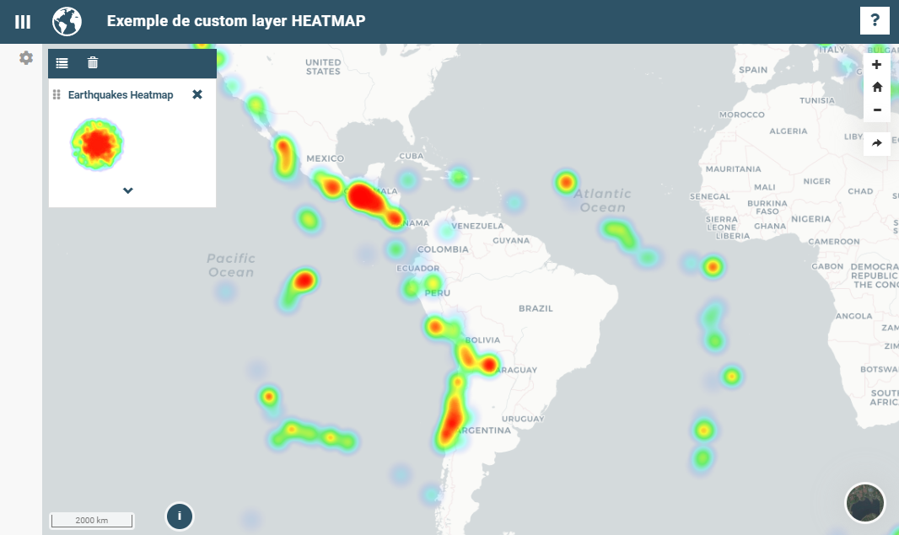

.. Authors :
.. mviewer team

.. _customlayer:

Développer un customLayer
#########################

L'ojectif est ici de créer une couche personnalisée de type ``heatmap`` à partir d'un fichier **KML** en utilisant la librairie ``Openlayers`` et en s'inspirant de cet `exemple. <https://openlayers.org/en/latest/examples/heatmap-earthquakes.html>`_  Avant tout, il faut préparer la structure de fichiers qui convient.

.. sidebar:: Créez un répertoire avec :

    - fichier image pour la légende
    - fichier de configuration
    - fichier customlayer
    - les données

::

    / demo
    │
    ├── heatmap
    │      │
    │      ├── config.xml
    │      ├── customlayer.js
    │      ├── legend.png
    │      ├── data
    │      │     ├── 2012_Earthquakes_Mag5.kml
    |

L'exemple complet est disponible sur `github. <https://github.com/geobretagne/mviewer/tree/develop/demo/heatmap>`_

Ecrire le customLayer
*********************

.. Tip::
   L'ancienne méthode fonctionne toujours mais est plus verbeuse que la nouvelle. Les 3 lignes mises en surbrillance sont remplacées par une seule ligne,
   également mise en surbrillance, dans la nouvelle version.

Ancienne méthode
==================

.. code-block:: javascript
    :caption: customlayer.js
    :linenos:
    :emphasize-lines: 2,4,22

    //Layerid is the same than the layerid in config.xml
    const layerid = "heatmap";
    //Create customlayer object
    mviewer.customLayers[layerid] = {};
    //Create Openlayers heatmap layer
    const layer = new ol.layer.Heatmap({
        source: new ol.source.Vector({
            url: 'demo/heatmap/data/2012_Earthquakes_Mag5.kml',
            format: new ol.format.KML({
                extractStyles: false
            })
        }),
        blur: 10,
        radius: 10,
        weight: function(feature) {
            var name = feature.get('name');
            var magnitude = parseFloat(name.substr(2));
            return magnitude - 5;
        }
    });
    // Set the openlayers layer to the customLayer object layer
    mviewer.customLayers[layerid].layer = layer;

Nouvelle méthode
==================

Depuis la version **3.2** de mviewer, une classe ``CustomLayer`` a été développée afin de faciliter la saisie de nouveaux customLayers

.. code-block:: javascript
    :caption: customlayer.js
    :linenos:
    :emphasize-lines: 16

    const layer = new ol.layer.Heatmap({
        source: new ol.source.Vector({
            url: 'demo/heatmap/data/2012_Earthquakes_Mag5.kml',
            format: new ol.format.KML({
                extractStyles: false
            })
        }),
        blur: 10,
        radius: 10,
        weight: function(feature) {
            var name = feature.get('name');
            var magnitude = parseFloat(name.substr(2));
            return magnitude - 5;
        }
    });
    new CustomLayer('heatmap', layer);

Ecrire le config.xml
*********************

Dans le fichier de configuration, il faut reprendre l'id du customlayer ``id="heatmap"``,  préciser ``type="customlayer"`` ainsi que l'URL du fichier ``url="demo/heatmap/customlayer.js"``

.. code-block:: XML
    :caption: config.xml
    :emphasize-lines: 1,4,7

    <layer id="heatmap"
        name="Earthquakes Heatmap"
        visible="true"
        type="customlayer"
        legendurl="demo/heatmap/legend.png"
        opacity="1"
        url="demo/heatmap/customlayer.js"
        attribution=""
        metadata=""
        metadata-csw="">
    </layer>

Exemples de customLayers
*************************

En respectant les consignes détaillées plus haut, voici quelques exemples prêts à l'emploi.

customlayer ArcGis REST Feature
================================

.. code-block:: javascript
    :caption: test_esri_college_80.js - ancienne version
    :linenos:

    {
        mviewer.customLayers.test_esri_college_80 = {};

        var esrijsonFormat = new ol.format.EsriJSON();

        mviewer.customLayers.test_esri_college_80.layer = new ol.layer.Vector({
            source: new ol.source.Vector({
                url: 'https://services2.arcgis.com/aYGUaoapooTe49i1/arcgis/rest/services/COLLEGES_PUBLICS_avec_Liens/FeatureServer/0/query?where=&objectIds=&time=&geometry=154415%2C6384802%2C345565%2C6494181&geometryType=esriGeometryEnvelope&inSR=3857&spatialRel=esriSpatialRelIntersects&resultType=none&distance=0.0&units=esriSRUnit_Meter&returnGeodetic=false&outFields=*&returnGeometry=true&featureEncoding=esriDefault&multipatchOption=xyFootprint&maxAllowableOffset=&geometryPrecision=&outSR=2154&datumTransformation=&applyVCSProjection=false&returnIdsOnly=false&returnUniqueIdsOnly=false&returnCountOnly=false&returnExtentOnly=false&returnQueryGeometry=false&returnDistinctValues=false&cacheHint=false&orderByFields=&groupByFieldsForStatistics=&outStatistics=&having=&resultOffset=&resultRecordCount=&returnZ=false&returnM=false&returnExceededLimitFeatures=true&quantizationParameters=&sqlFormat=none&f=pjson&token=',
                format: esrijsonFormat
            }),
            style: new ol.style.Style({
                image: new ol.style.Circle({
                    fill: new ol.style.Fill({
                        color: 'rgba(255, 118, 117,1.0)'
                    }),
                    stroke: new ol.style.Stroke({
                        color: "#ffffff",
                        width: 4
                    }),
                    radius: 9
                })
            })
        });
        mviewer.customLayers.test_esri_college_80.handle = false;

    }

.. code-block:: javascript
    :caption: test_esri_college_80.js - nouvelle version
    :linenos:

    let esrijsonFormat = new ol.format.EsriJSON();

    const layer =  new ol.layer.Vector({
        source: new ol.source.Vector({
            url: 'https://services2.arcgis.com/aYGUaoapooTe49i1/arcgis/rest/services/COLLEGES_PUBLICS_avec_Liens/FeatureServer/0/query?where=&objectIds=&time=&geometry=154415%2C6384802%2C345565%2C6494181&geometryType=esriGeometryEnvelope&inSR=3857&spatialRel=esriSpatialRelIntersects&resultType=none&distance=0.0&units=esriSRUnit_Meter&returnGeodetic=false&outFields=*&returnGeometry=true&featureEncoding=esriDefault&multipatchOption=xyFootprint&maxAllowableOffset=&geometryPrecision=&outSR=2154&datumTransformation=&applyVCSProjection=false&returnIdsOnly=false&returnUniqueIdsOnly=false&returnCountOnly=false&returnExtentOnly=false&returnQueryGeometry=false&returnDistinctValues=false&cacheHint=false&orderByFields=&groupByFieldsForStatistics=&outStatistics=&having=&resultOffset=&resultRecordCount=&returnZ=false&returnM=false&returnExceededLimitFeatures=true&quantizationParameters=&sqlFormat=none&f=pjson&token=',
            format: esrijsonFormat
        }),
        style: new ol.style.Style({
            image: new ol.style.Circle({
                fill: new ol.style.Fill({
                    color: 'rgba(255, 118, 117,1.0)'
                }),
                stroke: new ol.style.Stroke({
                    color: "#ffffff",
                    width: 4
                }),
                radius: 9
            })
        })
    });

    new CustomLayer('test_esri_college_80', layer);

.. Note::
    Pour aller plus loin :

    - :ref:`customlayerdev`
    - :ref:`publicfonctions`
