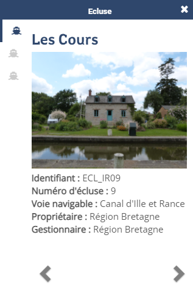
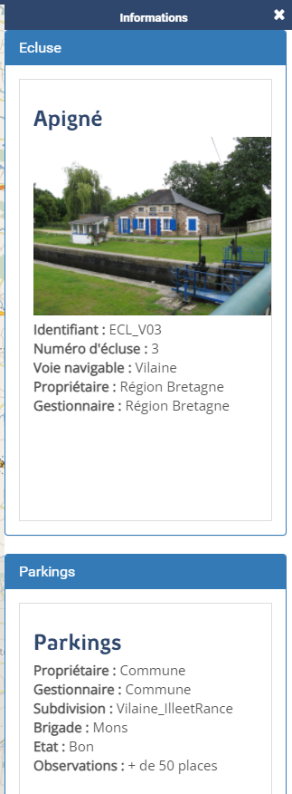
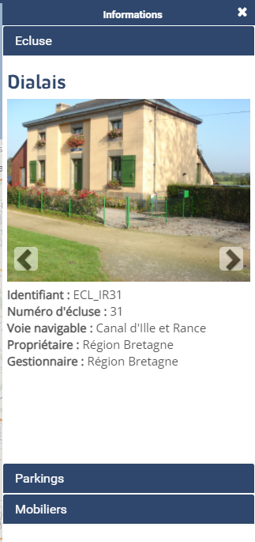
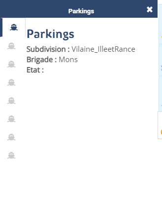

# Configurer - Application

Personnalisation de l'application

## Syntaxe

``` xml
<application
    id=""
    htmltitle=""
    title=""
    logo=""
    nologo=""
    help=""
    addlayerstools=""
    showhelp=""
    titlehelp=""
    iconhelp=""
    style=""
    exportpng=""
    mapprint=""
    measuretools=""
    zoomtools=""
    initialextenttool=""
    stats=""
    statsurl=""
    coordinates=""
    coordinatestype=""
    geoloc=""
    mouseposition=""
    togglealllayersfromtheme=""
    templaterightinfopanel=""
    templatebottominfopanel=""
    templatemobileinfopanel=""
    studio=""
    home=""
    lang=""
    langfile=""
    favicon=""
    sortlayersinfopanel=""
    />
```

Paramètres principaux -----------------

-   `title` `studio` : paramètre optionnel de type texte qui définit le
    titre de l'application. Valeur par défaut **mviewer**.
-   `logo` `studio` : paramètre optionnel de type url qui définit
    l'emplacement du logo de l'application. Valeur par défaut
    **img/logo/earth-globe.svg**.
-   `id` : identifiant de l'application. Il est utilisé dans de
    nombreuses extensions (exemple : filtre, print...) pour faire
    référence à l'application.
-   `help` `studio` : paramètre optionnel de type url qui définit
    l'emplacement du fichier html de l'aide.
-   `showhelp` `studio` : paramètre optionnel de type booléen
    (true/false) précisant si l'aide est affichée en popup au démarrage
    de l'application. Valeur par défaut **false**.
-   `style` `studio` : paramètre optionnel de type url précisant la
    feuille de style à utiliser afin de modifier l'apparence de
    l'application (couleurs, polices...). Valeur par défaut
    **css/themes/default.css**. Voir : [Configurer - Apparence](config_css.md).
-   `exportpng` `studio` : paramètre optionnel de type booléen
    (true/false) activant l'export de la carte en png. Valeur par défaut
    **false**. Attention l'export ne fonctionne qu'avec des couches
    locales (même origine) ou avec des couches servies avec
    [CORS](https://enable-cors.org/) activé.
-   `mapprint` `studio` : paramètre optionnel de type booléen
    (true/false) activant l'impression de la vue courante depuis le
    navigateur. Valeur par défaut **false**.
-   `measuretools` `studio` : paramètre optionnel de type booléen
    (true/false) activant les outils de mesure. Valeur par défaut
    **false**. Cet outil peut être également être fermé avec la touche
    <span class="title-ref">Esc</span>.
-   `zoomtools` `studio` : paramètre optionnel de type booléen
    (true/false) activant les outils de zoom +/-. Valeur par défaut
    **true**.
-   `initialextenttool` `studio` : paramètre optionnel de type booléen
    (true/false) activant le bouton de retour à l'étendue initiale.
    Valeur par défaut **true**.

Paramètres secondaires -----------------

-   `nologo`: paramètre optionnel de type booléen (true/false)
    permettant de masquer le logo dans la navbar. Valeur par défaut
    **false**.
-   `htmltitle` `studio` : optionnel de type texte, il permet d'utiliser
    du HTML uniquement pour le titre de l'application. Utiliser
    **title** avec ce paramètre pour le titre de l'onglet et la page de
    chargement. Il faut encoder pour une lecture en XML.
-   `titlehelp` `studio` : paramètre optionnel de type texte qui définit
    le titre de la popup d'aide. Valeur par défaut **Documentation**.
-   `iconhelp` `studio` : paramètre optionnel de type texte qui précise
    l'icône à utiliser afin d'illustrer la thématique. Le nom de l'icône
    doit être renseigné sous cette forme fab fa-apple ou fas fa-mobile.
    Les valeurs possibles sont à choisir parmi cette liste (cliquez sur
    l'icône souhaité pour obtenir la syntaxe) sur le site Fontawesome :
    <https://fontawesome.com/v5/search?m=free>
-   `stats`: paramètre optionnel de type booléen (true/false) activant
    l'envoi de stats d'utilisation l'application. Valeur par défaut
    **false**.
-   `statsurl`: paramètre optionnel de type url précisant l'url du
    service reccueillant les données d'utilisation de l'application (ip,
    application title, date). Ce service n'est pas proposé dans mviewer.
-   `coordinates` `studio` : paramètre optionnel de type booléen
    (true/false) activant l'affichage des coordonnées GPS en degrés
    décimaux ( navbar) lors de l'interrogation. Valeur par défaut
    **false**.
-   `coordinatestype`: paramètre optionnel de type texte permettant de
    modifier l'unité des coordonnées affichés grâce à l'option
    coordinate. La valeur dms permet afficher les coordonnées en degrés
    sexagésimale (degré minute seconde).
-   `geoloc` `studio` : paramètre optionnel de type booléen (true/false)
    activant la géolocalisation. Nécessite une connection **https**.
    Valeur par défaut **false**.
-   `mouseposition` `studio` : paramètre optionnel de type booléen
    (true/false) activant l'affichage des coordonnées correspondant à la
    position de la souris. Les coordonnées sont affichées en bas à
    droite de la carte. Valeur par défaut **false**.
-   `togglealllayersfromtheme` `studio` : Ajoute un bouton dans le
    panneau de gauche pour chaque thématique afin d'afficher/masquer
    toutes les couches de la thématique.Valeur : true/false. Valeur par
    défaut **false**.
-   `templaterightinfopanel`: Template à utiliser pour le rendu du
    panneau de droite. Valeur à choisir parmi les templates de
    mviewer.templates.featureInfo (defaultaccordion\|allintabs voir
    [Modes de templates]()). Valeur par défaut **default**.
-   `templatebottominfopanel`: Template à utiliser pour le rendu du
    panneau du bas. Valeur à choisir parmi les templates de
    mviewer.templates.featureInfo (defaultaccordion\|allintabs voir
    [Modes de templates]()). Valeur par défaut **default**.
-   `templatemobileinfopanel`: Template à utiliser pour le rendu de la
    fenêtre pour l'interrogation en mobile. Valeur à choisir parmi les
    templates de mviewer.templates.featureInfo (brut\|accordion). Valeur
    par défaut **accordion**.
-   `studio` `studio` : Lien vers le mviewerstudio pour modifier la
    carte en cours.
-   `home` `studio` : Lien vers le site parent de mviewer
-   `hideprotectedlayers`: Indique si les couches protégées doivent être
    masquées dans l'arbre des thématiques lorsque l'utilisateur n'y a
    pas accès. Valeur : true/false (true par défaut).
-   `lang`: Langue à utiliser pour l'interface. Passer "?lang=en" dans
    l'url pour forcer la langue et ignorer la config. Par défaut, lang
    n'est pas activé. Le fichier mviewer.i18n.json contient les
    expressions à traduire dans différentes langues. Pour traduire le
    texte d'un élément html, il faut que cet élément dispose d'un
    attribut i18n=texte.a.traduire. En javascript la traduction s'appuie
    sur la méthode mviewer.tr("texte.a.traduire").
-   `langfile`: URL du fichier de traduction supplémentaire à utiliser
    en complément de mviewer.i18n.json.
-   `favicon` `studio` : URL du fichier image à utiliser comme favicon
    de l'application.
-   `addlayerstools` `studio` : paramètre optionnel de type booléen
    (true/false) activant le panneau pour ajouter des couches WMS ou API
    features à la carte.
-   `sortlayersinfopanel`: mode de tri des couches dans le panneau
    d'information en suivant la légende qui suit l'ordre des couches de
    la map (valeur **default**) ou la toc (valeur **toc**). Valeur par
    défaut **default**.

Modes de templates -----------------

Modes d'affichage des templates soit à droite (templaterightinfopanel),
soit en bas (templatebottominfopanel).

-   `default`: Une entrée par couche avec un carroussel pour navigation
    par entités.



-   `brut`: Affichage à la suite de toutes les entités avec
    encapsulation par couche.



-   `accordion`: Affichage par couche avec carroussel et pliage/dépliage
    lors du changement de couche.



-   `allintabs`: Affichage à la suite avec une entrée par entité.



## Exemple

``` xml
<application title="Exemple"
    logo="img/logo/g.png"
    help="help/aide.html"
    exportpng="false"
    measuretools="true"
    favicon="https://www.bretagne.bzh/app/themes/bretagne/dist/img/icons/favicon.ico"
    style="css/themes/blue.css"/>
```
