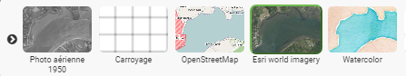
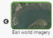

.. Authors :
.. mviewer team

.. _configbaselayers:

Configurer - Les couches de fond
=================================

Paramètres généraux ``<Baselayers>``
***************************

Paramétrages de la liste des fonds de plan.

**Syntaxe**

.. code-block:: xml
       :linenos:

        <baselayers style="">
            <baselayer />
            <baselayer />
        </baselayers>

**Paramètre**

* ``style`` :guilabel:`studio` : paramètre optionnel de type texte à choisir parmi (default/gallery) et définissant le style du contrôle permettant de changer de fond de carte. Valeur par défaut **default**.

Le mode **"default"** active le contrôle ci-dessous. Le fond de plan affiché dans la vignette est celui qui s'affichera dans la carte après un clic.

.. image:: ../_images/dev/config_baselayers/config_baselayers_default.png
              :alt: Configurer la liste des couches de fond
              :align: center

Le mode **"gallery"** active une liste à deux états :

un état déplié lors du premier clic affichant tous les fonds de plans disponibles :

un état replié lors du second clic (choix du fond de plan à afficher) :

Paramètre par fond de plan ``<baselayer>``
******************
Elément enfant de ``<baselayers>`` permettant le paramétrage de chaque fond de plan.

**Syntaxe**

.. code-block:: xml
       :linenos:

	<baselayer type=""
		owsoptions=""
		id=""
		label=""
		title=""
		maxscale=""
		thumbgallery=""
		url="" layers=""
		format=""
		visible=""
		fromcapacity=""
		attribution=""
		style=""
		matrixset=""
		maxzoom=""
		opacity=""
	/>

**Paramètres principaux**

* ``type``: paramètre obligatoire de type texte qui définit le type de la couche. Les options sont OSM, WMTS, WMS, fake. Fake permet de disposer d'un fond vierge. C'est alors le motif ou la couleur du fond de l'application qui s'affiche.
* ``id``: paramètre obligatoire de type texte pour attribuer un identifiant unique et interne à la couche
* ``label``: paramètre obligatoire de type texte pour définir le nom du fond de plan
* ``title``: paramètre obligatoire de type texte pour définir le sous-titre du fond de plan. Utilisé avec le mode "gallery"
* ``thumbgallery``: paramètre obligatoire de type url permettant de sélecionner l'imagette à associer au fond de plan.
* ``url``: paramètre obligatoire de type url définissant l'URL du service web OSM, WMTS ou WMS.
* ``layers``: paramètre optionnel de type texte définissant l'identifiant technique de la couche. (Obligatoire pour les couches de type WMS et WMTS)
* ``format``: paramètre optionnel de type texte définissant le Format d'image retourné par le serveur. (Obligatoire pour les couches de type WMS et WMTS)
* ``visible`` :guilabel:`studio` : paramètre obligatoire de type booléen (true/false) précisant si la couche est visible au démarrage. Il s'agit d'un paramètre exclusif. Une seule couche de fond peut être affichée sur la carte. Attention un baseselayer et un seul doit disposer du paramètre visible="true".
* ``attribution``: paramètre obligatoire alimentant le contrôle attributions de la carte ( |CreditsIcon| ).
* ``style`` : paramètre optionnel précisant le style à associer à la couche. Paramètre obligatoire pour les couches de type WMTS

**Paramètres secondaires**

* ``owsoptions``: Pour une couche WMS, permet de forcer certains paramètres des requêtes GetMap. Exemple : "VERSION:1.3.0".
* ``maxscale``: paramètre optionnel définissant l'échelle max du fond de plan
* ``fromcapacity``: paramètre optionnel de type booléen (true/false)spécifique aux fonds de plan WMTS. Permet la construction de la couche à  partir des capacités du service WMTS.
* ``matrixset`` : paramètre optionnel précisant le style à associer à la couche. Paramètre obligatoire pour les couches de type WMTS si le paramètre **fromcapacity** n'est pas activé
* ``maxzoom``: paramètre optionnel de type numérique définissant le zoom maximum pour la couche.
* ``opacity``: Opacité du fond de carte . Valeur numérique de 0 à 1. Défaut = 1.

**Exemple**

.. code-block:: xml
       :linenos:

	<baselayer
		type="OSM"
		id="osm1"
		label="OpenStreetMap"
		title="OpenSTreetMap"
		thumbgallery="img/basemap/osm.png"
		url="http://{a-c}.tile.openstreetmap.org/{z}/{x}/{y}.png"
		attribution="Données : les contributeurs d'&lt;a href='http://www.openstreetmap.org/' target='_blank'>OpenStreetMap &lt;/a>,  &lt;a 	href='http://www.openstreetmap.org/copyright' target='_blank'>ODbL &lt;/a>"
		visible="true"/>

.. |CreditsIcon| image:: ../_images/user/credits/credits_icon.png
              :alt: Credits
	      :width: 16 pt
