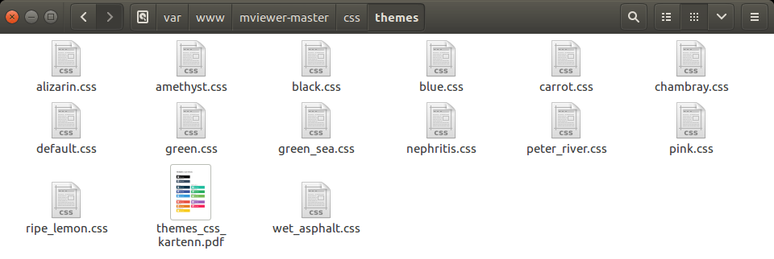
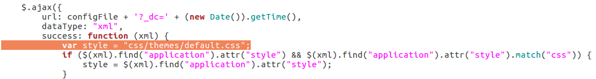

.. Authors : 
.. mviewer team
.. Gwendall PETIT (Lab-STICC - CNRS UMR 6285 / DECIDE Team)

.. _configcss:

Configurer - Apparence
=========================

Pour configurer l'apparence de mviewer, vous avez la possibilité de changer le style présent dans un fichier .css.

Par défaut, une liste de .css est fournie dans le dossier **/css/themes/**

Changer l'apparence
--------------------------------

Pour changer l'apparcence *(et donc le .css associé)* de mviewer, il vous suffit d'éditer le fichier **index.html** et de modifier l'adresse du fichier .css à la ligne suivante (n°49). 

.. code-block:: xml

	var style = "css/themes/default.css";

Par défaut, le fichier associé est **css/themes/default.css**.

Remarque
****************************

A noter qu'un fichier `themes_css_kartenn.pdf <http://kartenn.region-bretagne.fr/kartoviz/css/themes/themes_css_kartenn.pdf>`_  permet de visualiser à l'avance le rendu de chacun des thèmes proposés.