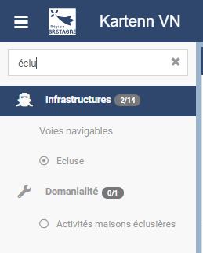
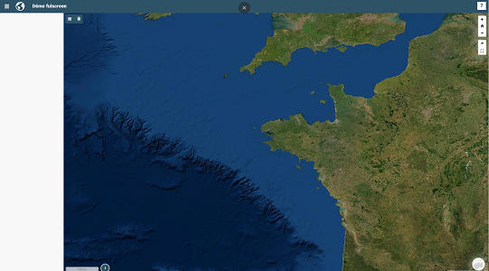
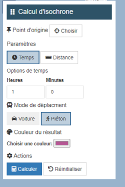
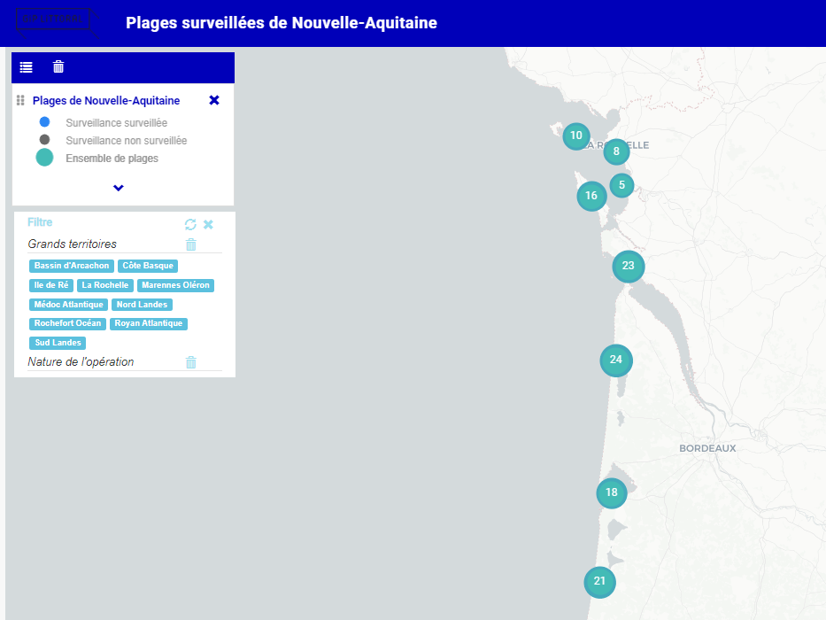
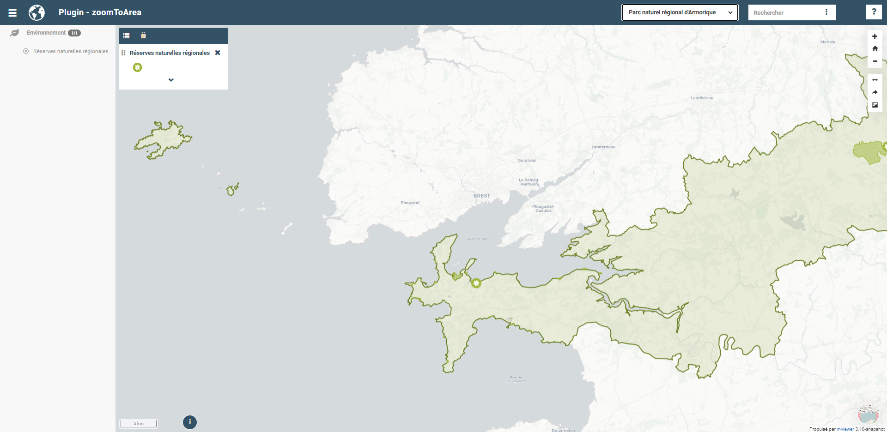

.. Authors :
.. mviewer team

.. _configextensions:

Configurer - Extensions
=======================

Configuration globale
--------------------

Chargement de librairies JavaScript externes ou de composants personnalisés.
Ce module d'extension permet de répondre à deux cas d'usage :

- J'ai besoin d'une librairie **JavaScript** (chart.js) pour faire mes templates de couche.
- J'ai besoin de créer un nouveau **composant** (mini carte de localisation) sans modifier le cœur de mviewer. Plus de précisions ici : ":ref:`configcustomcomponent`"

**Syntaxe**

.. code-block:: xml
       :linenos:

	<extensions>
    	<extension type="javascript" src=""/>
    	<extension type="component" id="" path=""/>
	</extensions>

**Paramètres pour les extensions de type JavaScript**

* ``src``: paramètre obligatoire qui correspond à l'URL vers le fichier.

**Paramètres pour les extensions de type component**

* ``id``: paramètre obligatoire qui correspond au nom du dossier du composant.
* ``path``: paramètre obligatoire qui correspond à l'URL vers le dossier contenant la structure su composant.

**Exemple**

.. code-block:: xml
       :linenos:

	<extensions>
    	<extension type="javascript" src="chart.js"/>
    	<extension type="component" id="graph3d" path="demo/addons"/>
	</extensions>

Extension filtre sur nom de la couche
--------------------

Cett extension permet de filtrer ses couches selon leur titre comme ceci :

Il faut pour cela ajouter ceci dans votre XML :

.. code-block:: xml

    <extensions>    
        <extension type="component" id="layerfilter" path="demo/addons"/>
    </extensions>

Extension plein écran
--------------------

Cette extension permet d'afficher la carte en plein écran comme ceci :

| Cette extension est très utile si vous intégrez votre carte via une iframe.
| Il faut pour cela ajouter ceci dans votre XML :

.. code-block:: xml

    <extensions>    
        <extension type="component" id="fullscreen" path="demo/addons"/>
    </extensions>

Extension isochrone
--------------------

Cett extension permet d'ajouter la possibilité de calculer des isochrones dans votre mviewer comme ceci :

| Cette extension utilise le geoservice de l'IGN. Il permet de faire des isochrones sur les parcours piétons et voiture.
| Il faut pour cela ajouter ceci dans votre XML :

.. code-block:: xml

    <extensions>    
        <extension type="component" id="isochroneAddon" path="demo/addons"/>
    </extensions>

Extension ajout couche temporaire
--------------------

Cette extension permet d'ajouter une couche dans votre mviewer. Attention, la couche ne sera pas persistente :

.. image:: ../_images/dev/config_extension/fileimport.png
              :alt: Calcul isochrone
              :align: center

| Elle fonctionne avec les formats CSV et Shapefile (via un ZIP).
| Il faut pour cela ajouter l'appel à l'extension dans votre XML :

.. code-block:: xml

    <extensions>    
        <extension type="component" id="fileimport" path="demo/addons"/>
    </extensions>

| Puis une couche au niveau de l'import donc voici un exemple (plus d'info sur la conf https://github.com/mviewer/mviewer/tree/master/demo/addons/fileimport) :

.. code-block:: xml

        <theme name="Données externes" collapsed="true" id="import" icon="caret-right">            
            <layer type="import" id="import_file" name="Import de donnée locales"  visible="false"
                legendurl="img/blank.gif"
                queryable="true"
                vectorlegend="true"
                geocoder="ban"
                xfield="longitude"
                yfield="latitude"
                attribution="Attention, le résultat n'est pas persistant. Il s'agit d'un affichage temporaire."
                expanded="true">
                <projections>
                    <projection proj4js="'EPSG:3857','+proj=merc +a=6378137 +b=6378137 +lat_ts=0.0 +lon_0=0.0 +x_0=0.0 +y_0=0 +k=1.0 +units=m +nadgrids=@null +wktext  +no_defs'"/>
                    <projection proj4js="'EPSG:2154','+proj=lcc +lat_1=49 +lat_2=44 +lat_0=46.5 +lon_0=3 +x_0=700000 +y_0=6600000 +ellps=GRS80 +towgs84=0,0,0,0,0,0,0 +units=m +no_defs'"/>
                </projections>
            </layer>
        </theme>

Extension filtre sur données
--------------------

Cette extension permet de filtrer les entités d'une donnée :

Elle nécessite plusieurs prérequis :

* Elle s'applique sur les couches de type customlayer (couche vecteur avec création d'un fichier JavaScript pointant sur un flux WFS par exemple). Cela ne fonctionne pas sur WMS. Pour plus d'information sur le fichier JavaScript à créer, se référer à cette page ":ref:`configfuse`".

.. code-block:: xml

	type="customlayer"
	
* il faut définir un id au niveau de l'application dans le XML :

.. code-block:: xml

	<application
		id="livre_lecture"

* il faut compléter le fichier demo/addons/filter/config.json en y ajoutant vos options de recherche et en mettant en début de liste le même id que dans votre XML. Exemple ici avec au début la configuration du positionnement de la fenêtre et ensuite les recherches par couches

.. code-block:: javascript

      "livre_lecture":{
        "tooltipPosition": "bottom-left",
        "title": "Filtrer",
        "open": true,
        "zoomOnFeatures": true,
        "legendTitle": "Sélectionner une donnée :",
        "style": {
          "border": "1px #2e5367 solid",
          "background": "#2e5367",
          "text": "white",
          "colorButton": "#2e5367"
        },
        "layers": [{
          "layerId": "reseau",
          "filter": [{
              "attribut": "code_departement",
              "type": "button",
              "label": "Départements"
            },
            {
              "attribut": "diagnostic_terr",
              "type": "button",
              "label": "Diagnostic Territorial",
              "updateOnChange": true
            }
          ]
        }]
      }

| Il faut pour cela ajouter ceci dans votre XML :

.. code-block:: xml

	<extensions>
			<extension type="component" id="filter" path="demo/addons"/>
	</extensions>

* Vous pouvez aussi rajouter des boutons pour permettre à l'utilisateur de télécharger les données filtrées en utilisant la propriété *downloadFormats*, ceci n'est possible que pour un layer WFS et créé un filtre CQL pour télécharger les données via une requête WFS.

.. code-block:: javascript

	"layers": [{
          "layerId": "occurence_public_filter",
          "downloadFormats":[ 
            { "label": "CSV", "format": "CSV" },
            { "label": "Shapefiles", "format": "SHAPE-ZIP" },
            { "label": "Geojson", "format": "application/json" }
          ],
          "filter": [{
              "attribut": "man_made",
              "type": "combobox",
              "label": "Man_made",
	      "updateOnChange": true
            },...

Extension zoomToArea
--------------------
Ce plugin permet à l'utilisateur de zoomer sur une zone d'intérêt sélectionnée préalablement dans une liste déroulante située en haut à droite du header mviewer.

Les entités disponibles dans la liste peuvent provenir :

* soit d'un flux wfs issue d'un catalogue de données
* soit d'un fichier au format .geojson disponible dans le dossier de l'application ``apps/monapp/data``

**1. Utiliser un ID par Mviewer**

Nous vous conseillons d'utiliser un identifiant respectif à votre Mviewer :

.. code-block:: xml

	<application id="zoomtoarea"></application>

À l'image de certains plugins existants (filter), cet ID permettra de lier une configuration (fichier ``config.json``) à un seul mviewer. Ainsi, un seul dossier et un seul fichier ``config.json`` pourra être utilisé pour configurer le plugin. Ce qui évite de dupliquer le dossier principal du plugin par mviewer. 

**2. Importer le plugin**

Comme tous les plugins, vous devez ajouter dans le fichier de configuration de votre mviewer une balise permettant de charger le plugin :

.. code-block:: xml

	<extensions>
			<extension type="component" id="zoomToArea" path="demo/addons"/>
	</extensions>

La configuration du plugin est accessible dans le fichier ``config.json`` du répertoire ``addon/zoomToArea``. Ce répertoire peut être localisé différemment selon votre organisation.

**3. Déclarer les paramètres du plugin pour votre carte**

Pour commencer, vous devez ajouter votre ID de Mviewer sous la propriété  ``mviewer``  indiquant ainsi que le plugin est paramétré pour la carte associée à l'ID :

.. code-block:: javascript

	{
	"js": ["zoomToArea.js"],
	"css": "style.css",
	"html":"zoomToArea.html",
	"target": "page-content-wrapper",
	"options":
		{
			"mviewer":
			{
				"idApp1":
					{
					...
					}
			},
			{
				"idApp2":
					{
					...
					}
			}
		}
}

**4. Configurer les paramètres du plugin**

Pour fonctionner, le plugin a besoin des paramètres suivants : 

.. code-block:: javascript

	"zoomtoarea":
	{
		"dataUrl": "apps/monapp/data/featuresZoom.geojson",
		"dataEPSG": "EPSG:4326",
		"fieldNameAreas": "name_feature",
		"fieldIdAreas": "id_feature",
		"fieldSortBy":"name_feature",
		"bufferSize": 5000,
		"selectLabel":"Sélectionner un territoire"
	}

 - ``dataUrl`` : Lien vers la couche de données (flux wfs ou couche geojson)
 - ``dataEPSG`` : Projection des données sources 
 - ``fieldNameAreas`` : Nom du champs où se trouve le nom des entités
 - ``fieldIdAreas`` : Nom du champs où se trouve l'id des entités 
 - ``fieldSortBy`` : Nom du champs pour ordonner les entités dans la liste déroulante (ordre croissant)
 - ``bufferSize``:  Valeur numérique définissant la taille du buffer réalisé autour des entités (permet de régler le niveau de zoom),
 - ``selectLabel`` : Label de la liste déroulante

**Exemple**

Vous pouvez retrouver un exemple complet dans les dossiers suivants :
-   Fichier de configuration du plugin : ``demo/addons/zoomToArea/config.json``
-   Fichier de configuration de la carte : ``demo/zoomtoarea.xml``

Visible également sur la page des démonstrations mviewer.

**Astuces**

**Afficher les contours sur la carte**

Ce plugin ne permet pas d'afficher la couche de données sur la carte. 

Si vous souhaitez visualiser les contours des polygones, vous pouvez intégrer la couche de données en tant que ``layer`` comme une couche classique. 

Si vous ne voulez pas afficher cette couche dans le menu thématique et la légende (aucune action possible pour l'utilisateur), vous pouvez activer le paramètre suivant à votre ``layer`` :

.. code-block:: xml

	showintoc="false"

**Filtrer les entités d'une couche** 

A l'heure actuelle, il n'est pas possible de filtrer les entités sur lesquelles zoomer depuis le plugin. Vous devez préalablement créer une couche avec vos entités filtrées et les importer dans votre application `apps/monapp/data` en privilégiant la projection `EPSG:4326` dans la mesure du possible.

Il est ensuite nécessaire de pointer le plugin vers cette couche comme présenté auparavant.
	    
Extension print
--------------------
Ce plugin permet d'ajouter un module d'impression dans mviewer pour générer des cartes aux formats PDF ou PNG. Seul le format A4 est disponible.

.. image:: ../_images/dev/config_extension/print.png
              :alt: module d'impression
              :align: center

**Installation**

Par défaut, print extension est disponible dans le dossier ``/demo/addons``. Il est conseillé de déplacer les addons que vous utiliser dans un dossier séparé.

1. Ajout de l'extension dans votre conf XML :

.. code-block:: xml

	<extensions>
	  <extension type="component" id="print" path="demo/addons"/>
	</extensions>

2. Ajout d'un id mviewer dans le bloc application de votre conf XML :

.. code-block:: xml

	<application id="mon_app" title="A super title" />

3. Ajout de votre application dans le fichier de conf ``demo/addons/print/config.json`` :

.. code-block:: json

	"options": {
	  "mviewer": {
		"mon_app": {
		}
	  }
	}

**Configuration**

La configuration du modèle n'est pas requise, vous pouvez utiliser le modèle par défaut.

3 paramètres sont possibles dans le config.json :

* ``printLayouts`` : lien vers le modèle
* ``ownerlogo`` : logo à afficher dans le modèle
* ``ownerInfos`` : texte par défaut de la zone d'information

Voici un exemple : 

.. code-block:: json

	"options": {
	  "mviewer": {
		"mon_app": {
			"printLayouts": "demo/addons/print/layouts/standard.json",
			"ownerLogo": "https://avatars.githubusercontent.com/u/114171481?s=400&u=7fcf63ac01887ece3f5f2d5527e92c10527c7a91&v=4",
			"ownerInfos": "Voici la carte"
		}
	  }
	}

**Personnalisation du modèle**

Pour la personnalisation du modèle, se référer à la documentation ici https://github.com/mviewer/mviewer/tree/master/demo/addons/print#layout-with-a-json-template