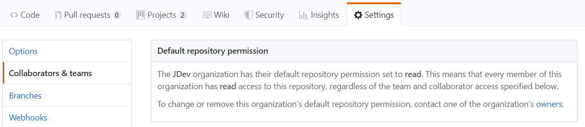

.. Authors : 
.. mviewer team

.. _practices:

Bien commencer avec mviewer
===========================

Préparer votre environnement de travail
----------------------------------------

Si vous débutez, nous vous conseillons de créer un dossier unique nommé "git". 
Nous installerons ensuite Git et le terminal Git Bash pour passer les commandes à Git.

- Sur Windows::

        C:\Users\jean\Documents\git

- Sur Ubuntu/Debian (autre)::

        /home/user/jean/git

- Le code mviewer sera par la suite placé dans un répertoire "mviewer"::

        Exemple: C:\Users\jean\Documents\git\mviewer

- Télécharger ensuite `Git <https://git-scm.com/book/fr/v1/D%C3%A9marrage-rapide-Installation-de-Git>`_ et installez le tout. Le terminal Git Bash sera installé en même temps.

*Git Bash vous permettra de réaliser les commandes qui suivront.*

Travailler avec un fork
------------------------

**Règle générale** : Ne jamais modifier la branche MASTER.

La branche master est une branche "mirroir" de la branche master du code initial (`geobretagne/mviewer <https://github.com/geobretagne/mviewer>`_).

C'est votre point de départ pour tout nouveau travail et tout nouveau travail doit repartir d'une base à jour et propre.

Nous recommandons de créer une branche à partir de la branche master à jour pour chaque nouveau travail. 

La section qui suit vous donnera la procédure pour obtenir votre fork.

.. _fork:

Récupérer les sources (fork)
----------------------------

Pour bien débuter, nous vous recommandons de réaliser un fork vers votre espace GitHub.

**Prérequis**

- Disposer d'un compte GitHub
- Avoir les droits de création sur ce compte
- Être connecté sur GitHub

**Procédure**

Sur la page `GitHub du mviewer <https://github.com/geobretagne/mviewer>`_ cliquer sur "Fork" en haut à droite.

.. image:: ../_images/contrib/fork1.png
              :alt: git fork repository
              :align: center   

Choisissez ensuite le compte vers lequel réaliser votre fork.

Vous détenez maintenant un fork disponible à l'adresse : https://github.com/MON_ORG/mviewer
*MON_ORG étant à remplacer par le nom de votre compte GitHub.*

Votre fork contient nativement les mêmes branches à l'identique, dont la branche **master**.

Vous pourrez créer des nouvelles branches et modifier le code sans impacter le code natif du repository inital (`geobretagne/mviewer <https://github.com/geobretagne/mviewer>`_).

- Ouvrez Git Bash

- Allez sur le repository mviewer GitHub et cliquez sur "clone or download". Copier ensuite l'URL dans la commande suivante.

- Réalisez un clone (copie) du code mviewer sur votre ordinateur en collant l'URL précédente::

        git clone https://github.com/MON_ORG/mviewer.git

.. image:: ../_images/contrib/cloneurl.PNG
              :alt: git clone url
              :align: center    

Gestion des droits
------------------

Vous pouvez gérer les droits de votre repository pour les utilisateurs, développeurs et autres personnes disposant d'un compte GitHub.

Pour cela, cliquez en haut dans "Settings" et accédez à gauche à l'onglet "Collaborators & team". 

Créer une branche
------------------

Vous pouvez créer une branche sur GitHub directement ou avec Git.

Pour créer une branche su GitHub.

- Cliquez sur le bouton de la liste Branch:(nom de branche)
- Choisissez la branche de départ (master) dans la liste des branches disponibles
- Cliquez à nouveau sur le bouton de la liste Branch:(nom de branche)
- Dans le champ de recherche, saisissez le nom de votre nouvelle branche (*).

.. image:: ../_images/contrib/newbranch.PNG
              :alt: git new branch
              :align: center   

- Cliquez ensuite sur "Create Branch: (nom de votre branche)"

Vous avez maintenant une nouvelle branche.

Pour récupérer cette nouvelle branche dans votre dépôt Git, suivez la procédure qui suit:

- Positionnez-vous dans votre dossier ../git/mviewer/:

- Synchronisez votre dossier git::
        
        git fetch

- Positionnez-vous dans votre dossier mviewer (le dossier créé par la commande 'git clone')::
        
        git pull

- Si vous souhaitez changer de branche, saisissez cette commande::

        git checkout NOM_DE_MA_BRANCHE

.. _pull:

Récupérer les nouveautés de la branche
--------------------------------------

Pour mettre à jour votre dépôt (dossier) local mviewer (/git/mviewer) réalisez la commande::

        git pull

Vous travaillerez maintenant sur la nouvelle branche de votre choix. 
Chaque nouvelle mise à jour de la branche master de votre fork devra être reportée sur cette branche aussi souvent que possible.

Pour mettre à jour la branche master de votre fork, nous devons définir en premier une "source distante" (upstream).

(*) *Attention : Choisissez un nom permettant d'identifier rapidement cette branche pour vous et votre équipe.*

.. _setupstream:

Définir un upstream
-------------------

Pour mettre à jour la branche master depuis le code de GéoBretagne, vous devrez indiquer quelle est la "source distante" (upstream). 
Votre "origin" sera votre votre repository mviewer (fork).

Voici la manipulation.

- Définir un upstream::
        
        git remote add upstream https://github.com/geobretagne/mviewer

- Observer que vous avez bien un upstream::
    
        git remote -v
        > origin    https://github.com/YOUR_USERNAME/YOUR_FORK.git (fetch)
        > origin    https://github.com/YOUR_USERNAME/YOUR_FORK.git (push)
        > upstream  https://github.com/geobretagne/mviewer.git (fetch)
        > upstream  https://github.com/geobretagne/mviewer.git (push)

Bravo ! Mettons maintenant à jour votre branche master.

.. _updatefork:

Mettre à jour votre fork - master
----------------------------------

*Attention : assurez-vous d'avoir réalisé l'étape précédente avant celle-ci.*

Vous devrez un jour mettre à jour votre branche master au sein de votre fork. Faites ainsi : 

- Avec Git Bash ou votre terminal, positionnez-vous dans votre dossier mviewer (dossier récupéré via le clone)::

        cd C:\Users\jean\Documents\git\mviewer

- Vérifiez que vous avez bien un upstream qui pointe vers https://github.com/geobretagne/mviewer.git (voir l'étape précédente).

- Positionnez vous sur la branche master::
        
        git checkout origin/master

- Synchronisez vous avec la source distante::
        
        git fetch upstream

- Remplacez votre branche master (origin) par celle de géoBretagne (upstream)::
        
        git reset --hard upstream/master

- Poussez ensuite ce code récupéré depuis géoBretagne (upstream) vers votre branche master (origin)::
        
        git push origin master --force
        
.. _orgfiles:

Organisation des fichiers de carte
----------------------------------

**Rgèle générale**

Ne **JAMAIS** modifier les fichiers du coeur.

Les fichiers du coeur sont tous les fichiers que vous obtenez nativement avec un clone de départ.

Nous vous recommandons d'intégrer la structure décrite dans cette section afin de simplifier vos manipulations de fichier :

- Créer un répertoire "apps" à la racine du mviewer.

- Positionner tous les fichiers de configuration XML à la racine du répertoire apps::
        
        Exemple : C:\Users\jean\Documents\git\mviewer\apps\ma_carte.xml

- Créer un dossier par fichier de configuration que nous appellerons "dossiers de carte"::
        
        Exemple : C:\Users\jean\Documents\git\mviewer\apps\ma_carte\

- Pour chaque dossier de carte, vous devrez créer les dossiers : templates, customcontrols, customlayers, data, sld, css, img.

Pour notre fichier de config "ma_carte.xml", nous aurons donc cette structure::

    /apps
    ├── ma_carte.xml
    └── ma_carte
        ├── customcontrols
        ├── customlayers
        ├── data
        ├── css
        ├── sld
        ├── img
        └── templates

Vous placerez dans ces dossiers les données (geojson), les customcontrols (js), les cunstomlayers (js) ainsi que les template mustache (js).
Vous prendrez en compte la localisation de ces fichiers dans le fichier de configuration XML en donnant les bons chemins d'accès.

Organisation des autres fichiers
---------------------------------

- Créer un répertoire "common" à la racine du répertoire "apps" (/apps/common/)
- Créer un dossier js, css, img, lib
- Créer un dossier basemaps, logo, legend, credit dans /img (/apps/common/img/)

On obtiendra donc cette structure::

    /apps    
    ├── common
        └── js/
        ├── css/
        ├── lib/
        └── img/
            ├── legend/
            ├── logo/
            ├── credit/
            └── basemap/
    ├── ma_carte.xml
    └── ma_carte
        ├── customcontrols
        ├── customlayers
        ├── data
        └── templates

Vous placerez tous les fichiers que vous avez créés ou modifiés dans ces dossiers au sein de /apps/common.
Vous prendrez en compte la localisation de ces fichiers dans le fichier de configuration XML en donnant les bons chemins d'accès.

URL de carte
------------

Il vous faudra prendre en compte le dossier "apps" dans vos urls de carte ainsi:: 

        http://kartenn.region-bretagne.fr/kartoviz/?config=apps/aide-droit-carte.xml

Addons
------

Si vous souhaitez enrichir vos cartes de fonctionnalités (isochrones, recherches, filtres temporels, ...) vous pouvez dupliquer cet addon dans tous les dossiers de carte.

Vous pouvez aussi créer un dossier "addons" dans le répertoire common et y ajouter la structure nécessaire (customlayers, customcontrols) pour être réexploitable par toutes les cartes :

Voici exemple d'organisation de fichier avec un addon "Isochrone"::

    /apps    
    ├── common
        └── js/
        ├── css/
        ├── lib/
        ├── addons/
            └── isochrone
                ├── customlayers
                ├── customcontrols
        └── img/
            ├── legend/
            ├── logo/
            ├── credit/
            └── basemap/

Le dossier "apps" étant votre dossier de travail, vous pouvez l'organiser selon vos besoins.

Participer à la communauté
--------------------------

Pour apporter une correction d'anomalie ou une évolution, nous vous recommandons d'aller à la la page ":ref:`contrib`".

Bonnes pratiques de développements
----------------------------------

**Commits**

Lorsque vous réalisez des commits, séparez les commits de style des commits de code.

Un commit de style comprend :

- Suppression / ajout d'un espace
- Suppression / ajout d'un saut de ligne
- Tout ce qui n'est pas du code

Un commit de code comprendra à l'inverse :

- Une modification sur une syntaxe
- Une modification sur une fonction
- Une modification sur un nom de variable
- Tout ce qui n'est pas du style 

**Encodage**

L'encodage a utiliser est l'UTF-8.

**Formatage**

Lors de vos développements, inspectez le formatage du code initial :

- Le nombre d'espace pour indenter
- La présence d'espace avant et après les parenthèses
- La présence d'espace avant ou après les opérateurs logiques (==, <, >, ||, &&)
- Le nombre de saut de lignes avant ou après une fonction, un bloc de clode, etc...
- autres

Méfiez-vous de votre éditeur de code. Pensez à désactiver les plugins ou à configurer les règles de formatage.

**Respectez** ensuite ce formatage.

**Commentaires**

Un code commenté est un code compréhensible par tous.
Nous recommandons très fortement d'utiliser les commentaires. Mieux vaut trop de commentaires que pas assez.

- Commentaires JavaScript::

        // ceci est un commentaire une sune ligne
        /* Ceci est 
        un commentaire sur plusieurs lignes*/

- Commentaire CSS::

        /*Je suis un commentaire CSS*/

- Commentaire HTML::

        <!--Je suis un commentaire HTML-->

Pour les fonctions ou méthodes JavaScript, nous recommandons d'ajouter en commentaire:

- Ce que fait cette fonction ou méthode
- Les paramètres en entrée
- Le résultat attendu et ce qui est retourné en sortie

**Les indésirables**

Nous déconseillons les affichages d'informations qui ne sont utiles qu'aux développeurs (console.log, alert, ...).

**Editeur de code**

Il n'y a pas d'obligation et vous êtes libre d'en choisir un.

- Notepadd++
- Sublime
- Visual Studio Code
- Atome
- autre

Informations git & GitHub
-------------------------

Vous trouverez plus d'information sur la page ":ref:`git`".

Vous trouverez notamment de la documentation  dans la partie ":ref:`docgit`".

Documentation
-------------

#. `Configurer un remote pour un fork <https://help.github.com/en/github/collaborating-with-issues-and-pull-requests/configuring-a-remote-for-a-fork>`_
#. `Maintien un fork avec l'upstream <https://stackoverflow.com/questions/9646167/clean-up-a-fork-and-restart-it-from-the-upstream>`_
