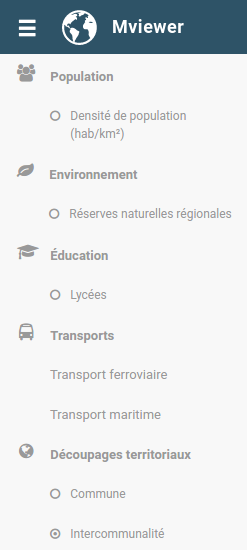

.. Authors :
.. mviewer team
.. Gwendall PETIT (Lab-STICC - CNRS UMR 6285 / DECIDE Team)

.. _configtopics:

Configurer - Les thématiques
============================

La configuration des thématiques qui seront visibles dans l'interface se fait dans le fichier **config.xml**.

Principe général
----------------------------------------

Ici, les `couches <configlayers>` sont organisées de la manière suivante :

* une **couche** (layer) est intégrée à un groupe ou à un thème,
* un **groupe** est intégré à un thème et peut contenir entre 1 et *n* couches,
* un **thème** est intégré au parent "themes" et peut contenir entre 1 et n groupes ainsi que 1 et *n* couches,
* le parent "**themes**" peut contenir entre 1 et *n* thème.

Ceci peut être résumé avec l'arborescence suivante :

.. code-block:: xml
       :linenos:

	<themes>
	    	<theme>
	    		<layer> </layer>
		</theme>
		<theme>
			<group>
				<layer> </layer>
				<layer> </layer>
			</group>
		</theme>
	</themes>

Structure par défaut
----------------------------------------

Par défaut, le contenu suivant est proposé :

.. code-block:: xml
       :linenos:

	<themes>
	    	<theme name="Population"  collapsed="false" id="habitant" icon="group">
	    		<layer id="rp_struct_pop_geom" name="Densité de population (hab/km²)" visible="false" tiled="false"
			searchable="false" queryable="false" attributefilter="true" attributefield="level" attributevalues="Commune,EPCI,Pays"  attributelabel="Échelle" attributestylesync="true" attributefilterenabled="true" infopanel="bottom-panel" infoformat="application/vnd.ogc.gml" featurecount="5" timefilter="true" timeinterval="year" timecontrol="slider" timemin="1999" timemax="2013" timevalues="1999,2008,2013" style="rphab_densite@commune" stylesalias="" url="http://ows.region-bretagne.fr/geoserver/rb/wms" attribution="Sources: INSEE (RP) - OpenStreetMap | Traitements: Région Bretagne - Service connaissance, observation, planification et prospective" metadata="http://kartenn.region-bretagne.fr/geonetwork/?uuid=26324529-e0b7-450c-9506-2dcdca608f5f" metadata-csw="http://kartenn.region-bretagne.fr/geonetwork/srv/eng/csw?SERVICE=CSW&amp;VERSION=2.0.2&amp;REQUEST=GetRecordById&amp;elementSetName=full&amp;ID=26324529-e0b7-450c-9506-2dcdca608f5f">
			</layer>
		</theme>
	    	<theme name="Environnement"  collapsed="false" id="environnement" icon="leaf">
			<layer id="reserve_naturelle_regionale" name="Réserves naturelles régionales"  visible="false" tiled="false" searchable="false" queryable="true" fields="axe" aliases="axe" infoformat="application/vnd.ogc.gml" featurecount="20" sld="http://kartenn.region-bretagne.fr/styles/reserve_naturelle.sld" url="http://ows.region-bretagne.fr:80/geoserver/rb/wms" legendurl="http://kartenn.region-bretagne.fr/doc/icons_region/reserve_naturelle.svg" attribution="Source: Région Bretagne" metadata="https://geobretagne.fr/geonetwork/apps/georchestra/?uuid=77f8fc52-ae57-41d1-8f08-7b121b013f51" metadata-csw="https://geobretagne.fr/geonetwork/srv/eng/csw?SERVICE=CSW&amp;VERSION=2.0.2&amp;REQUEST=GetRecordById&amp;elementSetName=full&amp;ID=77f8fc52-ae57-41d1-8f08-7b121b013f51" >
			<template url="templates/global.reserve_naturelle_reg.mst"></template>
			</layer>
		</theme>
		<theme name="Éducation"  collapsed="false" id="education" icon="graduation-cap">
			<layer id="lycee" name="Lycées"  visible="false" tiled="false" searchable="false" queryable="true" fields="axe" aliases="axe" attributefilter="true" attributefield="secteur_li" attributevalues="Public,Privé sous contrat avec l'éducation nationale"  attributelabel="Filtre" attributestylesync="false" attributefilterenabled="false" infoformat="application/vnd.ogc.gml" featurecount="20" sld="http://kartenn.region-bretagne.fr/styles/lycee_secteur.sld" url="http://ows.region-bretagne.fr/geoserver/rb/wms" attribution="Source: Région Bretagne" metadata="http://kartenn.region-bretagne.fr/geonetwork/?uuid=99e78163-ce9a-4eee-9ea0-36afc2a53d25" metadata-csw="http://kartenn.region-bretagne.fr/geonetwork/srv/eng/csw?SERVICE=CSW&amp;VERSION=2.0.2&amp;REQUEST=GetRecordById&amp;elementSetName=full&amp;ID=99e78163-ce9a-4eee-9ea0-36afc2a53d25" >
			<template url="templates/global.lycee.mst"></template>
			</layer>
		</theme>
		<theme name="Transports"  collapsed="false" id="transport" icon="bus">
			<group name="Transport ferroviaire" id="grp1" >
				<layer id="troncon_ferroviaire" name="Lignes ferroviaires"  visible="false" tiled="false" searchable="false" queryable="true" fields="axe" aliases="axe" infoformat="application/vnd.ogc.gml" featurecount="20" style="ligne_ferroviaire_defaut" stylesalias="Par défaut" url="http://ows.region-bretagne.fr/geoserver/rb/wms" attribution="Source: Région Bretagne" metadata="http://kartenn.region-bretagne.fr/geonetwork/?uuid=0da27e88-4da6-423e-ba4c-dbcad9128cd2" metadata-csw="http://kartenn.region-bretagne.fr/geonetwork/srv/eng/csw?SERVICE=CSW&amp;VERSION=2.0.2&amp;REQUEST=GetRecordById&amp;elementSetName=full&amp;ID=0da27e88-4da6-423e-ba4c-dbcad9128cd2">
				<template url="templates/transport.ligne_ferroviaire.mst"></template>
				</layer>
				<layer id="arret_ferroviaire" name="Arrêts ferroviaires régionaux"  visible="false" tiled="false" searchable="true" queryable="true" fields="" aliases="" infoformat="application/vnd.ogc.gml" featurecount="20" style="arret_ferroviaire_defaut, arret_ferroviaire_nature" stylesalias="Par défaut,Nature des arrêts ferroviaires" legendurl="http://kartenn.region-bretagne.fr/doc/icons_region/gare_ter.svg" url="http://ows.region-bretagne.fr/geoserver/rb/wms" attribution="Source: Région Bretagne" metadata="http://kartenn.region-bretagne.fr/ geonetwork/?uuid=4a9d13f7-17be-4a98-9f8f-907cf223072f" metadata-csw="http://kartenn.region-bretagne.fr/geonetwork/srv/eng/csw?SERVICE=CSW&amp;VERSION=2.0.2&amp;REQUEST=GetRecordById&amp;elementSetName=full&amp;ID=4a9d13f7-17be-4a98-9f8f-907cf223072f" >
				<template url="templates/global.arret_ferroviaire.mst"></template>
				</layer>
			</group>
			<group name="Transport maritime" id="grp2" >
				<layer id="gare_maritime" name="Gares maritimes"  visible="false" tiled="false" searchable="false" queryable="true" fields="axe" aliases="axe" infoformat="application/vnd.ogc.gml" featurecount="20" sld="http://kartenn.region-bretagne.fr/styles/gare_maritime.sld"
	             		url="https://geobretagne.fr/geoserver/dreal_b/ows" legendurl="http://kartenn.region-bretagne.fr/doc/icons_region/gare_maritime.svg" attribution="Source: DREAL Bretagne"
	             		metadata="https://geobretagne.fr/geonetwork/apps/ georchestra/?uuid=ffcb4e72-a01b-44f0-8da3-95a5b13c6e42" metadata-csw="https://geobretagne.fr/geonetwork/srv/eng/csw?SERVICE=CSW&amp;VERSION=2.0.2&amp;REQUEST=GetRecordById&amp;elementSetName=full&amp;ID=ffcb4e72-a01b-44f0-8da3-95a5b13c6e42" >
				<template url="templates/global.gare_maritime.mst"></template>
				</layer>
				<layer id="port" name="Ports"  visible="false" tiled="false" searchable="false" queryable="true" fields="axe" aliases="axe" infoformat="application/vnd.ogc.gml" featurecount="20" sld="http://kartenn.region-bretagne.fr/styles/port.sld" url="http://ows.region-bretagne.fr:80/geoserver/rb/wms" legendurl="http://kartenn.region-bretagne.fr/doc/icons_region/port.svg" attribution="Source: Région Bretagne" metadata="https://geobretagne.fr/geonetwork/apps/georchestra/?uuid=c55c4fba-6a37-48ea-8754-a1bf770a684b" metadata-csw="https://geobretagne.fr/geonetwork/srv/eng/csw?SERVICE=CSW&amp;VERSION=2.0.2&amp;REQUEST=GetRecordById&amp;elementSetName=full&amp;ID=c55c4fba-6a37-48ea-8754-a1bf770a684b" >
				<template url="templates/global.port.mst"></template>
				</layer>
			</group>
		</theme>
		<theme name="Découpages territoriaux"  collapsed="true" id="territoire" icon="globe">
			<layer id="commune" name="Commune" visible="false" queryable="false" fields="nom_geo" aliases="Nom" type="customlayer" style="" opacity="1" legendurl="img/legend/commune.png" url="customlayers/commune.js" tooltip="true" attribution="Source: GéoBretagne" metadata="https://geobretagne.fr/geonetwork/apps/ georchestra/?uuid=b08e6cb1-236c-49b7-88f9-42b500d274d5" metadata-csw="https://geobretagne.fr/geonetwork/srv/eng/csw?SERVICE=CSW&amp;VERSION=2.0.2&amp;REQUEST=GetRecordById&amp;elementSetName=full&amp;ID=b08e6cb1-236c-49b7-88f9-42b500d274d5"/>
			<layer id="epci" name="Intercommunalité" visible="true" queryable="false" fields="nom_geo" aliases="Nom" customcontrol="true" type="customlayer" style="" opacity="1" legendurl="img/legend/epci.png" url="customlayers/epci.js" tooltip="true" tooltipenabled="true" attribution="Source: GéoBretagne" metadata="https://geobretagne.fr/geonetwork/apps/ georchestra/?uuid=2298d744-49cb-4fcb-9487-26f916fecdff" metadata-csw="https://geobretagne.fr/geonetwork/srv/eng/csw?SERVICE=CSW&amp;VERSION=2.0.2&amp;REQUEST=GetRecordById&amp;elementSetName=full&amp;ID=2298d744-49cb-4fcb-9487-26f916fecdff"/>
		</theme>
	</themes>

Ici, ce code .xml peut être résumé à l'arborescence suivante :

.. code-block:: xml
       :linenos:

	<themes>
	    	<theme name="Population">
	    		<layer name="Densité de population (hab/km²)"> </layer>
		</theme>
	    	<theme name="Environnement">
			<layer name="Réserves naturelles régionales"> </layer>
		</theme>
		<theme name="Éducation">
			<layer name="Lycées"> </layer>
		</theme>
		<theme name="Transports">
			<group name="Transport ferroviaire">
				<layer name="Lignes ferroviaires"> </layer>
				<layer name="Arrêts ferroviaires régionaux"> </layer>
			</group>
			<group name="Transport maritime">
				<layer name="Gares maritimes"> </layer>
				<layer name="Ports"> </layer>
			</group>
		</theme>
		<theme name="Découpages territoriaux">
			<layer name="Commune"> </layer>
			<layer name="Intercommunalité"> </layer>
		</theme>
	</themes>

Ce qui donne visuellement ceci :

Configuration de la liste des thèmes
-------------------------------------

**Syntaxe** ``<themes>``
***************************

.. code-block:: xml
       :linenos:

	<themes mini="" legendmini="" />

**Paramètres**

* ``mini``: paramètre optionnel de type booléen (true/false) qui précise si le panneau de gauche est réduit à l'ouverture de l'application. L'attribut ``collapsed`` des ``<theme>`` doit être à true pour que cet attribut soit pris en compte. Défaut = false.
* ``legendmini``: paramètre optionnel de type booléen (true/false)  qui précise si le panneau de la légende est réduit à l'ouverture de l'application. Défaut = true.

**Syntaxe** ``<theme>``
***************************

Elément enfant de <themes>

.. code-block:: xml
       :linenos:

	<theme name=""  collapsed="" id="" url="" icon="" />

**Paramètres**

* ``name`` :guilabel:`studio` : paramètre obligatoire de type texte qui précise le nom de la thématique.
* ``id`` :guilabel:`studio` : paramètre obligatoire de type texte qui affecte un identifiant unique interne à la thématique.
* ``url`` :guilabel:`studio` : URL de la thématique. Des thèmes externes (présents dans d'autres configurations peuvent être automatiquement chargés par référence au fichier xml utilisé (url=) et à l'id de la thématique (id=). Attention si la configuration externe est sur un autre domaine, il faut alors que mviewer utilise un proxy Ajax ou alors s'assurer que CORS est activé sur le serveur distant. Les thématiques externes peuvent utiliser des ressources particulières (templates, customLayer, sld...) si les URLs de ces ressources sont absolues et accessibles.
* ``collapsed`` :guilabel:`studio` : paramètre optionnel de type booléen (true/false) qui précise si la thématique est fermée au démarrage de l'application. Pour que la thématique soit ouverte au démarrage, il faut choisir l'option **false**. Attention, il ne peut y avoir qu'une thématique ayant ce paramètre à false. Valeur par défaut **true**.
* ``icon`` :guilabel:`studio` : paramètre optionnel de type texte qui précise l'icône à utiliser afin d'illustrer la thématique. Les valeurs possibles sont à choisir parmi cette liste : http://fontawesome.io/icons/

**Syntaxe** ``<group>``
***************************

Elément enfant de ``<theme>``

.. code-block:: xml
       :linenos:

	<group name="" />

**Paramètres**

* ``name``: paramètre obligatoire de type texte qui précise le nom du groupe.
