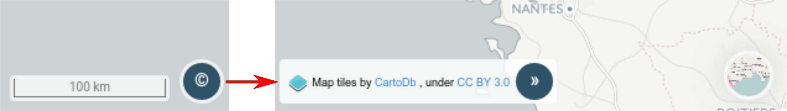

# Crédits

En cliquant sur l'icone (
 ) l'utilisateur
fait apparaître les crédits du fond de carte actuellement affiché.
Lorsque ce dernier est changé, les crédits sont automatiquement mis à
jour.

Pour replier la fenêtre de crédit, il vous suffit de cliquer sur l'icone
.
