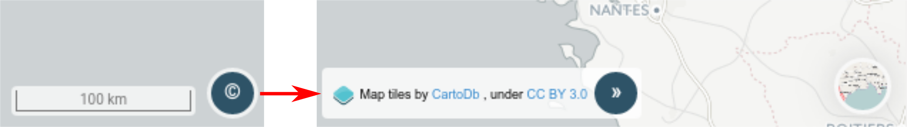

.. Authors : 
.. mviewer team (Pôle Observation et Information géographique / Région Bretagne)
.. Gwendall PETIT (Lab-STICC - CNRS UMR 6285 / DECIDE Team)

.. _credits:

Crédits
=====================

En cliquant sur l'icone ( |CreditsIcon| ) l'utilisateur fait apparaître les crédits du :ref:`maps` actuellement affiché. Lorsque ce dernier est changé, les crédits sont automatiquement mis à jour.

Pour replier la fenêtre de crédit, il vous suffit de cliquer sur l'icone |CreditsIconClose|.

