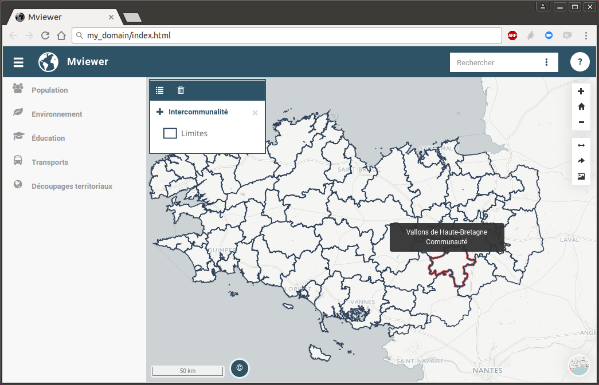
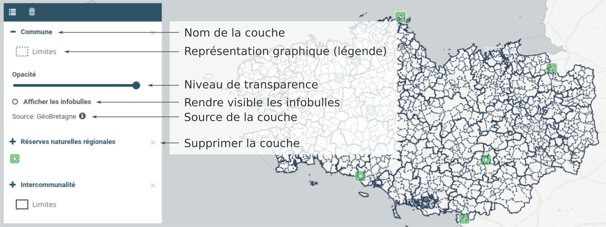

.. Authors : 
.. mviewer team
.. Gwendall PETIT (Lab-STICC - CNRS UMR 6285 / DECIDE Team)

.. _display:

Gestion de l'affichage
================================

Le gestionnaire d'affichage de couche se trouve sur la partie gauche de la carte.

Lorsque dans le panneau latéral (voir ":ref:`manager`") vous cliquez sur une couche, celle-ci apparaît dans le gestionnaire d'affichage. 

Options sur une couche
---------------------------------------
Là, vous avez la possibilité :

* de visualiser le rendu graphique *(la légende)*,
* de modifier l'opacité *(transparence)*,
* d'afficher des informations sous la forme d'infobulles *(optionnel)*,
* de voir la source de la donnée *(optionnel)*,
* de supprimer la couche de la carte*(en cliquant sur l'icone* |display_remove| *)*

Autres options
---------------------------------------

De plus, l'utilisateur à la possibilité de :

* modifier l'ordre d'affichage : pour cela, il vous suffit de cliquer sur une couche et de la glisser / déposer à l'endroit désiré. Notez que la couche en haut dans la liste sera affichée au premier plan dans la carte.
* supprimer *(ne plus afficher)* l'ensemble des couches ( |display_trash| )
* plier / déplier le gestionnaire ( |display_unfold| )

