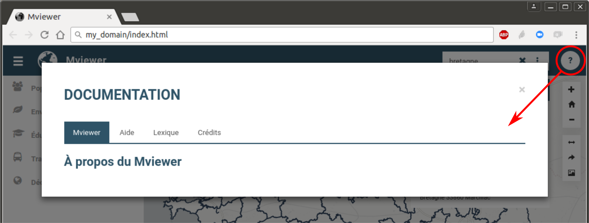
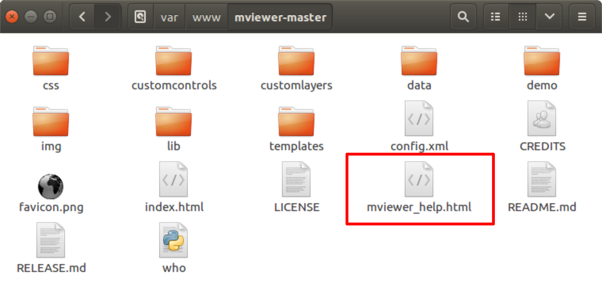

# Documentation

Le panneau de documenation offre aux utilisateurs des informations
complémentaires permettant de décrire le contexte de la plateforme, les
données diffusées, les points de contact ou toutes autres données
nécessaires.

## Ouvrir et fermer le panneau

En cliquant sur le bouton
"",
un nouveau panneau s'affiche au premier plan de l'écran.

Pour fermer ce panneau, il vous suffit soit :

-   de cliquer sur la croix en haut en droite du cadre,
-   de cliquer en dehors du cadre.

## Limiter l'affichage à l'ouverture

Une case à cocher (en bas à gauche) permet à l'utilisateur de masquer la
documentation à la prochaine consultation. Cette information est
sauvegardée dans le localStorage (voir section "cookies").

## Configurer le panneau

Techniquement, ce panneau de documentation se présente sous la forme
d'un fichier .html que l'on retrouve à la racine du dossier de
**mviewer** : **mviewer_help.html**.

En éditant et modifiant ce fichier, vous aurez la possibilité de gérer
(ajouter/supprimer/renommer) les onglets, ainsi que leur contenu.
