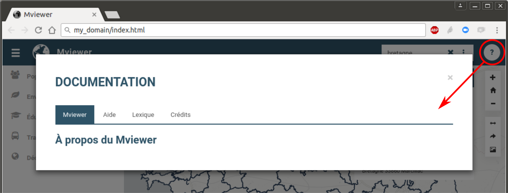
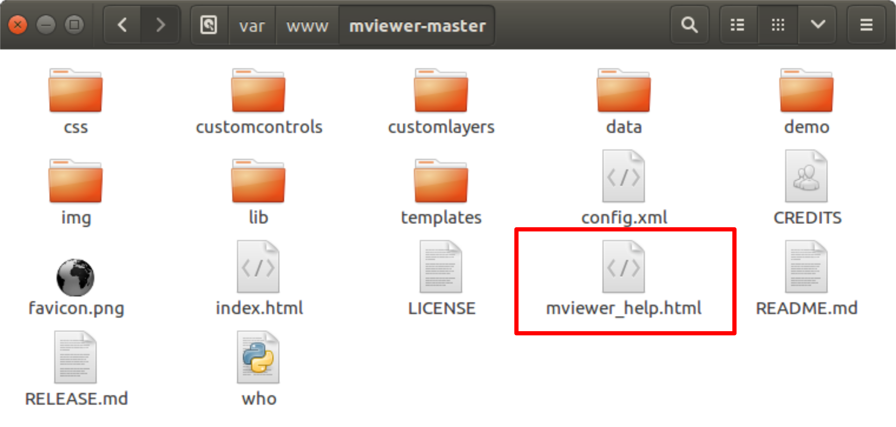

.. Authors : 
.. mviewer team
.. Gwendall PETIT (Lab-STICC - CNRS UMR 6285 / DECIDE Team)

.. _documentation:

Documentation
=====================

Le panneau de documenation offre aux utilisateurs des informations complémentaires permettant de décrire le contexte de la plateforme, les données diffusées, les points de contact ou toutes autres données nécessaires.

Ouvrir et fermer le panneau
************************************

En cliquant sur le bouton "**?**", un nouveau panneau s'affiche au premier plan de l'écran.

Pour fermer ce panneau, il vous suffit soit :

* de cliquer sur la croix en haut en droite du cadre,
* de cliquer en dehors du cadre.

Configurer le panneau
************************************

Techniquement, ce panneau de documentation se présente sous la forme d'un fichier .html que l'on retrouve à la racine du dossier de **mviewer** :  **mviewer_help.html**.

En éditant et modifiant ce fichier, vous aurez la possibilité de gérer (ajouter/supprimer/renommer) les onglets, ainsi que leur contenu. Pour plus d'information, veuillez consulter la page XXXX.