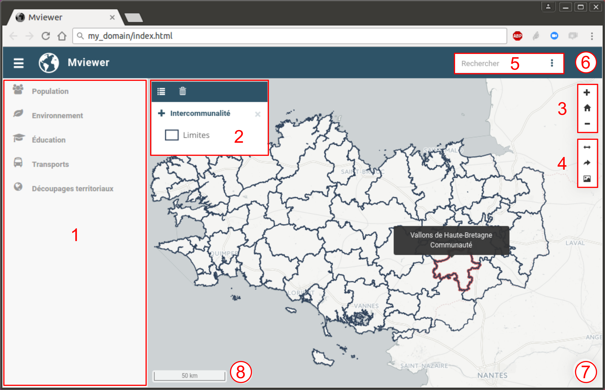

# Interface utilisateur

L'interface de mviewer peut être décomposée en 8 rubriques :

1.  [Gestion des couches](#gestion-des-couches)
2.  [Gestion de l'affichage](#gestion-de-laffichage)
3.  [Outils de navigation](#outils-de-navigation)
4.  [Outils aditionnels](#outils-aditionnels)
5.  [Barre de recherche](#barre-de-recherche)
6.  [Documentation](#documentation)
7.  [Fond de carte](#fond-de-carte)
8.  [Crédits](#crédits)

## Gestion des couches

Panneau listant l'ensemble des couches pouvant être chargées dans la
carte. Pour en savoir plus, consulter la page [Gestionnaire de couches](manager.md).

## Gestion de l'affichage

Panneau de gestion de l'affichage des couches sélectionnées. Pour en
savoir plus, consulter la page [Gestion de l'affichage](display.md).

## Outils de navigation

Outils de zoom dans la carte. Pour en savoir plus, consulter la page
[Outils de navigation](navigation.md).

## Outils aditionnels

Outils permettant :

-   de mesurer des aires ou des distances sur la carte,
-   de partager la carte,
-   d'exporter la carte sous forme d'image.

Pour en savoir plus, consulter la page [Outils additionnels](other_tools.md).

## Barre de recherche

Moteur de recherche de lieux (ville, département, région... ). Pour en
savoir plus, consulter la page [Barre de recherche](search.md).

## Documentation

Informations complémentaires permettant de décrire le contexte de la
plateforme, les données diffusées, les points de contact... Pour en
savoir plus, consulter la page [Documentation](documentation.md).

## Fond de carte

Outil permettant de changer le fond de carte parmi une liste prédéfinie.
Pour en savoir plus, consulter la page [Fonds de carte](maps.md).

## Crédits

Crédits relatifs aux fonds de cartes. Pour en savoir plus, consulter la
page [Crédits](credits.md).
