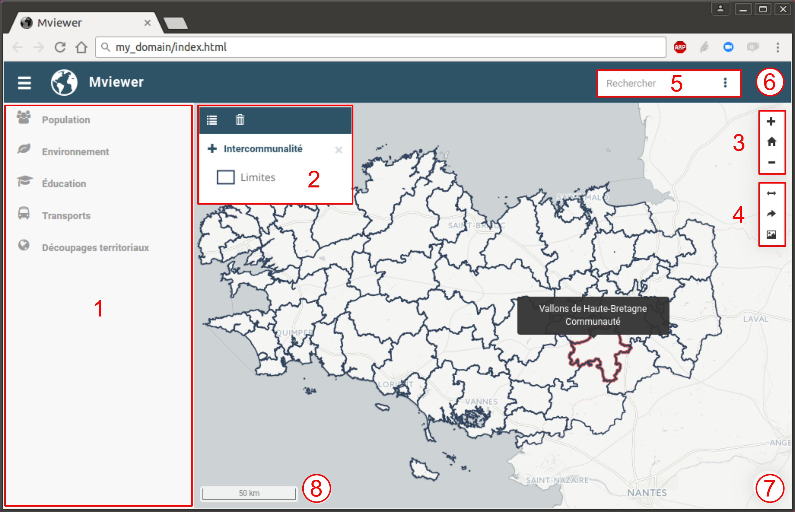

.. Authors : 
.. mviewer team
.. Gwendall PETIT (Lab-STICC - CNRS UMR 6285 / DECIDE Team)

.. _ui:

Interface utilisateur
=====================

L'interface de mviewer peut être décomposée en 8 rubriques :

1. `Gestion des couches`_
2. `Gestion de l'affichage`_
3. `Outils de navigation`_
4. `Outils aditionnels`_
5. `Barre de recherche`_
6. `Documentation`_
7. `Fond de carte`_
8. `Crédits`_

Gestion des couches
-------------------------------------------

Panneau listant l'ensemble des couches pouvant être chargée dans la carte. Pour en savoir plus, consulter la page ":ref:`manager`".

Gestion de l'affichage
-------------------------------------------

Panneau de gestion de l'affichage des couches sélectionnées. Pour en savoir plus, consulter la page ":ref:`display`".

Outils de navigation
-------------------------------------------

Outils de zoom dans la carte. Pour en savoir plus, consulter la page ":ref:`navigation`".

Outils aditionnels
-------------------------------------------

Outils permettant :

* de mesurer des aires ou des distances sur la carte
* de partager la carte
* d'exporter la carte sous forme d'image

Pour en savoir plus, consulter la page ":ref:`othertools`".

Barre de recherche
-------------------------------------------

Moteur de recherche de lieux (ville, département, région, ... ). Pour en savoir plus, consulter la page ":ref:`search`".

Documentation
-------------------------------------------

Information complémentaires permettant de décrire le contexte de la plateforme, les données diffusées, les points de contact, ... Pour en savoir plus, consulter la page ":ref:`documentation`".

Fond de carte
-------------------------------------------

Outil permettant de changer le fond de carte parmi une liste prédéfinie. Pour en savoir plus, consulter la page ":ref:`maps`".

Crédits
-------------------------------------------

Crédits relatifs aux fonds de cartes. Pour en savoir plus, consulter la page ":ref:`credits`".