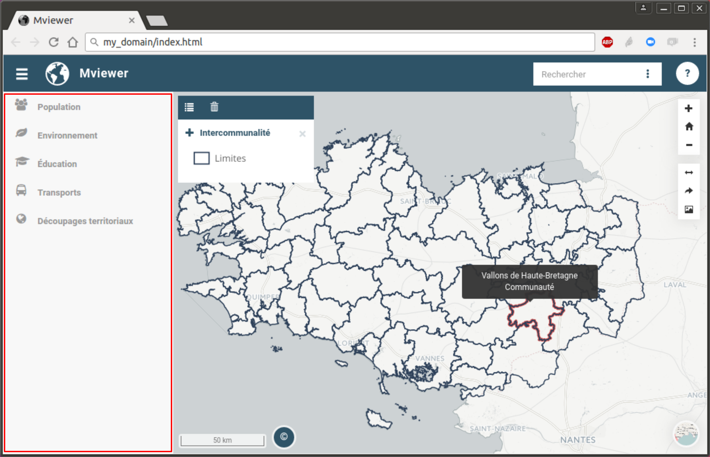
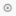
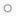
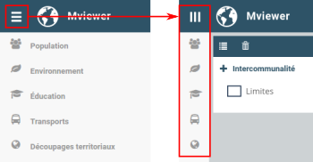

.. Authors : 
.. mviewer team
.. Gwendall PETIT (Lab-STICC - CNRS UMR 6285 / DECIDE Team)

.. _manager:

Gestionnaire de couches
===============================

Dans **mviewer**, la liste des données disponibles à l'affichage est visible dans le panneau de gauche.

L'arborescence
-----------------------------------

Comme décrit dans la page ":ref:`configlayers`", les couches peuvent être organisées de la manière suivante :

* un thème,
	* un (ou plusieurs) groupe(s) *(ce niveau est optionnel)*,
		* une (ou plusieurs) couche(s).

Par défaut, l'arborescence est repliée et seuls les thèmes sont visibles. En cliquant sur un thème, son contenu *(groupe(s) ou couche(s))* apparaît. Il en va de même sur un groupe qui peut être déplié pour voir apparaître les couches qu'il contient. De la même façon, un clic sur un thème / groupe déplié va le replier.

Afficher / cacher des couches
-----------------------------------

Pour afficher une couche dans la carte, il vous suffit de cliquer dessus. Dès lors, l'icone ( |IconNo| ) situé devant le nom devient ( |IconYes| ).

Pour supprimer une couche de la carte, il vous suffit de cliquer de nouveau sur son nom.

Afficher / cacher le panneau
-----------------------------------

En cliquant sur l'icone ( |PanelIcon| ) vous avez la possibilité de plier / déplier le panneau.

.. |PanelIcon| image:: ../_images/user/manager/panel_icon.png
              :alt: Icone pour afficher ou cacher le panneau
	      :width: 16 pt

Configurer
-----------------------------------

Pour savoir comment modifier la liste des couches présentes dans ce panneau, vous êtes invités à consulter la page ":ref:`configlayers`".