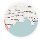
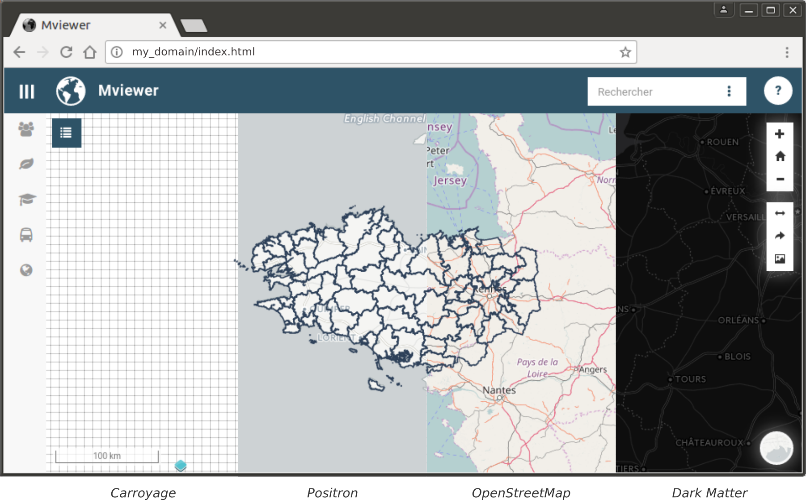

# Fonds de carte

En cliquant sur l'icone (
 ) en bas à
droite de la carte, l'utilisateur à la possibilité de changer le fond de
carte. Vous pouvez consulter la démo sur les fonds de carte :
<https://kartenn.region-bretagne.fr/kartoviz/?config=demo/fonds.xml>

Pour modifier la liste des fonds de carte, veuillez consulter la page
[Configurer - Les fonds de carte](../doc_tech/config_baselayers.md).
