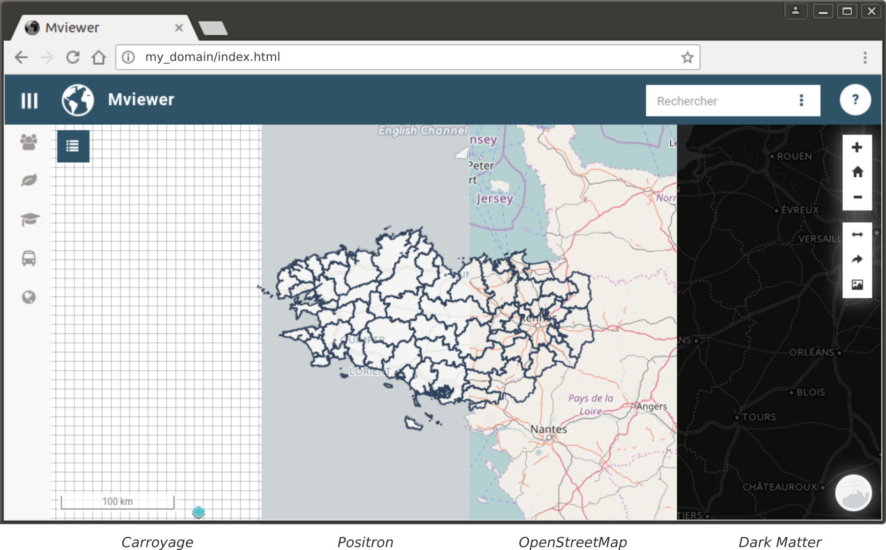
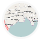

.. Authors : 
.. mviewer team
.. Gwendall PETIT (Lab-STICC - CNRS UMR 6285 / DECIDE Team)

.. _maps:

Fonds de carte
=====================

En cliquant sur l'icone ( |MapsIcon| ) en bas à droite de la carte, l'utilisateur à la possibilité de changer le fond de carte. Par défaut, quatre fonds sont proposés :

* Positron *(actif au démarrage)*,
* OpenStreetMap,
* Carroyage,
* Dark Matter.

Pour modifier la liste des fonds de carte, veuillez consulter la page ":ref:`configbaselayers`".