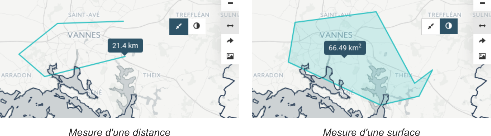
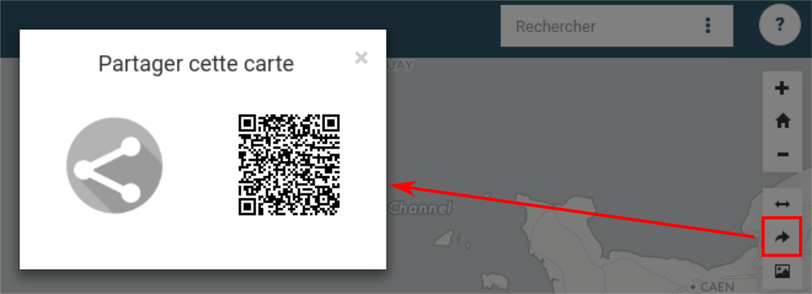
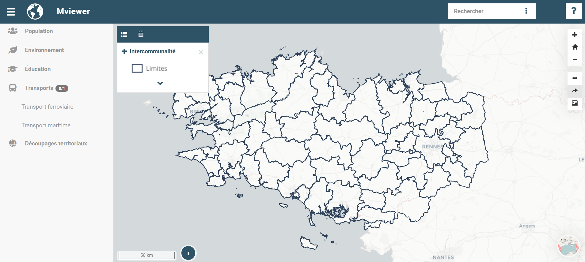
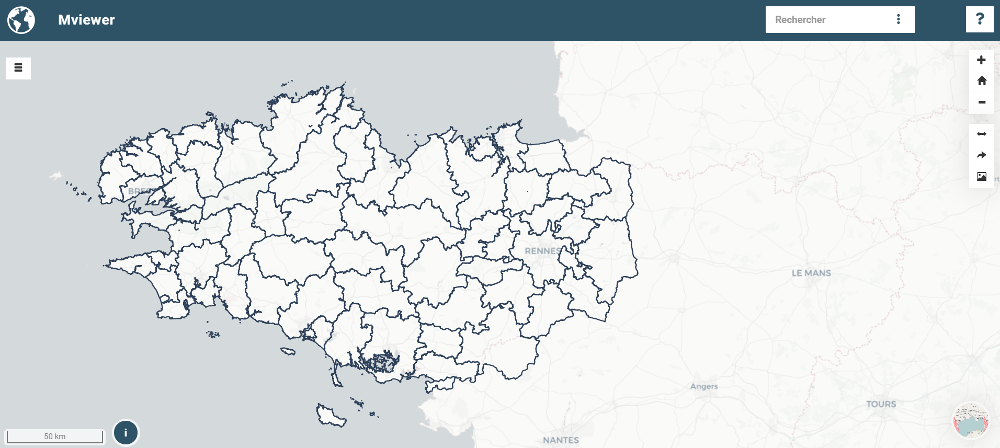
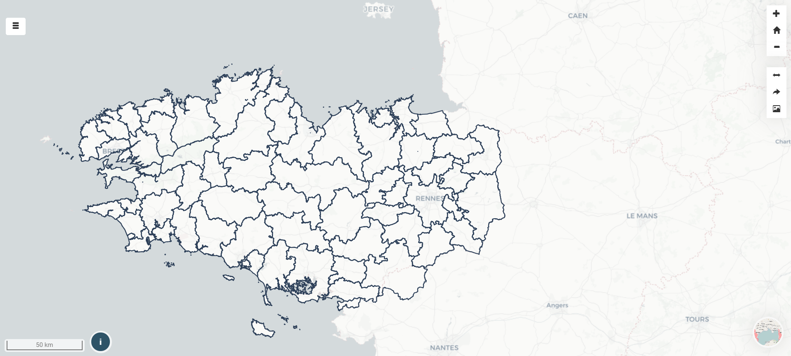
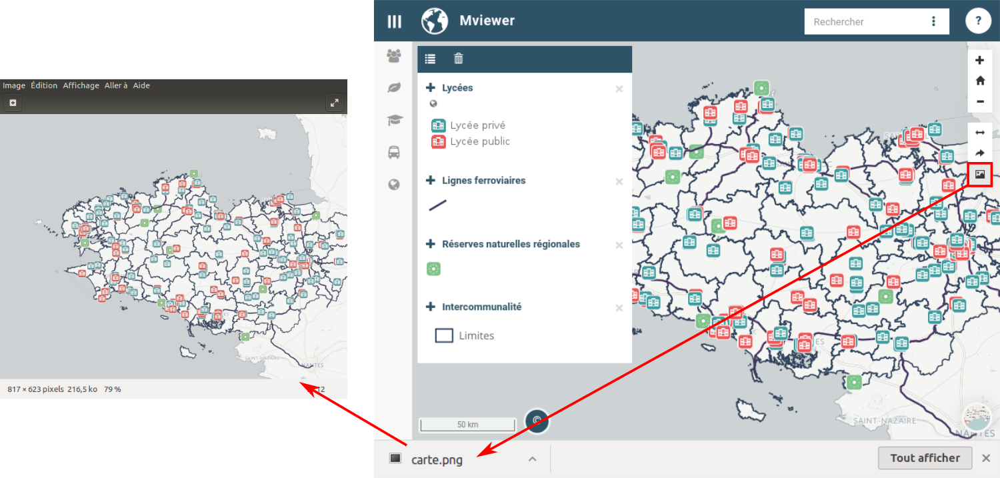

# Outils additionnels

Par défaut, Les outils additionnels se comptent au nombre de trois. Il
est possible d'en ajouter d'autres, se référer à la page
[Configurer - Extensions](../doc_tech/config_extensions.md).

1.  [Outils de mesure](#outils-de-mesure)
2.  [Partage de carte](#partage-de-carte)
3.  [Export de la carte](#export-de-la-carte)

## Outils de mesure

En cliquant sur l'icone (
 ),
deux nouveaux outils apparaissent et vous avez la possibilité de mesurer
:

-   une distance (
    
    ),
-   une surface (
    
    ).

### Marche à suivre

Pour faire une mesure, il vous suffit de dessiner une ligne (ou une
surface) à l'aide du clic-gauche de votre souris. Au fur et à mesure que
vous avancez dans le dessin, la distance cumulée (ou bien la surface)
est affichée.

Pour terminer une mesure, faites un double clic-gauche avec la souris.

Pour effacer une mesure (distance ou bien surface), il vous suffit de
cliquer de nouveau sur l'outil que vous avez utilisé.

## Partage de carte

Le partage de carte permet de générer un lien web fixant la situation
actuelle de l'interface. Ainsi sont conservés :

-   la position de la carte,
-   le niveau de zoom,
-   le fond de carte,
-   la liste des couches affichées avec leurs paramètres de transparence
    et leur style.

Une fois que vous avez cliqué sur l'icone (
 ), une
nouvelle fenêtre apparaît :

### Choix du mode d'affichage du permalien

-   Normal

    

-   Simplifié

    

-   Ultra Simplifié (idéal intégration page web)

    

### Choix du type de lien

Depuis la version 4, un grand nombre de modes de partage sont proposés :

-   Générer un lien hypertext *(icone nouvel onglet)* : lorsque vous
    cliquez, un nouvel onglet de votre navigateur s'ouvre avec le lien
    permanent,
-   E-mail
-   Intégrer pour intégration en iframe
-   Les réseaux sociauax : Linkedin, WhatsApp, Facebook
-   Génération d'un QR-code

Vous avez aussi la possibilité de copier directement le lien de partage.

**Exemple de permalien** :
<http://localhost/mviewer/?x=-220750&y=6144926&z=8&l=epci&lb=positron&mode=u>

-   x et y : coordonnées du centre de la carte
-   z : niveau de zoom
-   l : liste des couches
-   lb : couche de fond par défaut
-   mode : mode d'affichage (n,s ou u)

Il est possible d'ajouter un paramètre popup=false pour ne pas afficher
au démarrage de l'application la popup (à l'inverse popup=true pour
forcer l'affichage).

## Export de la carte

En cliquant sur l'icone (
 ) la
carte est automatiquement exportée au format .png.

