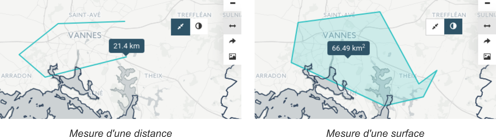
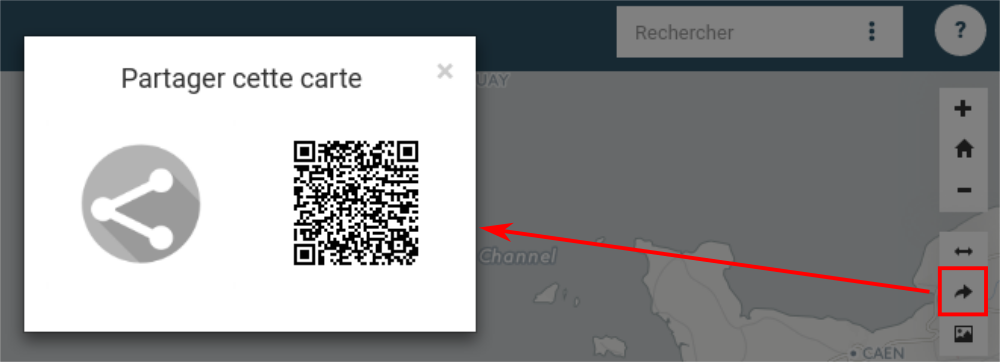
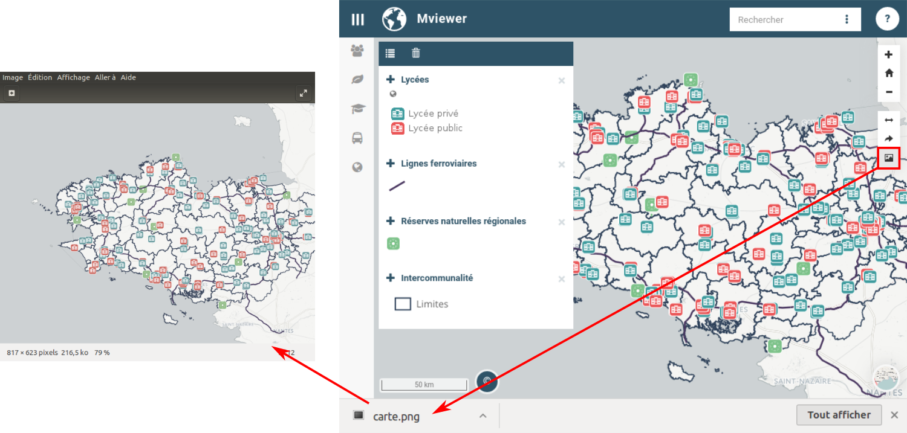

.. Authors : 
.. mviewer team
.. Gwendall PETIT (Lab-STICC - CNRS UMR 6285 / DECIDE Team)

.. _othertools:

Outils additionnels
===================

Les outils additionnels se comptent au nombre de trois :

1. `Outils de mesure`_
2. `Partage de carte`_
3. `Export de la carte`_

Outils de mesure
----------------

En cliquant sur l'icone ( |Mesure| ), deux nouveaux outils apparaissent et vous avez la possibilité de mesurer :

* une distance ( |Mesure_distance| ),
* une surface ( |Mesure_area| ).

Marche à suivre
***************

Pour faire une mesure, il vous suffit de dessiner une ligne (ou une surface) à l'aide du clic-gauche de votre souris. Au fur et à mesure que vous avancez dans le dessin, la distance cumulée (ou bien la surface) est affichée.

Pour terminer une mesure, faites un double clic-gauche avec la souris.

Pour effacer une mesure (distance ou bien surface), il vous suffit de cliquer de nouveau sur l'outil que vous avez utilisé.

Partage de carte
----------------

Le partage de carte permet de générer un lien web fixant la situation actuelle de l'interface. Ainsi sont conservés :

* la position de la carte,
* le niveau de zoom,
* la liste des couches affichées avec leurs paramètres de transparence.

Une fois que vous avez cliqué sur l'icone ( |Share_icon| ), une nouvelle fenêtre apparaît :

Choix du mode d'affichage du permalien
**************************************

* Normal

  .. image:: ../_images/user/other_tools/mode_normal.png
              :alt: Outils de partage de la carte
              :align: center

* Simplifié

  .. image:: ../_images/user/other_tools/mode_simplifie.png
              :alt: Outils de partage de la carte
              :align: center

* Ultra Simplifié (idéal intégration page web)

  .. image:: ../_images/user/other_tools/mode_ultra_simplifie.png
              :alt: Outils de partage de la carte
              :align: center

Choix du type de lien
*********************

* générer un lien hypertext *(icone de gauche)* : lorsque vous cliquez, un nouvel onglet de votre navigateur s'ouvre avec le lien permanent,
* utiliser un QR Code *(icone de droite)*.

**Exemple de permalien** : http://localhost/mviewer/?x=-220750&y=6144926&z=8&l=epci&lb=positron&mode=u

* x et y : coordonnées du centre de la carte
* z : niveau de zoom
* l : liste des couches
* lb : couche de fond par défaut
* mode : mode d'affichage (n,s ou u)

Export de la carte
------------------

En cliquant sur l'icone ( |Export_icon| ) la carte est automatiquement exportée au format .png.

