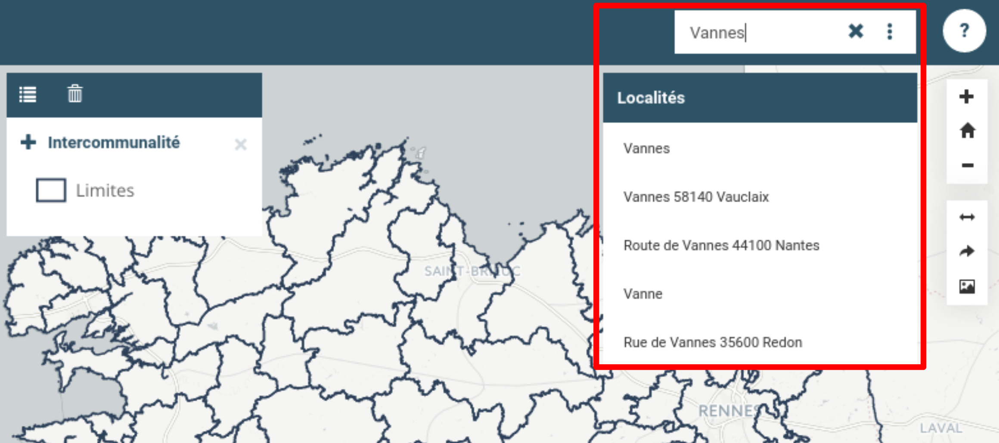
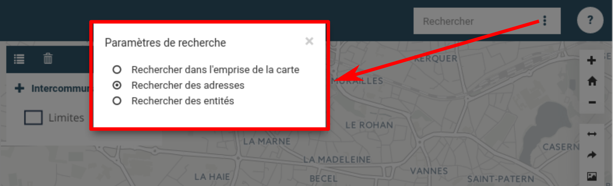

# Barre de recherche

La barre de recherche, située en haut à droite de l'interface, permet de
rechercher par défaut des adresses. Via paramétrage, il est aussi
possible d'ajouter des informations contenues dans les entités.

Au fur et à mesure que l'utilisateur écrit, le moteur de recherche
affiche les propositions correspondantes. Là, l'utilisateur est invité à
cliquer sur l'entrée qui correspond à son attente. Dès lors, le
navigateur va zoomer sur l'adresse ou l'entité sélectionnée.

En cliquant sur la **croix** *(à droite de la zone d'écriture)*,
l'utilisateur efface le contenu de la zone de texte.

## Options

En cliquant sur l'icone composée de 3 points, l'utilisateur à la
possibilité d'affiner les options de recherche, avec les choix suivants
:

-   Rechercher dans l'emprise de la carte uniquement
-   Rechercher des adresses
-   Rechercher des entités

