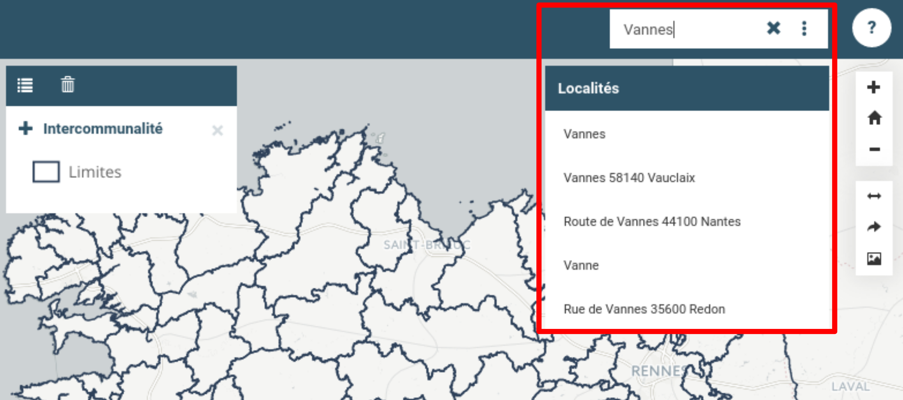
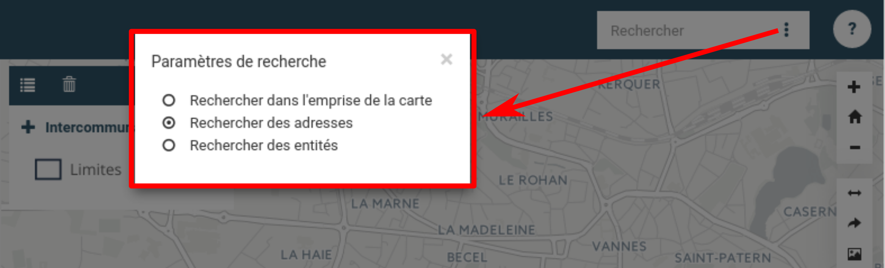

.. Authors : 
.. mviewer team
.. Gwendall PETIT (Lab-STICC - CNRS UMR 6285 / DECIDE Team)

.. _search:

Barre de recherche
==================

La barre de recherche, située en haut à droite de l'interface, permet de rechercher tout type de lieux, comme par exemple des noms de communes, de département ou de région ainsi que, si c'est paramètré, des entités.

Au fur et à mesure que l'utilisateur écrit, le moteur de recherche affiche les propositions correspondantes. Là, l'utilisateur est invité à cliquer sur l'entrée qui correspond à son attente. Dès lors, le navigateur va zoomer sur l'entité sélectionnée.

En cliquant sur la **croix** *(à droite de la zone d'écriture)*, l'utilisateur efface le contenu de la zone de texte.

Options
-------

En cliquant sur l'icone composée de 3 points, l'utilisateur à la possibilité d'affiner les options de recherche, avec les choix suivants :

* Rechercher dans l'emprise de la carte
* Rechercher des adresses
* Rechercher des entités

